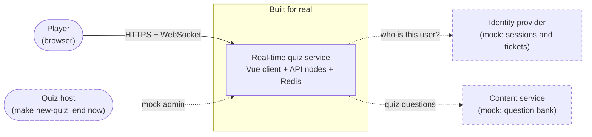
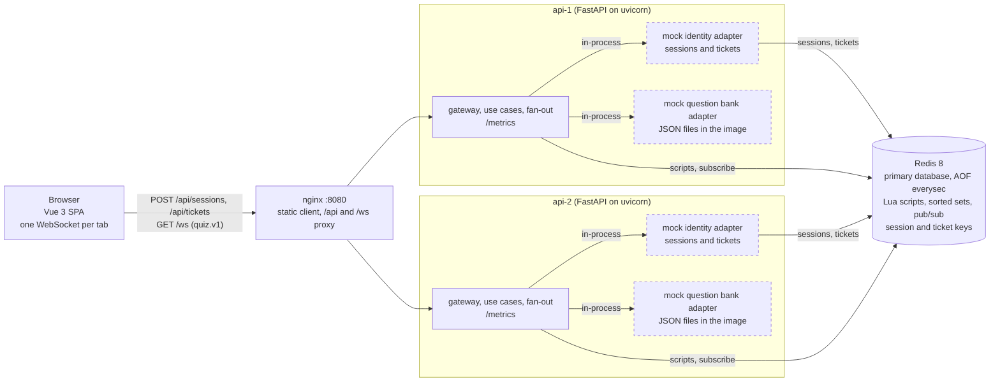

# System design: real-time vocabulary quiz

<!-- AI-ASSISTED-BEGIN: sections 1-4 drafted with Claude Code from docs/spec/ and docs/DECISIONS.md, checked by hand against the code layout and the import-linter contracts; the Mermaid diagrams were rendered with the Mermaid CLI. -->

## 1. Summary

**The problem.** Players join a vocabulary quiz with a quiz ID, answer timed questions, and
watch one shared leaderboard that changes as anyone scores. Scores must be accurate and
consistent (AC-4) even when many players answer at once through several server nodes.

**The solution.** The quiz is **self-paced**: every player gets the same questions in the same
order, one at a time, at their own pace, and all players share one live leaderboard (ADR-002).
A Vue 3 client keeps one WebSocket open to a FastAPI server. Two API nodes run behind nginx;
**Redis is the primary database** (AOF `everysec`). Every write with more than one step is one
Lua script that reads the time from Redis `TIME`, so any node can score any answer atomically
and a (player, question) scores at most once. Score changes only mark the quiz dirty; a 200 ms
coalescing tick publishes one full leaderboard frame per quiz over Redis pub/sub, numbered by a
per-quiz `seq`, and a client that sees a gap asks for a snapshot. Identity and the question bank
are mocks behind ports, and quiz admin is a mock host action (§14).

**Headline numbers.** The load runs and §9 fill in the measured column.

| Measure | Target (ours) | Measured |
|---|---|---|
| Concurrent sockets, two API nodes | thousands | TODO: from the load runs (§9) |
| Answer accepted → leaderboard delivered, p99 (C5) | below 500 ms | TODO: from the load runs (§9) |
| Leaderboard frames per quiz | at most 5 per second | by design: one per 200 ms tick, only after a change |
| Scoring rule | wrong or late 0; correct `100 + (50 * (T - e)) // T` | exact integers; one formula in Lua and Python |

## 2. Assumptions and non-goals

**How we read the README.** The README asks for joining by quiz ID, scores that update in real
time and a leaderboard that updates promptly. It does not say who opens and closes questions.
We read "real-time" as live scores and one shared live board, and let each player set their own
pace. A host-led quiz would need one owner per quiz to open and close questions on time, with a
failover story; the self-paced model needs no owner, because no rule depends on a timer
(ADR-002, ADR-006). Host-led stays future work.

**Assumptions.**

| Topic | Assumption |
|---|---|
| Players | Anonymous: a mock session gives a user ID; the player types a display name (1–32 characters). One open tab per player and quiz; a second tab replaces the first |
| Quiz shape | 10 questions, 4 choices each, `T` = 20 s per question; the quiz is open for a window from its creation (default 10 min, at most 60 min) or until a mock host ends it |
| Time | The server decides time on one clock (Redis `TIME`); the client countdown is display only |
| Clients | Current browsers with WebSocket support; phones and desktops |
| Store | One Redis 8 (Valkey 8 also works) with AOF `everysec`; a crash can lose about 1 s of answers (§11) |
| Load (our target, not a README requirement) | Thousands of concurrent sockets over **two API nodes** behind nginx, with a cap of 10,000 sockets per process |
| Latency (our target, not a README requirement) | C5: p99 below 500 ms from "answer accepted" to "leaderboard delivered", measured by the load bots |

The README asks the system to "perform well even under heavy load" (F-2) without a number. Our
measurable reading of F-2 is the load and latency rows above, run on one and on two nodes and
reported in §9. Two nodes are our choice: they make the scale-out claims of §10 real.

**Why the design meets each README acceptance criterion.**

| ID | Criterion | How the design meets it |
|---|---|---|
| AC-1 | Join a quiz session with a unique quiz ID | `join {quizId}` on the socket; the `join` script registers the player once per quiz; IDs match `^[A-Z0-9-]{3,16}$` |
| AC-2 | Many users join the same session at the same time | Joins only set `dirty`, so 5,000 joins cost one frame per tick, not one per join; any node accepts any join |
| AC-3 | Scores update in real time | The scoring script returns `answer_result` with the new total at once; the next tick carries it to everyone |
| AC-4 | Scoring is accurate and consistent | One integer formula; two idempotency layers and the deadline check in one atomic script on one clock (C1–C6, §7) |
| AC-5 | A leaderboard shows all participants | Every frame carries every player up to 200; above that the top 50, each other player's own rank, and `get_leaderboard` pages |
| AC-6 | The leaderboard updates promptly | A 200 ms coalescing tick with `seq` and resync; target p99 below 500 ms (C5) |

**Non-goals.** Real accounts or an identity provider; an admin UI or question authoring; a
host-led mode; a per-player question order; results that outlive the 24 h key TTL or a durable
answer log beyond AOF; a graceful drain when a node stops (clients reconnect and resync);
metrics or dashboard containers (the API serves `/metrics` only, §13); native apps;
translations.

## 3. Architecture (D-1)

**Context.** The quiz service is the one component built for real. The identity provider and the
content service are mocks behind ports, so a real one can replace each without touching the
core; the quiz host uses a token-gated mock admin API. All three are dashed.

**Containers.** The two mocks are not containers of their own: each API node loads them
in-process as adapters (dashed), and the identity mock keeps its sessions and tickets in Redis.

**Walk-through.** The client gets a mock session once (`POST /sessions`) and a single-use,
30 s ticket before every connect (`POST /tickets`); the `/api` prefix is dropped before the
API. It opens
`GET /ws?ticket=…` with the subprotocol `quiz.v1`; nginx sends the socket to either node, and
the node checks the origin, the ticket and the connection caps before the upgrade. Each
write request (`join`, `next`, `answer`) becomes one Lua script in Redis, which checks the
deadline on Redis `TIME` and writes atomically; for `answer` the script also checks the two
idempotency keys (the `submissionId` and "already answered"). A `resync` runs one
read-only script that returns the standings at one `seq` and writes nothing. The reply goes back
on the same socket. A scoring answer sets the quiz's `dirty` flag. Every node that serves the quiz
calls the tick script about every 200 ms; the one that wins the tick token increments `seq` and
publishes one `leaderboard` frame on `quiz:{<quizId>}:events`, and every node relays it to its
own sockets. Redis is the only database: the mock identity keeps its sessions and tickets
there, so a ticket made on one node works on the other. The mock question bank is read from
JSON files when a node starts.

## 4. Components (D-2)

The server is one Python package, `quiz` (`api/src/quiz/`), split into layers. The
import-linter contracts in `api/pyproject.toml`, run by `make check`, enforce these rules: the
domain imports no other part of the package and none of Pydantic, FastAPI, Starlette, uvicorn,
redis-py, structlog or the Prometheus client; the ports and the use cases never import the
adapters, the fan-out, the settings, the composition root (`quiz/main.py`), redis-py or the web
framework; the ports never import the use cases; the memory, Redis, mock identity, mock question
bank and HTTP adapters never import each other, and all but the HTTP adapter never import the
use cases, the fan-out, the settings or the web framework; and no module imports the
composition root. The WebSocket gateway and the fan-out are outside these contracts, and no
contract stops a module other than `quiz/main.py` from building an adapter: that the
composition root alone wires them is a convention, not a check.

| Component | Role | Owns | Talks to |
|---|---|---|---|
| Web client (`web/src/`) | The player's UI: join, question, feedback, finished and live leaderboard | The protocol client (backoff, `seq` tracking, resync), the Pinia quiz store, the views and the UI kit | nginx: HTTP for session and ticket, one WebSocket |
| nginx (`infra/`) | The single public entry | The static client, the `/api` and `/ws` routes, WebSocket upgrade headers, `X-Forwarded-For` | Browser; both API nodes |
| API node (`quiz/main.py`) | One FastAPI process; two run side by side | `create_app()`: settings, the chosen adapters, start and stop hooks | nginx; Redis |
| Domain (`quiz/domain/`) | The quiz rules with no I/O | Scoring, standings order and ranks, the player's session states, domain errors | Nothing |
| Contracts (`quiz/contracts/`) | The wire protocol, defined once | Pydantic models of every message and the codec; the source of the generated JSON Schema and TypeScript types | Used by the use cases, the gateway and the client (generated types) |
| App (`quiz/app/`) | The use cases | `QuizService`: join, next, answer, ping, resync, leaderboard pages; turns store results into replies and errors | The ports (`Store`, `QuestionBank`, `Clock`) |
| Ports (`quiz/ports/`) | The interfaces the core depends on | `Store`, `Clock`, `QuestionBank`, `TicketStore` | Implemented by the adapters |
| Store (`quiz/adapters/redis/`, `quiz/adapters/memory/`) | Atomic quiz state | The Redis adapter: key names, script loading and every Lua script of [redis spec §3](docs/spec/redis.md#3-scripts) (`create_quiz`, `join`, `serve_question`, `score_answer`, `publish_leaderboard`, `leave`, `end_quiz`, `renew_presence`, `mark_dirty` and the read-only `read_standings`); the memory twin for unit tests, with an injected clock | Redis (scripts, `TIME`) |
| Gateway (`quiz/adapters/ws/`, `quiz/adapters/http/`) | The edge of a node | The `/ws` endpoint, the upgrade checks (origin, ticket, caps), limits before parsing, heartbeat and send buffers; `POST /sessions`, `POST /tickets`, `GET /quizzes/{quizId}`, `/healthz`, `/readyz`, `/metrics`; the mock admin `POST /admin/quizzes` and `POST /admin/quizzes/{quizId}/end` (only with `ADMIN_MOCK=1` and the `X-Admin-Token` header, else 404) | Clients through nginx; the use cases; the ticket store, the store and the question bank |
| Fan-out (`quiz/fanout/`) | Leaderboard delivery across nodes | The 200 ms tick loop per served quiz, the pub/sub subscription, relay to local sockets, snapshots after a resubscribe | Redis (tick script, pub/sub); the gateway's sockets |
| Mock identity (`quiz/adapters/mock_auth/`) | Stands in for an identity provider | Sessions and single-use tickets (Redis, or memory in tests), display-name rules | Redis |
| Mock question bank (`quiz/adapters/mock_questions/`) | Stands in for a content service | Seed quizzes in `data/*.json`, validated at start | Local files |
| Observability (`quiz/obs/`) | Logs and metrics | JSON logs (structlog) and Prometheus counters and histograms | `/metrics` |
| Redis | Primary database and backplane | All quiz keys `quiz:{<quizId>}:*`, the scripts' atomicity, the clock, the events and control channels | All API nodes |

<!-- AI-ASSISTED-END -->

## 5. Data flow (D-3)
TODO: the flow from joining a quiz to a leaderboard update.

## 6. Technologies and justification (D-4)

<!-- AI-ASSISTED-BEGIN: drafted with Claude Code from docs/DECISIONS.md, api/pyproject.toml and web/package.json; the versions were read from api/uv.lock and web/pnpm-lock.yaml. -->

Each choice is set against the alternative it beat and the cost we accept for it. The ADR
column points to the full reasoning in [docs/DECISIONS.md](docs/DECISIONS.md).

| Component | Choice | Alternative | Reason | Cost we accept | ADR |
|---|---|---|---|---|---|
| Server language and framework | Python 3.14, FastAPI on uvicorn (uvloop, httptools), Pydantic v2 | Node.js (Fastify and `ws`); Go | The wire messages are defined once as Pydantic models, which validate every inbound frame and generate the JSON Schema and the client's TypeScript types; asyncio fits a server that mostly waits on sockets and Redis; FastAPI serves the HTTP endpoints and the WebSocket in one app; Hypothesis tests the scoring and standings rules | One event loop per process uses one CPU core, and JSON encoding per send costs CPU, so a node holds fewer sockets than a Go server would; we scale by adding processes (two nodes) | 001 |
| Transport | One raw WebSocket per tab (`GET /ws`, subprotocol `quiz.v1`), JSON text frames, `permessage-deflate` off | Server-Sent Events plus HTTP POST; Socket.IO | One two-way channel per player with one writer per socket, so the socket delivers messages in the order the node queued them ([protocol §1](docs/spec/protocol.md#1-envelope-and-connection)); no order is promised between a reply and a broadcast; no extra framing or version-matched client library | We own the heartbeat, the reconnect with backoff and the resync from `seq` | 003 |
| State and scoring | Redis 8: one sorted set per quiz and one Lua script per multi-step write, every time read from Redis `TIME`; AOF `everysec` | `WATCH`/`MULTI` transactions; PostgreSQL with row locks | Every check and its write run in one atomic script on one clock, so a (player, question) scores at most once on any node; ranks read with `ZRANGE` in O(log N + M) | A Redis crash can lose about 1 s of answers (§11); scripts block Redis while they run, so each stays small; one quiz is bounded by one shard | 005, 008 |
| Cross-node fan-out | Redis pub/sub on `quiz:{<quizId>}:events`, a per-quiz `seq` and resync | Redis Streams; a broker (NATS, Kafka) | The tick script increments `seq` and publishes in one atomic step on the Redis we already run; frames are full standings, so a lost one is healed by one snapshot | Delivery is at most once: a missed frame costs the client a snapshot; no history survives a node restart | 004, 006, 007 |
| Client | Vue 3, Vite and TypeScript; Pinia; Vue Router; Tailwind CSS 4 with shadcn-vue on reka-ui | React with Next.js; Svelte | A small single-page app with no server rendering; single-file components, a Pinia store and the protocol client test with Vitest in happy-dom; the generated message types keep client and server in step | The protocol client (backoff, `seq`, resync) is our code; shadcn-vue components are copied into `web/src/components/ui/`, so we maintain them | 009 |
| Edge | nginx: the static client, the `/api` and `/ws` routes to both API nodes | Traefik or HAProxy; uvicorn exposed directly | One origin for the page, the API and the socket, so the origin check stays strict; WebSocket upgrade headers and `X-Forwarded-For` for the per-IP cap; a plain, well-known config | Hand-written config whose read timeouts must exceed the 25 s heartbeat; one nginx is a single point of failure in this stack | 003 |
| Metrics and logs | The Prometheus client (`prometheus-client`) serves `/metrics` on each API node; structlog writes JSON logs. No Prometheus server or Grafana container | OpenTelemetry SDK with a collector; a Prometheus and Grafana stack in Compose | One library and the text format any scraper reads; the stack stays small and the counters and histograms are there for any existing Prometheus to scrape (§13) | No stored history or dashboards in this build: you read `/metrics` directly, and the load runs report their own latency numbers | — |
| Packaging and running | Docker Compose: Redis, two API nodes, nginx and the built client | Kubernetes (kind or minikube); processes started by hand | One command brings the whole stack up the same way on any machine with Docker; the tests start their own Redis container on a free port | One host: no autoscaling, rolling deploy or node spread; production would need an orchestrator | — |
| Build and test tooling | uv and pnpm with committed lock files; pytest, pytest-asyncio and Hypothesis; Vitest | pip or Poetry; npm; unittest | Fast, reproducible installs from the lock files in CI and locally; property tests for the rules that must hold for every input | Two toolchains (Python and Node) to install; the lock files are regenerated, never merged by hand | — |

**Resolved versions.** Read from the lock files (`api/uv.lock`, `web/pnpm-lock.yaml`) and the
version pins next to them; a lock-file change updates this table.

| Package | Version | Source |
|---|---|---|
| Python | 3.14 | `.python-version` |
| FastAPI / Starlette | 0.142.2 / 1.7.0 | `api/uv.lock` |
| uvicorn (uvloop, httptools, websockets) | 0.54.0 (0.23.0, 0.8.0, 17.1) | `api/uv.lock` |
| Pydantic / pydantic-settings | 2.13.5 / 2.15.0 | `api/uv.lock` |
| redis-py (hiredis) | 8.1.0 (3.4.2) | `api/uv.lock` |
| prometheus-client | 0.26.0 | `api/uv.lock` |
| structlog | 26.1.0 | `api/uv.lock` |
| pytest / Hypothesis | 9.1.1 / 6.168.3 | `api/uv.lock` |
| Redis server | `redis:8-alpine` | `compose.yaml` |
| Node / pnpm | 24 / 11.20.0 | `.nvmrc`, `web/package.json` |
| Vue / Vue Router / Pinia | 3.5.43 / 5.3.1 / 4.0.3 | `web/pnpm-lock.yaml` |
| Vite / TypeScript | 8.3.1 / 6.0.3 | `web/pnpm-lock.yaml` |
| Tailwind CSS / reka-ui | 4.3.3 / 2.10.5 | `web/pnpm-lock.yaml` |
| Vitest | 5.0.2 | `web/pnpm-lock.yaml` |

<!-- AI-ASSISTED-END -->

## 7. Consistency contract (AC-4)
TODO: the scoring and ordering guarantees, their mechanisms and the tests that prove them.

## 8. Non-functional requirements
TODO: latency, throughput, availability and durability targets.

## 9. Capacity estimate (F-1, F-2)
TODO: assumptions, per-connection memory, connections per node, messages per question, measured numbers.

## 10. Scalability and trade-offs (F-1)
TODO: how the system scales out and what each choice costs.

## 11. Reliability and failure modes (F-3)
TODO: the failure table (failure, detection, system behavior, user-visible effect, mitigation, proving test).

## 12. Security
TODO: authentication, input limits, origin checks and abuse limits.

## 13. Observability (F-5)
TODO: logs, metrics and how to diagnose a slow or stuck quiz.

## 14. Implemented and mocked (I-1)

<!-- AI-ASSISTED-BEGIN: drafted with Claude Code from the ADR index and the mock adapters' docstrings, checked by hand against the code. -->

**Built for real: the real-time quiz service** (ADR-001), end to end: the Vue client, the
WebSocket gateway, the use cases, the Redis scoring scripts, the coalescing tick and the
pub/sub fan-out across two API nodes behind nginx, plus the tests and the load bots that check
it.

| Part | Implemented in this build |
|---|---|
| Quiz rules and scoring | `quiz/domain/`, mirrored by the Lua scripts; `points.lua` is checked against Python for every elapsed value |
| Atomic state and the clock | The Redis adapter and its Lua scripts; the in-memory twin for unit tests |
| Wire protocol | Pydantic contracts with generated JSON Schema and TypeScript types |
| Gateway and fan-out | The `/ws` endpoint, limits, heartbeat, send buffers; the tick, pub/sub relay, `seq` and resync |
| Client | The Vue 3 app: protocol client with backoff and resync, Pinia store, screens |
| Scale-out | Two API nodes, nginx, one Redis, a two-node integration test and load runs |

**Mocked.** The identity and question-bank mocks sit behind ports (`TicketStore`,
`QuestionBank`); quiz admin is a token-gated mock admin API in the HTTP adapter, off unless
`ADMIN_MOCK=1`. All three say `MOCK:` in their code: the adapters' module docstrings, the
`/admin` routes and the `ADMIN_MOCK` setting in `quiz/config.py`.

| Mock | What this build does | What production would use instead |
|---|---|---|
| Identity and tickets (`quiz/adapters/mock_auth/`) | `POST /sessions` makes an anonymous user ID and a session token; `POST /tickets` makes a single-use 30 s ticket; both kept in Redis | The company's identity provider (OIDC) for users and sessions; the single-use ticket mechanism stays as built |
| Question bank (`quiz/adapters/mock_questions/`) | Seed quizzes read from JSON files at start-up | A content service or database, edited in an authoring tool |
| Quiz admin (`quiz/adapters/http/`, `ADMIN_MOCK`) | `POST /admin/quizzes {quizId, timeLimitMs, windowMs}` starts a quiz from the bank, only with `ADMIN_MOCK=1` and a matching `X-Admin-Token` header (else 404); the make targets `make new-quiz` and `make demo` create a quiz; a mock host action "end now" ends a quiz early | The admin API behind the identity provider, with per-user roles in place of one shared token, plus an admin UI for scheduling and quiz settings |

<!-- AI-ASSISTED-END -->

## 15. AI Collaboration in Design (D-5, S-6)

<!-- AI-ASSISTED-BEGIN: drafted with Claude Code from the design-phase and spec-PR AI-LOG entries, checked by hand against the specs and the named tests, which were run. -->

I designed this system with AI, and I treated every AI output as a draft to be checked. One
model drafted, a different model reviewed, and nothing counted as fixed until a spec section
stated the fix and a test pinned it. The full record is in the AI-LOG entries (below).

**Tools and models.**

| Tool | Model | Role in the design |
|---|---|---|
| Claude Code | claude-opus-5-5 | Drafted the architecture, the protocol, the Redis data model and scripts, the UI spec, the test strategy and the ADRs |
| Codex CLI | `gpt-6-astra`, high reasoning, read-only sandbox | Independent reviewer of the design drafts, and of every PR after its merge |
| A second Claude Code agent | claude-opus-5-5, fresh context, read-only | Independent reviewer of the design drafts, with no access to how they were written |
| Claude Code `/code-review` | claude-opus-5-5, high | Reviewer of every PR after its merge, next to Codex |

**Design tasks and the nature of each interaction.**

| Task | How I worked with the AI |
|---|---|
| Architecture and data flow (§3, §4) | I gave Claude Code the README and the fixed choices (self-paced quiz, one Redis, two API nodes); it drafted the diagrams and the component table, which I checked against the code layout and the import-linter contracts |
| Domain rules (`docs/spec/domain.md`, ADR-002) | Drafted from my list of rules and scoring examples; I recomputed every scoring example with the formula |
| Protocol (`docs/spec/protocol.md`, ADR-003, ADR-004) | Drafted from the message names, the `seq` rules and the limits; I traced the ordering of frames on one socket by hand |
| Redis store (`docs/spec/redis.md`, ADR-005 to ADR-008) | Claude Code designed the key schema, the script contracts and the tick without an owner; I checked each script against the `seq` rule |
| UI (`docs/spec/ui.md`) | Drafted the state chart and the tokens; contrast ratios were computed by a script, not estimated |
| Design review | One neutral prompt to Codex and to a second Claude agent, run in parallel and read-only; I checked each claim against the draft text before adopting it |

**What the design review found.** Both reviewers read the drafts before any spec was merged.
Four of the defects below were found by both reviewers independently, which made them the first
to fix. Each now has a spec section and a test (`docs/ai-log/design-phase.md` lists them all):

| Defect in the AI draft | What changed | Pinned by |
|---|---|---|
| A reconnect created a new player: tickets came from the display name and were single use | A session token per tab gets a fresh ticket for the same user before every connect (protocol §8) | `api/tests/unit/adapters/test_mock_auth.py`, `web/src/protocol/identity.test.ts` |
| A retried `next` could skip a question or restart its 20 s timer | `next` and `answer` carry the question index; the serve time is stored once (domain §5.1) | `api/tests/unit/test_session.py`, `api/tests/integration/test_serve_script.py` |
| Only the tick checked the deadline, and ticks stop on a node without sockets | Every write script checks the deadline on Redis `TIME` (Redis §3) | `api/tests/integration/test_score_script.py`, `api/tests/contract/test_store_contract.py` |
| The packed sorted-set score overflows after about 69.9 min; 0-point answers moved the tie-break | The window is at most 60 min; `reachedRelMs` moves only on points (domain §6) | `api/tests/integration/test_create_quiz.py`, `api/tests/unit/test_standings.py` |
| Each join broadcast to everyone: about 12.5 million sends for 5,000 joins | A join only sets `dirty`; the next coalesced frame carries the count (ADR-004) | `api/tests/integration/test_join_script.py` |

**What the reviews of the spec PRs found.** After each spec PR merged, `/code-review` (high) and
Codex reviewed it; I combined the two lists, verified each finding against the text, and fixed
the confirmed defects in a follow-up PR:

| Spec PR | Confirmed defects (examples) | Fix PR and test |
|---|---|---|
| #3 domain | The `next` table had no order and two rows overlapped at the last question | #34; `api/tests/unit/test_session.py` |
| #5 protocol | A newer frame conflated ahead of a queued `pong` looked like a store restart; `pong.seq` came from a node cache; a late `snapshot` could undo `quiz_ended`; a failed `join` bound the socket | #26, #30; `scripts/tests/test_protocol_spec.py` |
| #7 UI | The connection chart had no edges into `blocked` from `joining` or `resyncing`, and none out of `joining` after the end | #18; `scripts/tests/test_ui_spec.py` |
| #9 Redis | `create_quiz` accepted `T = 0` (the points formula divides by `T`); presence was never cleared after a node crash; a finished player could be served again | #16; `api/tests/integration/test_create_quiz.py`, `api/tests/integration/test_serve_script.py` |

Claude Code also caught some of its own mistakes while drafting. In the Redis spec it first
planned to end the quiz inside the write script that hit the deadline, which would have made
the scoring script increment `seq`; it caught this against the `seq` rule and changed it before
writing the script table (PR #9).

**Suggestions I rejected, and why.**

- **Remove the snapshot cache** (Codex, design review). The concern was real: answers do not
  move `seq`, so a cached per-player snapshot could be stale. Removing the cache was more than
  needed. Standings at one `seq` never change, so I kept the cache for the shared standings
  only and read the player's own row fresh (`api/tests/unit/app/test_service.py`,
  `test_snapshot_never_mixes_stale_standings_with_a_fresh_own_row`).
- **Finish a player only from the last question** (the review of PR #3). The review read the
  session core as strict, but a PR merged after the review made it finish from any cursor, with
  tests. Following the review would have changed working, tested behavior, so the spec follows
  the code (`test_next_n_finishes_from_any_cursor`).
- **Keep a lower `pong.seq` as a restart signal** (Claude Code, PR #26). Tracing the order of
  events showed that the counter read and the pub/sub relay use different Redis connections, so
  a frame can overtake a `pong` that read an older counter; the rule would have fired false
  resyncs. A restart is detected from `seq < lastSeq` on a broadcast instead.

**How I verified.** (1) A neutral review prompt that held none of my own suspicions, so the
reviewers could not just agree with me. (2) Two reviewers from two vendors, run independently;
agreement between them raised a finding's priority. (3) Every claim checked against the draft
before it was adopted; one Codex claim (the store tests must run on both stores) was already in
the draft. (4) Every fix stated in a spec section that names the test that proves it. (5) The
tests run: `make test-integration` and the unit suites in `make check` pass on `main`; the exact
commands and results are in each AI-LOG entry.

**AI-LOG entries for the design.** `docs/ai-log/design-phase.md`; the spec PRs
`docs/ai-log/PR-3.md`, `PR-5.md`, `PR-7.md`, `PR-9.md`; and their fix PRs `PR-16.md`,
`PR-18.md`, `PR-26.md`, `PR-30.md`, `PR-34.md`. Every later PR has its own entry in
`docs/ai-log/`.

<!-- AI-ASSISTED-END -->

## 16. GenAI roadmap (X-8)

<!-- AI-ASSISTED-BEGIN: drafted with Claude Code from the ports and the data the store already keeps, checked by hand against the architecture. -->

**One rule for all of it: generative AI stays off the real-time path.** Scoring must stay exact,
cheap and repeatable (AC-4), and the tick has a 200 ms budget. So a model never decides points
during a quiz and never runs inside a Lua script or a socket handler. It runs before the quiz
(content), between quizzes (difficulty) or in its own service with its own latency budget
(speech). Each feature enters through a port that already exists or a new one beside it, so
the quiz core does not change.

| Feature | Where it fits | Main risks | How to measure it |
|---|---|---|---|
| Question generation with evals | An offline pipeline writes vocabulary items into the content service behind the `QuestionBank` port | Wrong answer keys, ambiguous distractors, items at the wrong level, unsafe or biased content | An eval suite gates every batch; live item statistics after release |
| Adaptive difficulty | Picks the next quiz's difficulty band for a player or a group, between quizzes | Unfair standings if players in one quiz get different questions; a cold start with no history | Calibration of the predicted against the real correct rate; completion and return rates |
| Pronunciation feedback | A speaking question type for ELSA's core skill: the player says the word, a speech service scores it | Bias against accents, noisy rooms, latency, privacy of voice recordings | Agreement with human raters, the gap between accent groups, p95 scoring latency |

**Question generation with evals.** A model drafts items (the word, a sentence that uses it, one
correct meaning and three distractors at a target level) as JSON. Each batch must pass an eval
suite before an editor sees it: the schema and the bank's existing load checks (four unique
choices, one answer, valid positions); an independent model that answers each item without the
key and must agree with it; a duplicate and near-duplicate check against the bank; a safety
filter; and a fixed golden set of reviewed items that every prompt or model change is scored
against in CI. Editors approve items before they reach a quiz. After release, the store already
keeps what is needed to judge an item: each answer's choice, points and elapsed time per
(player, question). Items whose correct rate is near 0 or 100 %, or whose wrong answers all land
on one distractor, go back to review. The metrics: the share of generated items that pass the
evals, the share editors reject, and the share later pulled after release; the target for
wrong keys in released items is zero.

**Adaptive difficulty.** The model estimates each player's level from past answers (an item
response model or an Elo-style rating per item and player; a language model is not needed for
this part) and picks the difficulty band of the next quiz. Inside one quiz everyone still gets
the same questions in the same order, so the shared leaderboard stays fair; mixing levels in one
quiz would need a handicap in the score, which is a product decision, not a technical one. The
risks: a wrong estimate that makes quizzes too hard or too easy, and new players with no
history (start them at a middle band). The metrics: calibration (predicted against real correct
rate per band), quiz completion rate, and how often players return, compared with fixed
difficulty in an A/B test.

**Pronunciation feedback.** A new question type: the client records the word, uploads it over
HTTP to a speech-scoring service, and gets back a score per phoneme. The service returns a
signed result, and the player sends that result to the quiz service as the answer; the quiz
service checks the signature and scores it with the same `score_answer` script, so the audio
never travels over the WebSocket and the store's rules do not change. The time limit must allow
for recording and scoring, so these questions get a longer `T`. The risks: lower scores for some
accents, which is unfair and also moves players on the leaderboard; background noise; a slow service
that makes answers late; and voice data, which needs consent, a short retention period and no
use for training without permission. The metrics: correlation with human raters on a labeled
set, the score gap between accent groups on that set, the rate of answers scored late because
of scoring latency, and p95 scoring latency against its budget.

**Cost and change control.** Prompts and model versions are pinned and versioned with the eval
results, so a model upgrade is a reviewed change with numbers, like an ADR. Generation runs in
batches, so its cost is per item, not per player.

<!-- AI-ASSISTED-END -->

## 17. ADR index

<!-- AI-ASSISTED-BEGIN: one-line summaries drafted with Claude Code from docs/DECISIONS.md. -->

Every decision is recorded in full (context, decision, alternatives considered, consequences) in
[docs/DECISIONS.md](docs/DECISIONS.md). ADRs are never renumbered; a later ADR supersedes an earlier one.

| ADR | Decision |
|---|---|
| [ADR-001](docs/DECISIONS.md#adr-001--build-the-real-time-quiz-service-with-a-python-and-fastapi-server-mock-identity-questions-and-admin) | Build the real-time quiz service for real (Python and FastAPI server, Vue client); mock identity and tickets and the question bank behind ports; quiz admin is make targets and a mock host action. |
| [ADR-002](docs/DECISIONS.md#adr-002--self-paced-quiz-model-and-the-integer-scoring-rule) | Self-paced quiz: each player sets their own pace on one shared live board; integer scoring `100 + (50 * (T - e)) // T`, wrong or late 0. |
| [ADR-003](docs/DECISIONS.md#adr-003--transport-raw-websocket-on-fastapi-and-uvicorn) | One raw WebSocket per tab on FastAPI and uvicorn, subprotocol `quiz.v1`, a single-use ticket checked before the upgrade. |
| [ADR-004](docs/DECISIONS.md#adr-004--wire-protocol-standings-policy-and-the-200-ms-coalescing-tick) | Versioned JSON messages with a per-quiz `seq` and resync; full standings up to 200 players, else the top 50 plus `rank_update`; one frame per 200 ms tick. |
| [ADR-005](docs/DECISIONS.md#adr-005--redis-sorted-set-and-lua-scripts-for-scoring-aof-everysec) | Redis sorted set with a composite score and one Lua script per multi-step write, on Redis `TIME`; AOF `everysec`. |
| [ADR-006](docs/DECISIONS.md#adr-006--no-owner-per-quiz-the-dirty-gate-and-a-tick-token) | No owner per quiz: any node runs the tick; a `dirty` gate and a 200 ms tick token decide who publishes. |
| [ADR-007](docs/DECISIONS.md#adr-007--backplane-redis-pubsub-seq-and-resync-streams-as-the-next-step) | Redis pub/sub carries frames and session replacement between nodes; a gap in `seq` triggers a snapshot; Streams are the next step. |
| [ADR-008](docs/DECISIONS.md#adr-008--one-redis-schema-for-scoring-and-fan-out) | One Redis schema: every key of a quiz under the hash tag `quiz:{<quizId>}:*`, one 24 h TTL, ready for a Cluster. |
| [ADR-009](docs/DECISIONS.md#adr-009--repository-layout-and-the-vue-client-api-web-generated-contracts) | One repository with `api/`, `web/` and generated `contracts/`; a Vue 3, Vite, Pinia and Tailwind client using types generated from the Pydantic models. |

<!-- AI-ASSISTED-END -->
