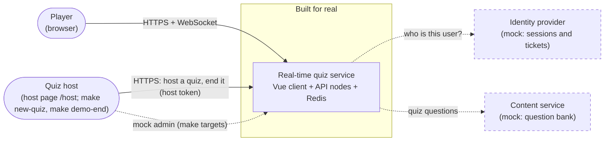
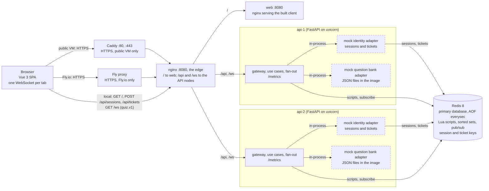
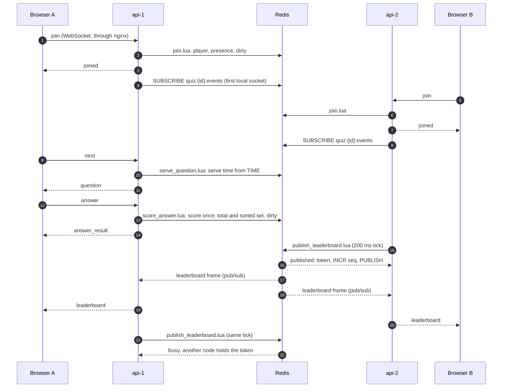

# System design: real-time vocabulary quiz

<!-- AI-ASSISTED-BEGIN: reading map drafted with Claude Code from the headings below. -->

## Reading map

Short on time: read §1, then §3 to §6 for the design, §9 for the measured results and §15 for how AI was used.

| Topic | Where |
|---|---|
| Architecture | [§3](#3-architecture): [context](#context), [containers](#containers), [walk-through](#walk-through) and [deployment](#deployment) |
| Components | [§4](#4-components): every component, its role and what it talks to |
| Data flow | [§5](#5-data-flow): [join](#join), [answer → leaderboard](#answer--leaderboard), [reconnect](#reconnect--resync), [hosting](#hosting-a-quiz) and [quiz end](#quiz-end) |
| Technologies | [§6](#6-technologies-and-justification): each choice against its alternative, with its ADR |
| AI collaboration | [§15](#15-ai-collaboration-in-design) |
| Implemented and mocked | [§14](#14-implemented-and-mocked) |
| Scalability | [§10](#10-scalability-and-trade-offs), sized by [docs/capacity.md](docs/capacity.md) |
| Performance | The targets of [§8](#8-non-functional-requirements), measured in [§9](#measured-results) |
| Reliability | [§11](#11-reliability-and-failure-modes), on the guarantees of [§7](#7-consistency-contract) |
| Maintainability | [Maintainability](#maintainability) in §4 |
| Observability | [§13](#13-observability) |
| Security | [§12](#12-security) |
| Decisions | [§16](#16-adr-index) |

<!-- AI-ASSISTED-END -->

<!-- AI-ASSISTED-BEGIN: sections 1-4 drafted with Claude Code from docs/spec/ and docs/DECISIONS.md, checked by hand against the code layout and the import-linter contracts; the Mermaid diagrams were rendered with the Mermaid CLI. -->

## 1. Summary

**The problem.** Players join a vocabulary quiz with a quiz ID, answer timed questions, and
watch one shared leaderboard that changes as anyone scores. Scores must be accurate and
consistent even when many players answer at once through several server nodes.

**The solution.**

- **A self-paced quiz:** every player gets the same questions in the same order, one at a time,
  at their own pace, and all players share one live leaderboard (ADR-002).
- **One socket, two nodes:** a Vue 3 client keeps one WebSocket open to a FastAPI server; two API
  nodes run behind nginx.
- **Redis as the primary store** (AOF `everysec`): every write with more than one step is one Lua
  script on Redis `TIME`, so any node can score any answer atomically, and a (player, question)
  scores at most once.
- **A coalescing tick:** a score change only sets the quiz's dirty flag; a 200 ms tick publishes
  one full leaderboard frame per quiz over Redis pub/sub, numbered by a per-quiz `seq`, and a
  client that sees a gap asks for a snapshot.
- **Mocks behind ports:** identity and the question bank; a token-gated mock admin API serves
  the make targets (§14).
- **Self-service hosting:** any visitor can host a quiz from the host page (`/host`) and end it
  with the host token it gets.

**Headline numbers.**

| Measure | Target (ours) | Measured |
|---|---|---|
| Concurrent sockets, two API nodes | thousands | 5,000 in one quiz (about 2,500 per node) and 5,000 over 500 quizzes, all within the latency target (C5, §7), measured in §9 |
| Answer accepted → leaderboard delivered, p99 (C5) | below 500 ms | 205 to 409 ms in four runs; worst 409 ms, one quiz of 5,000 players on two nodes (§9) |
| Leaderboard frames per quiz | at most 5 per second | by design: one per 200 ms tick, only after a change |
| Scoring rule | wrong or late 0; correct `100 + (50 * (T - e)) // T` | exact integers; one formula in Lua and Python |

**Terms.**

| Term | Meaning |
|---|---|
| Node | One API process (FastAPI on uvicorn); the stack runs two behind nginx |
| Ticket | A single-use, 30 s token from the mock identity that opens one WebSocket |
| Host token | A secret returned once to whoever hosts a quiz; it ends that quiz early |
| `seq` | The per-quiz counter that numbers the broadcasts; it grows by exactly 1 per broadcast |
| Dirty flag | A per-quiz flag that a join, a leave or a scoring answer sets, so the tick knows there is a change |
| Tick and tick token | Every 200 ms, each node that serves a quiz calls the tick script; the node that takes the 200 ms tick token publishes the frame |
| Snapshot and resync | A client that sees a gap in `seq` sends `resync` and gets a `snapshot`: the full standings at one `seq` |
| Ports and adapters | Ports are the interfaces the core depends on (`Store`, `Clock`, `QuestionBank`, `TicketStore`); adapters implement them (Redis, memory, the mocks) |
| C1–C6 | The consistency contract of §7: scored once, no gaps, one total, convergence, latency, one clock |

## 2. Assumptions and non-goals

**Requirements.** Players join by quiz ID, scores update in real time and the leaderboard
updates promptly; nothing says who opens and closes questions. We read "real-time" as live
scores and one shared live board, and let each player set their own pace. A host-led quiz
would need one owner per quiz to open and close questions on time, with a failover story;
the self-paced model needs no owner, because no rule depends on a timer (ADR-002, ADR-006).
Host-led stays future work.

**Assumptions.**

| Topic | Assumption |
|---|---|
| Players | Anonymous: a mock session gives a user ID; the player types a display name (1–32 characters). One open tab per player and quiz; a second tab replaces the first |
| Quiz shape | 10 questions, 4 choices each, `T` = 20 s per question; the quiz is open for a window from its creation (default 10 min, at most 60 min; 30 min for a self-hosted quiz) or until its host ends it (with the host token, or through the mock admin API) |
| Time | The server decides time on one clock (Redis `TIME`); the client countdown is display only |
| Clients | Current browsers with WebSocket support; phones and desktops |
| Store | One Redis 8 (Valkey 8 also works) with AOF `everysec`; a crash can lose about 1 s of answers (§11) |

The latency, throughput and availability targets are in [§8](#8-non-functional-requirements).

**How the design meets each acceptance criterion.** The acceptance tests in `api/tests/acceptance/`
number these criteria AC-1 to AC-6, in the order of the table.

| Criterion | How the design meets it |
|---|---|
| Join a quiz session with a unique quiz ID | `join {quizId}` on the socket; the `join` script registers the player once per quiz; IDs match `^[A-Z0-9-]{3,16}$` |
| Many users join the same session at the same time | Joins only set `dirty`, so 5,000 joins cost one frame per tick, not one per join; any node accepts any join |
| Scores update in real time | The scoring script returns `answer_result` with the new total at once; the next tick carries it to everyone |
| Scoring is accurate and consistent | One integer formula; two idempotency layers and the deadline check in one atomic script on one clock (C1–C6, §7) |
| A leaderboard shows all participants | Every frame carries every player up to 200; above that the top 50, each other player's own rank, and `get_leaderboard` pages |
| The leaderboard updates promptly | A 200 ms coalescing tick with `seq` and resync; target p99 below 500 ms (C5) |

**Non-goals.** Real accounts or an identity provider; an admin UI or question authoring; a
host-led mode; a per-player question order; results that outlive the 24 h key TTL or a durable
answer log beyond AOF; a graceful drain when a node stops (clients reconnect and resync);
metrics or dashboard containers (the API serves `/metrics` only, §13); native apps;
translations.

## 3. Architecture

### Context

The quiz service is the one component built for real. The identity provider and the
content service are mocks behind ports, so a real one can replace each without touching the
core; both are dashed. A quiz host starts a quiz and ends it early from the host page, which
calls the self-service hosting API with a host token; the make targets use the token-gated mock
admin API (dashed).



### Containers

nginx is the edge of the stack: it proxies `/` to the `web` container, which
serves the built client from an nginx of its own, and `/api` and `/ws` to both API nodes. On a
public VM (`compose.prod.yaml`) Caddy terminates HTTPS in front of it, and nginx publishes no
port of its own; on Fly.io, Fly's proxy terminates HTTPS instead and one web Machine runs both
the edge and the client (Deployment below). The two mocks are not containers of their own: each API node loads them
in-process as adapters (dashed), and the identity mock keeps its sessions and tickets in Redis.



### Walk-through

The client gets a mock session once and a single-use ticket before every connect, then opens one
WebSocket (`GET /ws?ticket=…`, subprotocol `quiz.v1`) that nginx sends to either node. Each write
(`join`, `next`, `answer`) is one Lua script in Redis on Redis `TIME`; a scoring answer sets the
quiz's dirty flag. Every 200 ms, if the flag is set, the node that takes the tick token publishes
one `leaderboard` frame over pub/sub, and every node relays it to its own sockets. [§5](#join)
gives each step with the code that runs it.

### Deployment

One host runs the whole stack with Docker Compose. On a public host
(`compose.prod.yaml`), Caddy terminates HTTPS in front of nginx. CI builds the API and web
images for amd64 and arm64, scans them and publishes them to GitHub Container Registry
(`ghcr.io/kobars/realtime-vocab-quiz-api` and `-web`, tagged `main`, the commit's short SHA and
`vX.Y.Z`) with SBOM and provenance attestations; the host pulls the tag named by `IMAGE_TAG`
instead of building ([ADR-012](docs/adr/012-ghcr-images-and-doctl-droplet.md)).
`make do-deploy` creates the host as a DigitalOcean Droplet with doctl, and its cloud-init user
data runs the install script ([docs/operations.md](docs/operations.md#deploy-to-a-vm)).
On Fly.io, `make fly-launch` and `make fly-deploy` run the same images as three apps in one
region: the web edge (Fly's proxy terminates HTTPS and names the client in `Fly-Client-IP`), two
API Machines behind a private Flycast address and Redis on a volume, reached over the private
network ([ADR-014](docs/adr/014-flyio-second-target.md);
[docs/operations.md](docs/operations.md#deploy-to-flyio)).

## 4. Components

The server is one Python package, `quiz` (`api/src/quiz/`), split into layers; the table gives
each component, its role and what it talks to.

| Component | Role | Owns | Talks to |
|---|---|---|---|
| Web client (`web/src/`) | The player's UI: join, question, feedback, finished and live leaderboard; the host page (`/host`) | The protocol client (backoff, `seq` tracking, resync), the Pinia quiz store and the views | nginx: HTTP for session and ticket, one WebSocket; the design system |
| Design system (`web/packages/clay/`) | The client's look, as the workspace package `@quiz/clay` | The design tokens (light and dark), the Tailwind theme and utilities, the self-hosted font, the components (button, card, badge, input, progress, toaster) and their gallery ([README](web/packages/clay/README.md)) | Imported by the web client through its entry points only |
| nginx (`infra/nginx/`) | The edge: the stack's single entry | The routes (`/` to the web container; `/api`, its prefix dropped, and `/ws` to both API nodes), WebSocket upgrade headers, `X-Forwarded-For`, the request limits and an access log without the query string | Browser, or Caddy on a public host; the web container; both API nodes |
| Web container (`web/Dockerfile`, `web/nginx.conf`) | Serves the built client | The Vite build's static files, their cache headers, the CSP and the other security headers (`web/security-headers.conf`) | nginx |
| Caddy (`infra/caddy/`, `compose.prod.yaml`) | HTTPS on a public VM only (on Fly.io, Fly's proxy terminates it and the web app runs the edge config `infra/fly/nginx.conf.template`) | The certificate for `DOMAIN` (Let's Encrypt, renewed), the redirect to HTTPS, HSTS, a fresh `X-Forwarded-For` and a log without the admin token, the host token or the ticket | Browser; nginx |
| API node (`quiz/main.py`) | One FastAPI process; two run side by side | `create_app()`: settings, the chosen adapters, start and stop hooks | nginx; Redis |
| Domain (`quiz/domain/`) | The quiz rules with no I/O | Scoring, standings order and ranks, the player's session states, domain errors | Nothing |
| Contracts (`quiz/contracts/`) | The wire protocol, defined once | Pydantic models of every message and the codec; the source of the generated JSON Schema and TypeScript types | Used by the use cases, the gateway and the client (generated types) |
| App (`quiz/app/`) | The use cases | `QuizService`: join, next, answer, ping, resync, leaderboard pages; turns store results into replies and errors | The ports (`Store`, `QuestionBank`, `Clock`) |
| Ports (`quiz/ports/`) | The interfaces the core depends on | `Store`, `Clock`, `QuestionBank`, `TicketStore` | Implemented by the adapters |
| Store (`quiz/adapters/redis/`, `quiz/adapters/memory/`) | Atomic quiz state | The Redis adapter: key names, script loading and every Lua script of [redis spec §3](docs/spec/redis.md#3-scripts) (`create_quiz`, `join`, `serve_question`, `score_answer`, `publish_leaderboard`, `leave`, `end_quiz`, `renew_presence`, `hold_hosted` and the read-only `read_standings`); the memory twin for unit tests, with an injected clock | Redis (scripts, `TIME`) |
| Gateway (`quiz/adapters/ws/`, `quiz/adapters/http/`) | The edge of a node | The `/ws` endpoint, the upgrade checks (origin, ticket, caps), limits before parsing, heartbeat and send buffers; `POST /sessions`, `POST /tickets`, `GET /quizzes/{quizId}`, `/healthz`, `/readyz`, `/metrics`; the mock admin `POST /admin/quizzes` and `POST /admin/quizzes/{quizId}/end` (only with `ADMIN_MOCK=1` and the `X-Admin-Token` header, else 404); self-service hosting `GET /banks`, `POST /quizzes` and `POST /quizzes/{quizId}/end` with the `X-Host-Token` header (only with `PUBLIC_HOSTING`, else 404) | Clients through nginx; the use cases; the ticket store, the store and the question bank |
| Fan-out (`quiz/fanout/`) | Leaderboard delivery across nodes | The 200 ms tick loop per served quiz, the pub/sub subscription, relay to local sockets, snapshots after a resubscribe | Redis (tick script, pub/sub); the gateway's sockets |
| Mock identity (`quiz/adapters/mock_auth/`) | Stands in for an identity provider | Sessions and single-use tickets (Redis, or memory in tests), display-name rules | Redis |
| Mock question bank (`quiz/adapters/mock_questions/`) | Stands in for a content service | Seed quizzes in `data/*.json`, validated at start | Local files |
| Observability (`quiz/obs/`) | Logs and metrics | JSON logs (structlog) and Prometheus counters and histograms | `/metrics` |
| Redis | Primary database and backplane | All quiz keys `quiz:{<quizId>}:*`, the scripts' atomicity, the clock, the events and control channels | All API nodes |

### Maintainability

What keeps the code easy to change, and the check behind each point:

- **Layers.** The import-linter contracts in `api/pyproject.toml` fail `make check` when an
  import crosses a layer:
  - the domain imports nothing else in the package and no framework or I/O library;
  - the ports and the use cases never import the adapters, the fan-out, the settings or the web
    framework;
  - the memory, Redis, mock and HTTP adapters never import each other (the WebSocket gateway and
    the fan-out are outside the contracts);
  - wiring happens only in `quiz/main.py`, by convention: no contract checks it.
- **One protocol source.** The wire messages are Pydantic models in `quiz/contracts/`;
  `scripts/gen_contracts.py` generates the JSON Schema (`contracts/schema/protocol.json`) and the
  client's TypeScript types (`web/src/protocol/types.generated.ts`) from them, and its `--check`
  step in `make check` fails when a generated file drifts from the models (§6, ADR-009).
- **Specs and decisions.** The rules live in [docs/spec/](docs/spec/) (domain, protocol, Redis,
  UI) and the reasoning in the ADRs (§16). `scripts/check_citations.py` fails `make check` when a
  document cites a test that does not exist, and `scripts/tests/test_design_components.py` when
  §4 misses a Lua script or an HTTP endpoint that the specs define.
- **A test pyramid with floors.** Unit, property (Hypothesis) and contract tests (one suite run
  on the memory and the Redis store) under the integration, acceptance, system and browser
  layers ([CONTRIBUTING.md](CONTRIBUTING.md#run-the-tests)). CI fails below 95% combined Python
  coverage or 90% of a PR's changed lines; `make check` keeps a unit floor of 84% and Vitest
  thresholds of its own.
- **Gates and boundaries.** `make check` runs before every push and again in CI
  ([what it runs](CONTRIBUTING.md#what-make-check-runs)). The design system is the
  workspace package `@quiz/clay` (ADR-013), and an ESLint rule lets the client import it only
  through its entry points.

<!-- AI-ASSISTED-END -->

## 5. Data flow

<!-- AI-ASSISTED-BEGIN: section 5 drafted with Claude Code from the gateway, use-case, fan-out and Redis adapter code and the Lua scripts, checked by hand against that code. -->

Server paths are under `api/src/quiz/`; client paths under `web/src/`, and the design system's under `web/packages/clay/`. Every Lua script is in
`adapters/redis/lua/` and runs through `adapters/redis/store.py` (`RedisStore`), which passes
no time and no points: each script reads Redis `TIME` itself.



*Two players on two nodes: join, answer, one tick, both leaderboards.*

A player joins with a ticket, on either node. Each answer is scored once, in one Lua script that
marks the quiz dirty when the answer earns points. The 200 ms tick publishes the standings over pub/sub, and every node
relays them to its own sockets; the numbered steps below give the detail.

### Join

1. The client (`protocol/identity.ts`) creates a mock session once per tab
   (`POST /api/sessions`, kept in `sessionStorage`) and asks for a single-use, 30 s ticket
   before every connect (`POST /api/tickets`). The mock identity
   (`adapters/mock_auth/redis_store.py`) keeps both in Redis, so a ticket made on one node works
   on the other.
2. `protocol/client.ts` opens `GET /ws?ticket=…` with the subprotocol `quiz.v1`; nginx sends it
   to either node.
3. `adapters/ws/endpoint.py` checks, before the upgrade: the `Origin` (403), the subprotocol
   (400), the ticket, redeemed once (401; 503 when the ticket store is unreachable), then the
   connection caps (503 per process, 429 per client address). The identity comes from the
   ticket only.
4. The client sends `join {quizId, displayName}`. `adapters/ws/session.py` checks the frame
   size, the token bucket and the strict parser (`contracts/codec.py`), then calls
   `QuizService` (`app/service.py`).
5. `join.lua` checks the quiz and its deadline, creates the player with score 0 on the
   first join, writes the presence entry with this connection's ID and sets the quiz's `dirty`
   flag. It never increments `seq` and publishes no broadcast. If the user already held
   another connection, the script returns that connection's ID and publishes a
   `session_replaced` message on the quiz's `control` channel.
6. The node replies `joined {atSeq, cursor, score, …}` and records the socket in its registry
   (`adapters/ws/registry.py`). The user's older socket gets `SESSION_REPLACED` and close 4001:
   at once on this node, or through the `control` message on the node that holds it (and the
   scripts refuse its writes, since they compare the connection ID). The quiz's first socket on
   a node starts that node's loop for the quiz (`fanout/tick.py`): it subscribes to
   `quiz:{<quizId>}:events` and `quiz:{<quizId>}:control` and ticks.
7. The client sends one `resync {lastSeq}` and gets a `snapshot`: the standings at one `seq`
   from `read_standings.lua`, and its own row read fresh.
8. The next tick's `leaderboard` frame carries the new player count to everyone.

### Answer → leaderboard

1. The client sends `next {questionIndex}`. `serve_question.lua` stores the serve time from
   `TIME` once (a retry gets the same question and the same deadline) and returns the question
   ID and the time left; the use case adds the prompt and the choices from the mock question
   bank (`adapters/mock_questions/bank.py`) and replies `question`.
2. The client sends `answer {questionIndex, choiceIndex, submissionId}`. `score_answer.lua`, in
   one atomic step: a stored `submissionId` returns its stored result (`INVALID_MESSAGE` if it
   was sent for another question); then the deadline and the player's connection are checked;
   a question not served yet is `QUESTION_NOT_OPEN` and an answered one `ALREADY_ANSWERED`; then
   it scores with `lib/points.lua` on the time since the serve (0 points when wrong or late) and
   records the answer. When the answer scored, the same script adds the points to the total,
   writes the packed sorted-set score and sets `dirty`.
3. The node replies `answer_result` with the points, the new total and the correct choice.
4. Every node that holds a socket of the quiz calls `publish_leaderboard.lua` every 200 ms. It
   returns `clean` when `dirty` is unset and `busy` while another node's tick token lives;
   otherwise it takes the token (`SET NX PX 200`), clears `dirty`, increments `seq`, builds the
   frame (every player up to 200, else the top 50 and the ranks of the scorers outside them)
   and publishes it once on `quiz:{<quizId>}:events`.
5. On each node, `fanout/broadcast.py` (`Relay`) receives the frame, queues the same bytes on
   every local socket of the quiz, and sends `rank_update` to each local scorer outside the top
   50. Each socket's one writer (`adapters/ws/sender.py`) skips and conflates leaderboards for
   a slow client.
6. The client's `protocol/seq.ts` applies a frame whose `seq` is the last one plus 1, and the
   Pinia store (`stores/quiz.ts`) redraws the leaderboard.

### Reconnect → resync

1. A socket drops (close 1006), or a side stops hearing the other: the client closes and
   reconnects after 50 s with no inbound message, and the server closes a socket that missed the
   pong of its 25 s heartbeat ping (`adapters/ws/heartbeat.py`). The registry starts a 10 s grace
   timer; then `leave.lua` removes the presence only if this connection still holds it. If the
   node itself died, another node's presence renew (`fanout/presence.py`) drops the entry.
2. The client waits a full-jitter backoff (`protocol/backoff.ts`), gets a new ticket with the
   same session token (so the same user ID), and connects again, to either node.
3. `join.lua` finds the player and keeps the cursor and the score; the new connection ID takes
   over the presence, which makes the old connection's pending leave stale.
4. The client sends exactly one `resync` with the last `seq` it applied. The use case answers
   with a full `snapshot`: the shared standings cached per (`seq`, status, player count), and the
   player's own row read fresh. At most one resync per second per connection (`RATE_LIMITED`).
5. `protocol/seq.ts` resets to the snapshot's `atSeq` and applies the newer frames it buffered.
   The client resends each answer that has no `answer_result` yet with the same
   `submissionId`; `score_answer.lua` returns the stored result, so nothing scores twice.

On a live socket the same repair runs on a gap: a frame above the last `seq` plus 1 makes the
client wait 0–250 ms and resync; a lower `seq` (the store restarted) makes it resync at once;
a `pong` whose `seq` is above the last one applied makes it check again after 1 s and resync if
no frame arrived, which finds a lost last frame.

### Hosting a quiz

Any visitor can start a quiz without the admin token (`PUBLIC_HOSTING`,
on by default).

1. The host page (`/host`, [ui.md §3.8](docs/spec/ui.md#38-host-a-quiz)) lists the bank
   quizzes (`GET /api/banks`) and posts `POST /api/quizzes {bankQuizId}`; any HTTP client may
   do the same. `adapters/http/hosting.py` checks the `Origin` (403 from another site), the
   client address's creation limit (429 `RATE_LIMITED`), then draws a run ID such as
   `VOCAB-42-7K3Q`.
2. `hold_hosted.lua` counts the run in `quiz:hosted`, one sorted set for every node, unless
   `HOSTING_MAX_OPEN` runs are open (503 `HOSTING_FULL`). `create_quiz.lua` then writes the quiz
   with the SHA-256 of a fresh 32-byte host token in its `meta`. The token goes to the host's
   tab once, in the reply, and to no log.
3. Players join the share path `/q/<quizId>` as above. The host ends the quiz early with
   `POST /api/quizzes/{quizId}/end` and the `X-Host-Token` header: the node compares the
   token's hash with the stored one in constant time (403 on a mismatch), then runs the host
   end below, which takes the run out of `quiz:hosted` (the admin end does too).

### Quiz end

1. At the deadline there is no timer: once `TIME` passes it, `publish_leaderboard.lua` returns
   `ended`, and the first write refused at the deadline (a join, a serve or an answer gets
   `QUIZ_ENDED`) also leads the use case to call `end_quiz.lua` with the reason `deadline`.
2. The host end (the mock admin's `POST /admin/quizzes/{quizId}/end`, or the host token's
   `POST /quizzes/{quizId}/end`) runs `RedisStore.end_by_host`: an end
   mark, `WAITAOF 1 0 2000` until the mark is on disk (else 503 `UNAVAILABLE`, retry), then
   `end_quiz.lua` with the reason `host`.
3. `end_quiz.lua` announces once: it increments `seq`, stores it as `endSeq` and publishes
   `quiz_ended` with the top 50; every later call returns the same `endSeq`.
4. Each node's `Relay` reads its local players' final rows and sends each player `quiz_ended`
   with their own rank and score; then the node's loop for the quiz ends.
5. The client always applies `quiz_ended` and drops later frames. A `join` after the end is read
   only: a final `snapshot` and `QUIZ_ENDED`, and `get_leaderboard` pages still answer. The
   quiz's keys expire 24 h after the last write.

<!-- AI-ASSISTED-END -->

## 6. Technologies and justification

<!-- AI-ASSISTED-BEGIN: drafted with Claude Code from docs/DECISIONS.md, api/pyproject.toml and web/package.json. -->

Each choice is set against the alternative it beat and the cost we accept for it. In the ADR
column, each ADR links its full record under [docs/adr/](docs/adr/).

| Component | Choice | Alternative | Reason | Cost we accept | ADR |
|---|---|---|---|---|---|
| Server language and framework | Python 3.14, FastAPI on uvicorn (uvloop, httptools), Pydantic v2 | Node.js (Fastify and `ws`); Go | Pydantic models define each message once, validate every frame and generate the client's types; asyncio suits a server that mostly waits | One event loop uses one core, so a node holds fewer sockets than a Go server; we add processes | [001](docs/adr/001-real-time-quiz-service-python-fastapi.md) |
| Transport | One raw WebSocket per tab (`GET /ws`, subprotocol `quiz.v1`), JSON text frames, `permessage-deflate` off | Server-Sent Events plus HTTP POST; Socket.IO | One two-way channel per player with one writer, so a socket keeps the order the node queued ([protocol §1](docs/spec/protocol.md#1-envelope-and-connection)) | We own the heartbeat, the reconnect with backoff and the resync from `seq` | [003](docs/adr/003-raw-websocket-transport.md) |
| State and scoring | Redis 8: one sorted set per quiz and one Lua script per multi-step write, on Redis `TIME`; AOF `everysec` | `WATCH`/`MULTI` transactions; PostgreSQL with row locks | Each check and its write run in one atomic script on one clock, so an answer scores at most once on any node | A Redis crash can lose about 1 s of answers (§11), and scripts block Redis, so each stays small | [005](docs/adr/005-redis-sorted-set-and-lua-scoring.md), [008](docs/adr/008-one-redis-schema.md) |
| Cross-node fan-out | Redis pub/sub on `quiz:{<quizId>}:events`, a per-quiz `seq` and resync | Redis Streams; a broker (NATS, Kafka) | The tick script numbers and publishes each frame in one atomic step, on the Redis we already run | Delivery is at most once: a missed frame costs the client one snapshot | [004](docs/adr/004-wire-protocol-standings-and-tick.md), [006](docs/adr/006-no-owner-per-quiz-dirty-gate-tick-token.md), [007](docs/adr/007-redis-pubsub-backplane.md) |
| Client | Vue 3, Vite and TypeScript; Pinia; Vue Router; Tailwind CSS 4 with shadcn-vue on reka-ui | React with Next.js; Svelte | A small single-page app with no server rendering; the generated message types keep client and server in step | The protocol client is our code, and so are the shadcn-vue components copied into `web/packages/clay/` | [009](docs/adr/009-repository-layout-and-vue-client.md), [010](docs/adr/010-clay-design-system.md), [013](docs/adr/013-clay-workspace-package.md) |
| Edge | nginx: `/` to the web container (the static client), the `/api` and `/ws` routes to both API nodes | Traefik or HAProxy; uvicorn exposed directly | One origin for the page, the API and the socket keeps the origin check strict, with a plain, well-known config | Its read timeouts must exceed the 25 s heartbeat, and one nginx is a single point of failure | [003](docs/adr/003-raw-websocket-transport.md) |
| Metrics and logs | `prometheus-client` serves `/metrics` on each API node; structlog writes JSON logs; no Prometheus or Grafana container | OpenTelemetry SDK with a collector; a Prometheus and Grafana stack in Compose | One library and a text format that any existing Prometheus can scrape keep the stack small (§13) | No stored history or dashboards: you read `/metrics` directly, and the load runs report their own latency | — |
| Public edge and deploy | On a public VM, Caddy in front of nginx; images built, scanned and published to GHCR by CI; scripts for a VM, a Droplet and Fly.io | TLS in nginx with certbot; building on the host; Terraform for the VM | Caddy renews the certificate on its own, and the host pulls tested images by `IMAGE_TAG` instead of building them | A second proxy hop, a dependency on GHCR, and no plan or drift view for the one VM | [011](docs/adr/011-images-pinned-by-digest.md), [012](docs/adr/012-ghcr-images-and-doctl-droplet.md), [014](docs/adr/014-flyio-second-target.md) |
| Packaging and running | Docker Compose: Redis, two API nodes, nginx and the built client | Kubernetes (kind or minikube); processes started by hand | One command brings the whole stack up the same way on any machine with Docker | One host: no autoscaling, rolling deploy or node spread; production would need an orchestrator | — |
| Build and test tooling | uv and pnpm with committed lock files; pytest, pytest-asyncio and Hypothesis; Vitest | pip or Poetry; npm; unittest | Fast, reproducible installs from the lock files, and property tests for the rules that must hold for every input | Two toolchains to install; the lock files are regenerated, never merged by hand | — |

Exact versions: `api/uv.lock` and `web/pnpm-lock.yaml`; runtimes in `.python-version`,
`.nvmrc`, `web/package.json` (`packageManager`) and `compose.yaml`.

<!-- AI-ASSISTED-END -->

## 7. Consistency contract

<!-- AI-ASSISTED-BEGIN: sections 7 and 8 drafted with Claude Code from docs/spec/domain.md §8 and the scripts that enforce it. -->

What the design guarantees about scores and standings. The full contract, with the code that
enforces each guarantee and the tests that prove it, is
[domain spec §8](docs/spec/domain.md#8-the-consistency-contract-c1c6).

- **C1, scored once.** Each (player, question) scores at most once, even with retries and the
  same answer sent to both nodes at once: the `submissionId` and the "already answered" check
  run in the same atomic script as the write.
- **C2, no gaps.** `seq` grows by exactly 1 per broadcast: only the scripts that publish
  (`publish_leaderboard.lua`, `end_quiz.lua`) increment it.
- **C3, one total.** The total in `answer_result` is the total in the next frame (or
  `rank_update`) unless the player scored again first: one script writes both.
- **C4, convergence.** All clients show the same standings after a quiet period: the tick runs
  while `dirty` is set, and a client that sees a gap resyncs.
- **C5, latency.** p99 below 500 ms from "answer accepted" to "leaderboard delivered" (§8).
- **C6, one clock.** The server decides time on Redis `TIME`; lateness and the deadline need no
  timer.

The self-paced model keeps this small: no rule depends on a timer firing or on which node
serves a player, so any node can run any write, and the only ordering that matters is `seq`.

## 8. Non-functional requirements

**Targets.** There is no load number in the requirements; these targets are ours. Two nodes are
our choice: they make the scale-out claims of §10 real.

| Target | Value | How it is measured |
|---|---|---|
| Latency (C5) | p99 below 500 ms from "answer accepted" to "leaderboard delivered"; frames come from a 200 ms coalescing tick, so the tick spends up to 200 ms of it | The bot swarm (`load/bots.py`) times each pair on the client side: the interval starts when the client receives the `answer_result` with points (the client's proof that the server accepted the answer) and ends at the first frame that shows the new total. A missing or timed-out sample, of the answer or of its frame, counts as a miss, and a run that misses the target exits with status 1; the measured runs are in §9 |
| Throughput | Thousands of concurrent sockets over **two API nodes** behind nginx (a cap of 10,000 per process), and 1,000 answers per second in one quiz of 5,000 players (§9) | Bot swarm runs on one and on two nodes: sockets, messages per second, CPU and memory (§9) |
| Availability | The service keeps running when one API node stops: its clients reconnect to the other node and resync; Redis is the single point of failure | `make smoke-full` (`load/smoke_full.py`) stops the node that holds a protocol client's socket and requires the client back through nginx, resynced, within 10 s; that client retries every 250 ms on its own, so the browser client's backoff bounds are checked by `web/src/protocol/backoff.test.ts`; `/readyz` on each node (503 while Redis is unreachable); the failure table of §11 |

**Reconnect bounds.** Retries follow a full-jitter backoff: a client that had stayed joined for
10 s makes its first retry within 250 ms, and each later retry waits at most 10 s (5 s more after
an overload close, 1013). A socket that dies silently is detected after 50 s with no inbound
message, then the same retries follow. While Redis is down, requests get `UNAVAILABLE`
([protocol §7](docs/spec/protocol.md#7-errors-and-close-codes), [§11](#11-reliability-and-failure-modes)).

Durability: Redis AOF `everysec`, so a Redis crash can lose about the last
second of answers (§11).

<!-- AI-ASSISTED-END -->

## 9. Performance and capacity

<!-- AI-ASSISTED-BEGIN: sections 9 and 10 drafted with Claude Code from api/src/quiz/config.py, the contracts, docs/spec/ and the ADRs; the measured numbers are copied from the load runs in load/results/. -->

The sizing behind these runs (assumptions, frame sizes, buffer bounds, Redis load) is in [docs/capacity.md](docs/capacity.md).

### Measured results

Four runs of the bot swarm (`make load`) on an Apple M4 Pro laptop, where nginx, the API nodes,
Redis and the swarm share one Docker VM of 12 CPUs; each run ramps for 30 s, then answers for
180 s, one answer per player about every 5 s. The latency is the bots' "answer accepted →
leaderboard delivered" (C5), and the CPU is the mean over the answering window, in percent of one
core per node.

| Scenario | Connections | p99 ms | Below 500 ms | CPU % per node |
|---|---|---|---|---|
| One hot quiz, 1 node | 1,000 | 205.4 | 100.00% | 31.2 |
| One hot quiz, 1 node | 2,500 | 363.9 | 99.99% | 62.7 |
| One hot quiz, 2 nodes | 5,000 | 408.6 | 99.94% | 72.8, 71.0 |
| 500 quizzes × 10 players, 2 nodes | 5,000 | 384.4 | 99.32% | 77.1, 75.0 |

[load/README.md](load/README.md#measured-runs) has the full table (p50 and p95, answer latency,
memory, swarm load), the result files and how to repeat each run.

**C5 is met**: the p99 stays below 500 ms in every run, 409 ms in the worst, and every run
delivers at least 99 % of updates below 500 ms (99.32 % in the many-quizzes run, the least
margin). The p50 of about 120 ms in one hot quiz is the tick: a new total waits on average half
of the 200 ms tick. The tail grows with the node's CPU, so the margin at 2,500 sockets per node in one hot quiz is small.

**What the estimate says** ([docs/capacity.md](docs/capacity.md)):

- The cap is 10,000 sockets per process.
- CPU sets the practical limit: 2,500 sockets measured, and about 3,500 estimated, per node in one
  hot quiz.
- Losing a node keeps the target only up to about 2,500 to 3,500 sockets in one hot quiz, not the
  5,000 that two nodes held.
- With the default Redis pool, a node serves at most 100 quizzes at once.
- A healthy socket costs about 60 KiB of memory.

## 10. Scalability and trade-offs

**How it scales out today.** Any node can take any socket and score any answer, because every
write is one Lua script in Redis and no node owns a quiz (ADR-006). Adding an API node adds
sockets and CPU for frame writes; each node subscribes once per quiz it serves and receives
one copy of each frame from Redis. Each of those subscriptions holds one Redis connection, so a
node serves at most `REDIS_MAX_CONNECTIONS` quizzes at once (A13 in [docs/capacity.md](docs/capacity.md)). Redis is the shared part: every write and every tick of
every quiz runs there.

**Trade-offs.**

1. **No owner lease.** We chose no owner per quiz (the `dirty` gate and a 200 ms tick token)
   over an owner lease with a fencing token, because a self-paced quiz has no timer-driven rule
   and a dead node then needs no failover step, and we accept the cost of having no owner: every
   node checks each active quiz's `dirty` flag 5 times a second, even when nothing changed.
   That is `5 × nodes × active quizzes` script calls per second; two nodes serving 500 quizzes
   make 5,000 calls per second on an idle system. Those 500 quizzes also need
   `REDIS_MAX_CONNECTIONS` of at least 500 on each node that holds a socket of every quiz, and
   Redis then holds up to 1,000 subscription connections besides the command pools.
2. **Pub/sub against Streams.** We chose Redis pub/sub with a per-quiz `seq` and resync over
   Redis Streams, because frames carry full standings, so one snapshot heals any lost frame and
   resync is needed anyway, and we accept at-most-once delivery: when a node's subscription
   drops, every client on that node gets a snapshot at once, and no frame history survives a
   node restart (ADR-007). Streams are the next step if those snapshot bursts become frequent.
3. **Redis AOF against a durable log.** We chose Redis with AOF `everysec` as the only
   database over a durable answer log (PostgreSQL or Kafka), because one script on one clock
   gives the whole consistency contract (§7) in one round trip, and we accept that a crash can
   lose about 1 s of answers: a client retries only answers that have no `answer_result` yet,
   so acknowledged answers in that second are lost. A host end's mark survives through
   `WAITAOF` before the end is announced; a deadline end cannot be undone (every write at or
   after the deadline is refused), but its final scores can lose that second of answers. We also accept that results expire 24 h after the last write (ADR-005, ADR-008).
4. **A coalescing tick against a frame per answer.** We chose one frame per quiz per 200 ms
   over a broadcast per answer, because the cost per socket stays at most 5 frames per second
   whatever the answer rate ([docs/capacity.md](docs/capacity.md)), and we accept up to 200 ms of the 500 ms C5 budget spent
   waiting for the tick (ADR-004).
5. **Full standings against diffs.** We chose frames with full standings (up to 200 rows) over
   diffs, because a lost or conflated frame never leaves a client with wrong standings, and we
   accept the bytes: at 200 players a socket receives up to `5 × 16,995 B` ≈ 85 KB/s ([docs/capacity.md](docs/capacity.md)).
   Above 200 players the frame shrinks to the top 50, and each other player gets their own
   `rank_update`.
6. **What changes at 100,000 players.** We chose a design sized for thousands of sockets on two
   nodes over one built for 100,000 now, because the goal is a working real-time quiz,
   and we accept these changes for 100,000 players:
   - Sockets: at least 10 processes at the 10,000 cap, more if the measured per-node number is
     lower, and a load balancer layer instead of one nginx, which would hold 200,000 sockets
     (client side and upstream side).
   - Many small quizzes (10,000 quizzes of 10): with sockets spread at random over 10 nodes, a
     node holds a socket of a given quiz with probability `1 − 0.9^10` ≈ 0.65, so a quiz is on
     about 6.5 nodes and the ticks alone cost `5 × 6.5 × 10,000` ≈ 326,000 script calls per
     second. Routing by quiz ID brings each quiz to one or two nodes: 50,000 to 100,000 calls
     per second. It needs the quiz ID in the `/ws` URL (today the URL carries only the ticket,
     and the quiz ID arrives later in `join`) and an L7 balancer that hashes on it, since an L4
     balancer sees only the TCP connection; a lookup before connecting that returns the node
     for the quiz also works. Past that, a `control` message when `dirty` is first set would
     replace the polling. The subscriptions grow the same way: at 6.5 nodes per quiz, Redis
     holds about 65,000 subscription connections, above its default `maxclients` of 10,000,
     and each node needs `REDIS_MAX_CONNECTIONS` of about 6,500. One subscriber connection per
     node that carries every quiz's channel would make it one connection per node.
   - One quiz of 100,000: the nodes write `5 × 100,000` = 500,000 frames per second, 2.1 GB/s
     of egress for the top-50 frame, spread over the nodes. One Redis shard runs all of the
     quiz's scripts, because one quiz stays in one slot: 20,000 scoring and 20,000 serving
     scripts per second (`N / 5` each), plus the ticks. Each published frame also ranks every
     scorer since the last frame: about 4,000 at A11's pace (a burst can bring far more), so
     about 8,000 `ZRANK` and `HGET` calls inside one blocking script, and a `ranks` array of
     about 135 KB in every `PUBLISH`, 5 times a second, to every node. These run in a write
     script, so read replicas cannot take them; the tick would rank only the top band and leave
     the rest to the once-per-second reads. Those reads (`read_standings`, one per 1,000
     local players per node per second) only read, so they could move to read replicas once the loader also loads the
     script there, if ranks that lag behind the primary under asynchronous replication are
     acceptable; coarser rank bands are the other option.

**Redis as one process: failure.** Today a Redis outage stops the service: scripts fail with
`UNAVAILABLE` and `/readyz` returns 503 (§11). The next step is a replica with Sentinel, or a
managed Redis with automatic failover. Replication is asynchronous, so a failover can lose the
last acknowledged writes like an AOF crash does, and `seq` can go back without the numbers alone
showing it. Frames would then carry a `seq` epoch, renewed once per failover, and a client that
sees a new epoch resyncs, whatever the number:

- **The epoch** is a random value stored with the counter, together with the replication ID it
  was made under (`master_replid` in `INFO replication`).
- **Renewed once:** a node that sees a new replication ID passes the ID it knew and the new one
  to one script, which renews the epoch only while the stored ID is still the one the node knew
  (compare and set). One failover renews it once however many nodes see it, and a late observer
  changes nothing.
- **The host end** would also wait for the replica (`WAITAOF 1 1 <timeout>`, with
  `appendonly yes` on the replica), so an announced end survives a failover when the promoted
  replica is the one that confirmed it. With one replica that always holds; Redis gives no
  stronger guarantee.

**Redis as one process: growth.** Past one Redis, a Redis Cluster spreads quizzes over shards.
The hash tag in every key (`quiz:{<quizId>}:*`) keeps one quiz in one slot, so each script
still touches only keys of one shard and stays atomic (ADR-008); the largest quiz is bounded
by one shard. Plain `PUBLISH` on a Cluster is sent to every shard, so the tick script would
use sharded pub/sub (`SPUBLISH` on `quiz:{<quizId>}:events`, which hashes to the quiz's slot)
and each node would hold one `SSUBSCRIBE` connection per shard.

<!-- AI-ASSISTED-END -->

## 11. Reliability and failure modes

<!-- AI-ASSISTED-BEGIN: sections 11 to 13 drafted with Claude Code from the gateway, fan-out, Redis adapter, nginx and client code and the named tests, checked by hand against that code. -->

| Failure | Detection | System behavior | User-visible effect | Mitigation |
|---|---|---|---|---|
| API node crash or SIGTERM | The socket closes: 1006 on a crash, 1012 when uvicorn shuts down on SIGTERM; nginx's connect to the stopped node fails | No graceful drain: the node's sockets drop; nginx sends new connects to the other node; the dead node's grace timers die with it, and another node's presence renew drops its entries 13–16 s later | "Reconnecting", then play resumes on the other node with the same score and cursor | Client backoff (full jitter, at most 10 s), new ticket, `join`, `resync`; compose restarts a crashed container (`restart: unless-stopped`) |
| Redis down | A store call raises a connection error; `/readyz` returns 503 | Every request that needs Redis gets `UNAVAILABLE`; ticket redeem fails, so new sockets get HTTP 503; ticks back off (full jitter, at most 10 s) and log at most one warning a second | Errors and "reconnecting" until Redis is back | The client retries with backoff; restore Redis (a replica with failover is the next step, §10) |
| Redis refuses writes (a read-only replica, a failed AOF write, `maxmemory` with `noeviction`) | A `READONLY`, `MISCONF` or `OOM` error reply; `/readyz` returns 503, because its probe is a write | Treated like Redis down (`adapters/redis_outage.py`): requests get `UNAVAILABLE` and keep their socket, HTTP gets 503; any other error reply stays `INTERNAL` | Errors until Redis takes writes again | Fix the cause (disk, memory, failover); the client retries with backoff |
| Redis stops answering (a paused or frozen process, a network black hole) | A command gets no reply within `REDIS_SOCKET_TIMEOUT_MS` (5 s), a connect none within `REDIS_CONNECT_TIMEOUT_MS` (2 s) | Treated like Redis down: the call fails as `TimeoutError`, requests get `UNAVAILABLE`, HTTP gets 503; a script sent before the stall may still have run, and the retry is idempotent; quiz subscriptions wait for their next message without the timeout | Errors within seconds (a request waits at most for a pooled connection, a connect and a command, each bounded), never a frozen screen until nginx's 60 s proxy timeout | The client retries with backoff; fix or restart Redis |
| A node's subscriptions are all taken (`REDIS_MAX_CONNECTIONS` quizzes) | The ticker counts the quizzes it follows and the joins in flight; `feed_subscribe_failures_total{reason="limit"}` | A `join` to one more open quiz gets `UNAVAILABLE` and close 1013 before it writes anything; the quizzes the node follows keep their feed, and an ended quiz still answers with its final standings | That player's client reconnects after 5 s plus the backoff, maybe to the other node | Raise `REDIS_MAX_CONNECTIONS` (A13 in [docs/capacity.md](docs/capacity.md)); one subscriber connection for every quiz is the next step (§10) |
| Redis restart (AOF loss window) | The client sees a lower `seq` on the next frame, or a gap | AOF `everysec`: the last second of writes can be lost, acknowledged answers included; a host end is announced only after its mark is on disk | A score can step back by the answers of that second; standings repair on the resync | `WAITAOF` before the host end; the client resyncs on `seq < lastSeq` |
| Slow consumer | The socket's send buffer passes 64 KiB, then 256 KiB | Above 64 KiB, leaderboards are skipped and the newest one is sent with `rebase: true`; above 256 KiB, `error`, then close 1013 | A slow client sees fewer frames; past the hard limit it reconnects after 5 s plus the backoff | Per-socket buffer limits; one writer per socket |
| Network drop (silent) | Server: no pong to its 25 s ping; client: no inbound message for 50 s | The server closes the socket and starts the 10 s grace; the client closes and reconnects | "Reconnecting", then resync | Heartbeat both ways; grace before the player counts as gone |
| Pub/sub disconnect | The feed raises, also when redis-py reconnected on its own (a new `subscribe` confirmation); or the tick fails | The node's loop for the quiz (`fanout/tick.py`) logs `fan-out of quiz … failed: subscribing again`, subscribes again after a full-jitter backoff (250 ms base, 10 s cap), then sends each local player a snapshot from one read at one `seq` before it relays again | Players on that node miss frames for the length of the drop, then get the snapshot | Snapshots after the resubscribe; the client also resyncs on a gap or on a `pong.seq` ahead |
| Duplicate answer | The stored `submissionId`, or the "already answered" field | The same `submissionId` returns the stored result; a new one for an answered question is `ALREADY_ANSWERED`; the score does not change | None: the retry gets the same `answer_result` | Two idempotency checks in `score_answer.lua` |
| Late answer | Elapsed time on Redis `TIME` above `T` | Recorded with 0 points; not an error | `answer_result` with 0 points and the correct choice | One clock in the script |
| Replayed ticket | The ticket store redeems a ticket once | The second upgrade gets HTTP 401 | The client gets a fresh ticket on its next connect | Single use, 30 s |
| Oversize frame | Frame size above 16 KiB, checked before parsing | `MESSAGE_TOO_LARGE`, then close 1009 | The client reconnects and never resends that frame | Size check first; uvicorn's own cap is 4 × 16 KiB |
| Message flood | The per-connection token bucket (20/s, burst 40), before parsing | Dropped messages get `RATE_LIMITED`; 10 s of abuse closes 1008 | The flooding client is cut off | Bucket before the parser; caps per address and per process |
| Lost last frame (no later `seq` shows the gap) | `pong.seq` above the last applied `seq` | The client checks again 1 s later and resyncs if no frame arrived | Standings lag by at most one ping (25 s) plus 1 s | `pong` carries the counter read from Redis |
| Redis restore that moves `seq` back | A broadcast with `seq` below the last applied one | The client resyncs at once and accepts the lower snapshot | Standings jump back to the restored state | Resync on a lower `seq`; an epoch next to `seq` would also catch a counter that climbs past `lastSeq` first (§10) |
| Reconnect with a new ticket | `join.lua` finds the user's player and presence | Same user, same score and cursor; the new connection takes over the presence; the older socket gets `SESSION_REPLACED` | Play continues; an older tab shows "opened elsewhere" (4001) | Session token per tab; ticket per connect |

**Tests for each failure.** Test paths are under `api/tests/` (server) or `web/src/` (client); "not tested" says why.

- **API node crash or SIGTERM:** `integration/test_two_nodes.py::test_a_player_who_moves_to_the_other_node_within_the_grace_keeps_presence`; `integration/fanout/test_presence.py::test_another_nodes_renew_drops_presence_that_no_live_node_renews`; `web/src/protocol/client.test.ts` (reconnect with backoff). `make smoke-full` (`load/smoke_full.py`) stops the node that holds its socket in the running stack and checks that the player is back through nginx within 10 s with its score; it needs the stack, so it is not part of `make check`
- **Redis down:** `integration/http/test_endpoints.py::test_readyz_and_requests_report_an_unreachable_redis`; `integration/ws/test_gateway.py::test_an_unreachable_ticket_store_answers_503`; `unit/app/test_service.py::test_redis_faults_are_unavailable_and_ping_answers_null`
- **Redis refuses writes (a read-only replica, a failed AOF write, `maxmemory` with `noeviction`):** `unit/app/test_service.py::test_redis_write_refusals_are_unavailable_and_other_errors_internal`; `unit/adapters/test_http_routes.py::test_redis_write_refusals_answer_503_and_other_reply_errors_500`; `integration/test_main_redis.py::test_readyz_answers_503_while_redis_refuses_writes`
- **Redis stops answering (a paused or frozen process, a network black hole):** `integration/test_main_redis.py::test_a_paused_redis_answers_503_within_the_command_timeout`, `::test_a_quiet_subscription_outlives_the_command_timeout`
- **A node's subscriptions are all taken (`REDIS_MAX_CONNECTIONS` quizzes):** `integration/test_main_redis.py::test_a_join_to_a_quiz_past_the_subscription_limit_is_unavailable`; `unit/fanout/test_tick_faults.py::test_a_node_at_its_subscription_limit_admits_only_the_quizzes_it_follows`; `unit/fanout/test_tick_faults.py::test_a_join_in_flight_holds_its_subscription_until_the_bind_opens_the_loop`
- **Redis restart (AOF loss window):** `integration/test_deadline.py::test_host_end_announces_only_after_the_mark_is_fsynced`; `web/src/protocol/seq.test.ts` (a lower `seq` resyncs at once). The loss itself is not tested: it needs a Redis killed between a write and its fsync
- **Slow consumer:** `integration/ws/test_connections.py::test_a_client_that_never_reads_is_conflated_then_closed_with_1013`, `::test_a_conflated_client_gets_rebase_true_and_sends_no_resync`
- **Network drop (silent):** `integration/ws/test_connections.py::test_the_server_pings_and_drops_a_socket_that_never_pongs`, `::test_a_drop_leaves_after_the_grace_unless_the_player_comes_back`; `web/src/protocol/client.test.ts` (reconnects after 50 s without an inbound message)
- **Pub/sub disconnect:** `integration/test_two_nodes.py::test_a_dropped_subscription_gets_each_local_socket_a_snapshot`; `unit/fanout/test_tick_faults.py::test_another_refusal_logs_its_traceback_and_the_loop_subscribes_again_with_a_snapshot`, `::test_the_backoff_grows_until_a_tick_goes_through`
- **Duplicate answer:** `contract/test_store_contract.py::test_replay_returns_same_result`; `integration/test_scoring_concurrency.py::test_concurrent_copies_of_one_answer_score_once`
- **Late answer:** `unit/test_scoring.py::test_late_by_one_ms_scores_zero`; `integration/test_score_script.py::test_writes_after_the_deadline_write_nothing_and_a_replay_still_answers`
- **Replayed ticket:** `unit/adapters/test_mock_auth.py::test_ticket_redeems_once`, `::test_ticket_expires_after_30_s`
- **Oversize frame:** `integration/ws/test_gateway.py::test_a_frame_of_max_payload_passes_and_one_byte_more_gets_close_1009`
- **Message flood:** `integration/ws/test_gateway.py::test_the_token_bucket_runs_before_the_parser`, `::test_ten_seconds_of_abuse_get_rate_limited_then_close_1008`
- **Lost last frame (no later `seq` shows the gap):** `web/src/protocol/seq.test.ts` (the pong check); `unit/app/test_service.py::test_ping_reads_only_the_counter`
- **Redis restore that moves `seq` back:** `web/src/protocol/seq.test.ts` (resyncs at once on a lower `seq`). A counter that climbs past `lastSeq` before the client sees a frame is not caught: no epoch yet
- **Reconnect with a new ticket:** `web/src/protocol/identity.test.ts`; `unit/adapters/test_mock_auth.py::test_tickets_of_one_session_share_the_user`; `unit/app/test_service.py::test_session_replaced_closes_the_older_socket`; `integration/test_two_nodes.py::test_join_on_other_node_closes_old_socket_4001`

**Known limits.**

- **A crash leaves stale presence.** The 10 s grace timer lives in the node; when the node dies,
  `leave` never runs. Every node renews its own players' presence every 3 s, and the first renew
  of a quiz in each 3 s window, from any node, drops the entries no node renewed for 13 s
  (`fanout/presence.py`, `renew_presence.lua`), so another node that serves the quiz clears
  them 13–16 s later. If no other node serves the quiz, they stay until one does or the keys
  expire. Until then the online count is too high; scores and
  standings are not affected.
- **No epoch on a Redis failover.** `seq` can go back after a failover or a restore; a client
  resyncs on a lower `seq`, but a counter that climbs past its `lastSeq` first goes unnoticed
  until the next gap. The fix is a `seq` epoch (§10).
- **The AOF loss window.** AOF `everysec` can lose about the last second of acknowledged
  answers on a Redis crash; only the host end waits for the fsync.

## 12. Security

**Authentication.** Identity is a mock with the real shape; [§5](#join) gives the join path.
Before the upgrade the node checks the `Origin` against `ALLOWED_ORIGINS` and redeems the ticket,
which is single use and lives 30 s. The user ID comes from the ticket only: nothing the client
sends later can change it. Nothing logs the query string that holds the ticket: the API's
logs and nginx's access log record the path only (`adapters/ws/endpoint.py`, nginx's `edge` log
format). nginx's error log is the exception: when an upgrade fails at a node, its line quotes the
request line, ticket included. That is a known limit of low risk, since the ticket lives 30 s and
gives only an anonymous mock identity ([SECURITY.md](SECURITY.md#known-limits)).

**Abuse limits.**

| Limit | Value | Where |
|---|---|---|
| Inbound message size | 16 KiB, checked before parsing; close 1009 | `contracts/codec.py`, `adapters/ws/session.py` |
| JSON nesting | depth 8, checked before parsing | `contracts/codec.py` |
| Strict messages | unknown types and unknown fields rejected | `contracts/messages.py` |
| Message rate | 20 messages/s, burst 40, per connection; 10 s of abuse closes 1008 | `adapters/ws/limits.py` |
| Connections | 10,000 per process (503), 50 per client address (429) | `adapters/ws/limits.py` |
| Sessions and tickets | a bucket of 2 × 50 per client address, refilled in 60 s (429); nginx adds a flood ceiling for the whole stack | `adapters/http/routes.py`, `infra/nginx/nginx.conf` |
| Slow HTTP clients | nginx cuts a client that stalls 10 s between two reads of its request head or body (408) or between two writes of a response (60 s on `/ws`, above the heartbeat), and lets 2,000 `/api/` requests be in flight for the whole stack (503) | `infra/nginx/nginx.conf` |
| Resync | at most one per second per connection | `app/service.py` |
| Send buffer | 64 KiB soft, 256 KiB hard (close 1013) | `adapters/ws/sender.py` |
| Display name | at most 128 characters raw, 1–32 after trim and NFC, at least one visible, no control character | `contracts/messages.py`, `adapters/mock_auth/tokens.py`, `domain/names.py` |

<!-- AI-ASSISTED-BEGIN: drafted with Claude Code from api/src/quiz/adapters/ws/heartbeat.py and the gateway's upgrade checks. -->

**Transport limits before the app.** API nodes sit behind nginx and are never published directly:
uvicorn runs with no connection limit of its own and times no request body (nginx buffers each
body first), and the gateway's caps count only accepted sockets. So the server config bounds
what comes before: a request head is cut at 16 KiB (400) and closed
when it is not complete `HEADER_TIMEOUT_MS` (10 s) after the connection opened or the request
began; a WebSocket message of more than 64 fragments, empty ones included, is closed with 1009;
on shutdown, requests still open after 5 s are cancelled. Upgrade attempts are throttled per
client address before the ticket lookup (protocol §8).

<!-- AI-ASSISTED-END -->

The client address comes from `X-Forwarded-For` only when the peer is a trusted proxy (nginx,
`TRUSTED_PROXIES`). On a public host (`compose.prod.yaml`), Caddy terminates HTTPS, sends HSTS
and replaces any `X-Forwarded-For` a client sent; nginx trusts that header from Caddy's network
alone, so each player keeps their own address for the caps, and its request zones stay ceilings
for the whole stack. Caddy's error log drops the admin token, the host token and the WebSocket
ticket. The mock admin API exists only with `ADMIN_MOCK=1`; without the `X-Admin-Token` header
(compared in constant time) its paths answer 404 like unknown paths.
nginx answers 404 for `/api/metrics`. The containers run as non-root users on read-only root
filesystems with every capability dropped, and the web image sends a CSP and the other
security headers (`web/security-headers.conf`). [SECURITY.md](SECURITY.md) lists the scans.

**Self-service hosting.** Any visitor can host a quiz (`PUBLIC_HOSTING`, on by default; `0`
removes the routes, which then answer 404). The host token is 32 random bytes (base64url),
returned once; the store keeps only its SHA-256 with the quiz, the node compares hashes in
constant time (`hmac.compare_digest`), and no log line carries the token: the node logs the
path only (`adapters/http/hosting.py`), and on a public host Caddy deletes the `X-Host-Token`
header from the requests it logs. A request whose `Origin` names a site outside
`ALLOWED_ORIGINS` gets 403 on all three routes. A browser sends `Origin` with every `POST`, so a
`POST` without it comes from no browser and no other site can make a visitor send it; a `GET
/banks` without it, such as a navigation, only reads the list of question sets. Creation has two
limits. Per client address, a token bucket on each node holds `HOSTING_PER_IP` (5) creations and
refills them over `HOSTING_PER_IP_WINDOW_S` (600 s), one every 120 s: a burst of 5, then one per
refill (429 with `Retry-After`), and nginx's two nodes each keep their own bucket. Across every
node, at most `HOSTING_MAX_OPEN` (50) self-hosted quizzes are open, counted in Redis by
`hold_hosted.lua` (503 `HOSTING_FULL`). Each self-hosted quiz is open for `HOSTING_WINDOW_MS` (30 min). The routes and
their errors are in [protocol §8](docs/spec/protocol.md#83-self-service-hosting).

**The reveal abuse.** `answer_result` reveals the correct choice at once, and a mock identity
is free: one person with a second tab (a second identity) can answer each question there
first, read the correct choice, and answer it in the first tab for full points. Real sign-in
(one identity per person) and a per-player choice order are the fix; both are out of scope for
this build (§2).

**Players per quiz.** Nothing caps the unique players of a quiz, and a player's state stays after
they leave (about 2 KB once they answered 10 questions): the session bucket bounds how fast new
identities arrive, and the stack Redis runs with `maxmemory` (`REDIS_MAXMEMORY`, 256 MB by default)
and `noeviction`, so a full store refuses writes rather than evicting a quiz's state.

## 13. Observability

**SLO.** 99% of leaderboard updates reach the client within 500 ms of "answer accepted" (C5),
over a quiz; `/readyz` answers 200 while Redis is reachable. The load bots measure the first
(`load/bots.py`, §9): from the client's receipt of `answer_result` to the first frame with the new
total, with missing and timed-out samples counted as misses.

**What each node exposes.**

- `/healthz`: liveness, 200 `{"status":"ok"}` while the process answers HTTP.
- `/readyz`: readiness, 200 `{"status":"ready"}`, or 503 `{"status":"unavailable"}` when Redis is
  unreachable.
- JSON logs (`obs/logs.py`, structlog): one `http_request` line per request with the path,
  status and duration; a line when a socket closes, with its code; each line carries the
  `request_id` (a socket's connection ID) and the `quiz_id`. No API log line holds a ticket.
- `/metrics` (Prometheus text format, `obs/metrics.py`): the metrics in the table below.

| Metric | Type | What it tells you |
|---|---|---|
| `ws_connections` | gauge | Sockets holding a connection cap slot, from the cap check until the slot is freed |
| `ws_pending_close` | gauge | Those of them whose close frame the sender gave up on, waiting for the peer to read or go |
| `ws_closes_total{code}` | counter | Closes by close code: 1013 for a slow client, 1008 for abuse; a code a peer picks outside the ones the service and browsers use counts as `other`, so a client cannot add series |
| `ws_send_delay_seconds` | histogram | Observed by each socket's sender on each frame it writes: the time from queueing the frame to the end of its write |
| `event_loop_lag_seconds` | gauge | How late the node's event loop ran its latest 100 ms timer |
| `answers_total{result}` | counter | Scored answers: correct, wrong, late |
| `leaderboard_frames_total` | counter | Frames this node published |
| `leaderboard_publish_lag_seconds` | histogram | Observed by the tick on each frame it publishes: the time from the first change the frame carries (an answer that scored, a join or a leave) to its publication, on the Redis clock |
| `leaderboard_frames_conflated_total` | counter | Frames a slow socket's send queue dropped for a newer one |
| `resyncs_total` | counter | Resync requests answered with a snapshot |
| `tick_duration_seconds` | histogram | The time of one tick |
| `feed_subscribe_failures_total{reason}` | counter | `limit`: joins refused because every subscription connection is taken; `error`: subscribe attempts that failed |
| `ws_errors_total{request,code}` | counter | The `error` replies of the use cases, by request type and error code |
| `redis_clock_step_total` | counter | Answers scored at elapsed 0 after a Redis clock step back |
| `log_lines_dropped_total` | counter | Log lines lost because the queue to the log writer was full or the output stream was closed or broken |

**The server's part of the SLO.** `leaderboard_publish_lag_seconds` covers the store part of C5:
from "answer accepted" to the frame leaving Redis. Its p99 over all nodes:

```promql
histogram_quantile(0.99, sum by (le) (rate(leaderboard_publish_lag_seconds_bucket[5m])))
```

It is per frame, not per answer: a frame's lag is that of its oldest change, so every answer it
carries waited at most that long. It stays near the 200 ms tick on a healthy stack. The node's part
after the publish, a frame's wait in a socket's send queue and its write, is
`ws_send_delay_seconds`. Neither sees the relay to each node or the network, so true client
delivery still needs client-side timings, which this build does not export; the bot swarm
measures them in load runs.

**Alerts a production setup would add.** Each condition, its threshold and why:

- `/readyz` failing on any node: Redis is unreachable from it.
- The p99 of `leaderboard_publish_lag_seconds` above 300 ms: the store part then leaves less than
  200 ms of the 500 ms budget for delivery.
- The client-observed answer → leaderboard p99 above 500 ms, once clients report timings: C5 is
  missed.
- The p99 of `tick_duration_seconds` above 50 ms: a slow tick delays every frame of its quiz, and
  it points at Redis.
- `sum(rate(leaderboard_frames_total))` over all nodes at 0 while
  `sum(rate(answers_total{result="correct"}))` grows: scores change but no frame goes out. Only a
  correct answer on time scores and sets `dirty`, so wrong and late answers alone publish
  nothing; and only the node that wins a tick publishes, so one node's counter can stay flat on
  a healthy stack.
- `ws_connections` near the 10,000 cap, or a growing `ws_pending_close`: the node is filling up
  or peers stop reading.
- The p99 of `ws_send_delay_seconds` above 100 ms: slow clients or a saturated node.
- `event_loop_lag_seconds` above 50 ms for minutes: the node's one event loop runs late, so every
  socket waits.
- Any increase of `redis_clock_step_total` or `feed_subscribe_failures_total`: the Redis clock
  stepped back, or a node refused or failed a subscription.
- A rise in `ws_closes_total{code="1013"}` or `ws_closes_total{code="1008"}`: more slow clients,
  or abuse.

**Diagnosis: "the leaderboard is slow".**

1. Check `/readyz` on both nodes (`docker compose exec api-1 …`, see
   [docs/operations.md](docs/operations.md#metrics)): a 503 means Redis.
2. Check that frames are published: the sum of `leaderboard_frames_total` over both nodes must
   grow while correct answers arrive (each node counts only the frames it published itself, so read
   both). If it does not, look for `tick of quiz … store unreachable` or `fan-out of quiz … failed`
   in the logs.
3. Check the tick time: a high `tick_duration_seconds` points at Redis (`SLOWLOG GET`,
   `INFO commandstats` for the scripts; a quiz above 200 players ranks every scorer in the tick).
4. Check the sockets: a growing `leaderboard_frames_conflated_total`, a rising
   `ws_closes_total{code="1013"}` or a high `ws_send_delay_seconds` p99 means slow clients or a
   saturated node. A high `event_loop_lag_seconds` says it is the node: its one event loop runs
   late, so every socket's writes wait (CPU of the node; `ws_connections`, `ws_pending_close`).
   A `leaderboard_publish_lag_seconds` p99 near 200 ms with a high send delay puts the delay here,
   after the publish.
5. Check the clients: a growing `resyncs_total` means clients that see gaps, which points at lost
   frames, for example repeated pub/sub drops on their node (§11).
6. Reproduce with the bot swarm against the stack and compare its answer → leaderboard
   percentiles with §9.

<!-- AI-ASSISTED-END -->

## 14. Implemented and mocked

<!-- AI-ASSISTED-BEGIN: drafted with Claude Code from the ADR index and the mock adapters' docstrings, checked by hand against the code. -->

**Built for real: the real-time quiz service** (ADR-001), end to end: the Vue client, the
WebSocket gateway, the use cases, the Redis scoring scripts, the coalescing tick and the
pub/sub fan-out across two API nodes behind nginx, plus the tests and the load bots that check
it.

| Part | Implemented in this build |
|---|---|
| Quiz rules and scoring | `quiz/domain/`, mirrored by the Lua scripts; `points.lua` is checked against Python for every elapsed value |
| Atomic state and the clock | The Redis adapter and its Lua scripts; the in-memory twin for unit tests |
| Wire protocol | Pydantic contracts with generated JSON Schema and TypeScript types |
| Gateway and fan-out | The `/ws` endpoint, limits, heartbeat, send buffers; the tick, pub/sub relay, `seq` and resync |
| Client | The Vue 3 app: protocol client with backoff and resync, Pinia store, screens |
| Scale-out | Two API nodes, nginx, one Redis, a two-node integration test and load runs |
| Self-service hosting | The host page `/host` (pick a question set, share the link, end the quiz); `GET /banks`, `POST /quizzes {bankQuizId}` (a fresh run ID and a host token, kept as its SHA-256) and the host-token end `POST /quizzes/{quizId}/end`; a creation limit per client address on each node and a cap on the open self-hosted quizzes across nodes; on unless `PUBLIC_HOSTING=0` (§12) |

**Mocked.** The identity and question-bank mocks sit behind ports (`TicketStore`,
`QuestionBank`); quiz admin for the make targets is a token-gated mock admin API in the HTTP
adapter, off unless `ADMIN_MOCK=1`, beside the self-service hosting above. The three mocks say
`MOCK:` in their code: the adapters' module docstrings, the `/admin` routes and the
`ADMIN_MOCK` setting in `quiz/config.py`.

| Mock | What this build does | What production would use instead |
|---|---|---|
| Identity and tickets (`quiz/adapters/mock_auth/`) | `POST /sessions` makes an anonymous user ID and a session token; `POST /tickets` makes a single-use 30 s ticket; both kept in Redis | The company's identity provider (OIDC) for users and sessions; the single-use ticket mechanism stays as built |
| Question bank (`quiz/adapters/mock_questions/`) | Seed quizzes read from JSON files at start-up, looked up by their own ID | A content service or database, edited in an authoring tool |
| Quiz admin (`quiz/adapters/http/`, `ADMIN_MOCK`) | `POST /admin/quizzes {quizId, bankQuizId, timeLimitMs, windowMs}` starts a seed quiz (`bankQuizId`, by default `quizId`) under its own ID, only with `ADMIN_MOCK=1` and a matching `X-Admin-Token` header (else 404); the make targets `make new-quiz` and `make demo` create a quiz with a fresh ID (`VOCAB-42-7K3Q` plays `VOCAB-42`); a mock host action "end now" (`make demo-end`) ends a quiz early | The admin API behind the identity provider, with per-user roles in place of one shared token, plus an admin UI for scheduling and quiz settings |

<!-- AI-ASSISTED-END -->

## 15. AI Collaboration in Design

<!-- AI-ASSISTED-BEGIN: drafted with Claude Code from the design-phase and spec-PR AI-LOG entries, checked by hand against the specs and the named tests, which were run. -->

I designed this system with AI, and I treated every AI output as a draft to be checked. One
model drafted, a different model reviewed, and nothing counted as fixed until a spec section
stated the fix and a test pinned it. The full record is in the AI-LOG entries (below).

**Tools and models.**

| Tool | Model | Role in the design |
|---|---|---|
| Claude Code | claude-opus-5-5 | Drafted the architecture, the protocol, the Redis data model and scripts, the UI spec, the test strategy and the ADRs |
| Codex CLI | `gpt-6-astra`, high reasoning, later xhigh (each AI-LOG entry says which), read-only sandbox | Independent reviewer of the design drafts, of each spec PR once it merged, and of every later PR: after the merge up to PR #100, before the merge from PR #101 |
| A second Claude Code agent | claude-opus-5-5, fresh context, read-only | Independent reviewer of the design drafts, with no access to how they were written |
| Claude Code `/code-review` | claude-opus-5-5, high | Reviewer of each spec PR once it merged and of every later PR: after the merge up to PR #100, before the merge from PR #101; next to Codex |

**Design tasks and the nature of each interaction.**

| Task | How I worked with the AI |
|---|---|
| Architecture and data flow (§3, §4) | I gave Claude Code the challenge requirements and the fixed choices (self-paced quiz, one Redis, two API nodes); it drafted the diagrams and the component table, which I checked against the code layout and the import-linter contracts |
| Domain rules (`docs/spec/domain.md`, ADR-002) | Drafted from my list of rules and scoring examples; I recomputed every scoring example with the formula |
| Protocol (`docs/spec/protocol.md`, ADR-003, ADR-004) | Drafted from the message names, the `seq` rules and the limits; I traced the ordering of frames on one socket by hand |
| Redis store (`docs/spec/redis.md`, ADR-005 to ADR-008) | Claude Code designed the key schema, the script contracts and the tick without an owner; I checked each script against the `seq` rule |
| UI (`docs/spec/ui.md`) | Drafted the state chart and the tokens; contrast ratios were computed by a script, not estimated |
| Design review | One neutral prompt to Codex and to a second Claude agent, run in parallel and read-only; I checked each claim against the draft text before adopting it |

**What the design review found.** Both reviewers read the drafts before any spec was merged.
Four of the defects below were found by both reviewers independently, which made them the first
to fix. Each now has a spec section and a test (`docs/ai-log/design-phase.md` lists them all):

| Defect in the AI draft | What changed | Pinned by |
|---|---|---|
| A reconnect created a new player: tickets came from the display name and were single use | A session token per tab gets a fresh ticket for the same user before every connect (protocol §8) | `api/tests/unit/adapters/test_mock_auth.py`, `web/src/protocol/identity.test.ts` |
| A retried `next` could skip a question or restart its 20 s timer | `next` and `answer` carry the question index; the serve time is stored once (domain §5.1) | `api/tests/unit/test_session.py`, `api/tests/integration/test_serve_script.py` |
| Only the tick checked the deadline, and ticks stop on a node without sockets | `join`, `serve_question`, `score_answer` and the tick script `publish_leaderboard` check the deadline on Redis `TIME` and refuse late writes; `leave` is still accepted after it (Redis §3) | `api/tests/integration/test_score_script.py`, `api/tests/integration/test_join_script.py`, `api/tests/contract/test_store_contract.py` (on the memory and the Redis store) |
| The packed sorted-set score overflows after about 69.9 min; 0-point answers moved the tie-break | The window is at most 60 min; `reachedRelMs` moves only on points (domain §6) | `api/tests/integration/test_create_quiz.py`, `api/tests/unit/test_standings.py` |
| Each join broadcast to everyone: about 12.5 million sends for 5,000 joins | A join only sets `dirty`; the next coalesced frame carries the count (ADR-004) | `api/tests/integration/test_join_script.py` |

**What the reviews of the spec PRs found.** After each spec PR merged, `/code-review` (high) and
Codex reviewed it; I combined the two lists, verified each finding against the text, and fixed
the confirmed defects in a follow-up PR:

| Spec PR | Confirmed defects (examples) | Fix PR and test |
|---|---|---|
| #3 domain | The `next` table had no order and two rows overlapped at the last question | #34; `api/tests/unit/test_session.py` |
| #5 protocol | A newer frame conflated ahead of a queued `pong` looked like a store restart; `pong.seq` came from a node cache; a late `snapshot` could undo `quiz_ended`; a failed `join` bound the socket; the unicast `atSeq` had no client rule; the upgrade refusals had no close code | #26, #30; `scripts/tests/test_protocol_spec.py` (the `atSeq` rule, the upgrade refusals seen as close 1006), `api/tests/unit/app/test_service.py` (`pong.seq` from the counter, the failed `join`), `web/src/protocol/seq.test.ts` (the late `snapshot`), `api/tests/integration/ws/test_connections.py::test_a_conflated_client_gets_rebase_true_and_sends_no_resync` (the conflation barrier: a held `leaderboard` stays before a `leaderboard_page`, the same send path a `pong` takes) |
| #7 UI | The connection chart had no edges into `blocked` from `joining` or `resyncing`, and none out of `joining` after the end | #18; `scripts/tests/test_ui_spec.py` |
| #9 Redis | `create_quiz` accepted `T = 0` (the points formula divides by `T`); a finished player could be served again; presence was never cleared after a node crash | #16; `api/tests/integration/test_create_quiz.py` (`T = 0`), `api/tests/integration/test_serve_script.py` (the finished player); the presence renewal of Redis §3, built later: `api/tests/contract/test_store_contract.py`, `api/tests/integration/fanout/test_presence.py` |

Claude Code also caught some of its own mistakes while drafting. In the Redis spec it first
planned to end the quiz inside the write script that hit the deadline, which would have made
the scoring script increment `seq`; it caught this against the `seq` rule and changed it before
writing the script table (PR #9).

**Suggestions I rejected, and why.**

- **Remove the snapshot cache** (Codex, design review). The concern was real: answers do not
  move `seq`, so a cached per-player snapshot could be stale. Removing the cache was more than
  needed. I kept the cache for the shared standings only, per `seq`, status and player count,
  and read the player's own row fresh. The shared list is the standings as of the cached read:
  `score_answer` does not move `seq`, so the list can lag answers scored since then until the
  next tick's frame corrects it; only the own row is always current
  (`api/tests/unit/app/test_service.py`, `test_snapshot_caches_the_shared_part_per_seq`).
- **Finish a player only from the last question** (the review of PR #3). The review read the
  session core as strict, but a PR merged after the review made it finish from any cursor, with
  tests. Following the review would have changed working, tested behavior, so the spec follows
  the code (`test_next_n_finishes_from_any_cursor`).
- **Keep a lower `pong.seq` as a restart signal** (Claude Code, PR #26). Tracing the order of
  events showed that the counter read and the pub/sub relay use different Redis connections, so
  a frame can overtake a `pong` that read an older counter; the rule would have fired false
  resyncs. A restart is detected from `seq < lastSeq` on a broadcast instead.

**How I verified.** (1) A neutral review prompt that held none of my own suspicions, so the
reviewers could not just agree with me. (2) Two reviewers from two vendors, run independently;
agreement between them raised a finding's priority. (3) Every claim checked against the draft
before it was adopted; one Codex claim (the store tests must run on both stores) was already in
the draft. (4) Every fix stated in a spec section, with the test that pins it listed in
`docs/ai-log/design-phase.md` (and in the spec's own test list, where it has one). (5) The
tests run: `make test-integration` and the unit suites in `make check` pass on `main`; the exact
commands and results are in each AI-LOG entry.

**AI-LOG entries for the design.** [design-phase.md](docs/ai-log/design-phase.md); the spec
PRs [PR-3](docs/ai-log/PR-3.md), [PR-5](docs/ai-log/PR-5.md), [PR-7](docs/ai-log/PR-7.md) and
[PR-9](docs/ai-log/PR-9.md); and their fix PRs [PR-16](docs/ai-log/PR-16.md),
[PR-18](docs/ai-log/PR-18.md), [PR-26](docs/ai-log/PR-26.md), [PR-30](docs/ai-log/PR-30.md) and
[PR-34](docs/ai-log/PR-34.md). Every later PR has its own entry in
[docs/ai-log/](docs/ai-log/README.md).

<!-- AI-ASSISTED-END -->

## 16. ADR index

<!-- AI-ASSISTED-BEGIN: pointer to the ADR index drafted with Claude Code from docs/DECISIONS.md. -->

Each decision has its own record (context, decision, alternatives considered, consequences) under
[docs/adr/](docs/adr/); [docs/DECISIONS.md](docs/DECISIONS.md) lists them with a one-line summary each.
ADRs are never renumbered; a later ADR supersedes an earlier one.

<!-- AI-ASSISTED-END -->
