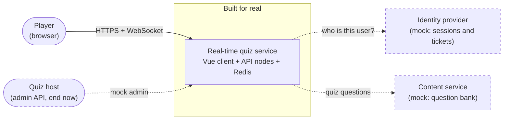
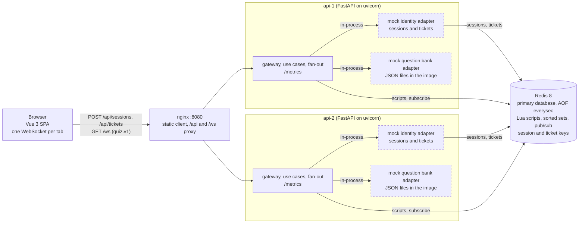

# System design: real-time vocabulary quiz

<!-- AI-ASSISTED-BEGIN: sections 1-4 drafted with Claude Code from docs/spec/ and docs/DECISIONS.md, checked by hand against the code layout and the import-linter contracts; the Mermaid diagrams were rendered with the Mermaid CLI. -->

## 1. Summary

**The problem.** Players join a vocabulary quiz with a quiz ID, answer timed questions, and
watch one shared leaderboard that changes as anyone scores. Scores must be accurate and
consistent (AC-4) even when many players answer at once through several server nodes.

**The solution.** The quiz is **self-paced**: every player gets the same questions in the same
order, one at a time, at their own pace, and all players share one live leaderboard (ADR-002).
A Vue 3 client keeps one WebSocket open to a FastAPI server. Two API nodes run behind nginx;
**Redis is the primary database** (AOF `everysec`). Every write with more than one step is one
Lua script that reads the time from Redis `TIME`, so any node can score any answer atomically
and a (player, question) scores at most once. Score changes only mark the quiz dirty; a 200 ms
coalescing tick publishes one full leaderboard frame per quiz over Redis pub/sub, numbered by a
per-quiz `seq`, and a client that sees a gap asks for a snapshot. Identity and the question bank
are mocks behind ports, and quiz admin is a mock host action (§14).

**Headline numbers.** The load runs and §9 fill in the measured column.

| Measure | Target (ours) | Measured |
|---|---|---|
| Concurrent sockets, two API nodes | thousands | TODO: from the load runs (§9) |
| Answer accepted → leaderboard delivered, p99 (C5) | below 500 ms | TODO: from the load runs (§9) |
| Leaderboard frames per quiz | at most 5 per second | by design: one per 200 ms tick, only after a change |
| Scoring rule | wrong or late 0; correct `100 + (50 * (T - e)) // T` | exact integers; one formula in Lua and Python |

## 2. Assumptions and non-goals

**Requirements.** Players join by quiz ID, scores update in real time and the leaderboard
updates promptly; nothing says who opens and closes questions. We read "real-time" as live
scores and one shared live board, and let each player set their own pace. A host-led quiz
would need one owner per quiz to open and close questions on time, with a failover story;
the self-paced model needs no owner, because no rule depends on a timer (ADR-002, ADR-006).
Host-led stays future work.

**Assumptions.**

| Topic | Assumption |
|---|---|
| Players | Anonymous: a mock session gives a user ID; the player types a display name (1–32 characters). One open tab per player and quiz; a second tab replaces the first |
| Quiz shape | 10 questions, 4 choices each, `T` = 20 s per question; the quiz is open for a window from its creation (default 10 min, at most 60 min) or until a mock host ends it |
| Time | The server decides time on one clock (Redis `TIME`); the client countdown is display only |
| Clients | Current browsers with WebSocket support; phones and desktops |
| Store | One Redis 8 (Valkey 8 also works) with AOF `everysec`; a crash can lose about 1 s of answers (§11) |
| Load (our target) | Thousands of concurrent sockets over **two API nodes** behind nginx, with a cap of 10,000 sockets per process |
| Latency (our target) | C5: p99 below 500 ms from "answer accepted" to "leaderboard delivered", measured by the load bots |

There is no load number in the requirements; our targets are the rows above, run on one and on
two nodes and reported in §9. Two nodes are our choice: they make the scale-out claims of §10
real.

**How the design meets each acceptance criterion.**

| ID | Criterion | How the design meets it |
|---|---|---|
| AC-1 | Join a quiz session with a unique quiz ID | `join {quizId}` on the socket; the `join` script registers the player once per quiz; IDs match `^[A-Z0-9-]{3,16}$` |
| AC-2 | Many users join the same session at the same time | Joins only set `dirty`, so 5,000 joins cost one frame per tick, not one per join; any node accepts any join |
| AC-3 | Scores update in real time | The scoring script returns `answer_result` with the new total at once; the next tick carries it to everyone |
| AC-4 | Scoring is accurate and consistent | One integer formula; two idempotency layers and the deadline check in one atomic script on one clock (C1–C6, §7) |
| AC-5 | A leaderboard shows all participants | Every frame carries every player up to 200; above that the top 50, each other player's own rank, and `get_leaderboard` pages |
| AC-6 | The leaderboard updates promptly | A 200 ms coalescing tick with `seq` and resync; target p99 below 500 ms (C5) |

**Non-goals.** Real accounts or an identity provider; an admin UI or question authoring; a
host-led mode; a per-player question order; results that outlive the 24 h key TTL or a durable
answer log beyond AOF; a graceful drain when a node stops (clients reconnect and resync);
metrics or dashboard containers (the API serves `/metrics` only, §13); native apps;
translations.

## 3. Architecture

**Context.** The quiz service is the one component built for real. The identity provider and the
content service are mocks behind ports, so a real one can replace each without touching the
core; the quiz host uses a token-gated mock admin API. All three are dashed.

**Containers.** The two mocks are not containers of their own: each API node loads them
in-process as adapters (dashed), and the identity mock keeps its sessions and tickets in Redis.

**Walk-through.** The client gets a mock session once (`POST /sessions`) and a single-use,
30 s ticket before every connect (`POST /tickets`); the `/api` prefix is dropped before the
API. It opens
`GET /ws?ticket=…` with the subprotocol `quiz.v1`; nginx sends the socket to either node, and
the node checks the origin, the ticket and the connection caps before the upgrade. Each
write request (`join`, `next`, `answer`) becomes one Lua script in Redis, which checks the
deadline on Redis `TIME` and writes atomically; for `answer` the script also checks the two
idempotency keys (the `submissionId` and "already answered"). A `resync` runs one
read-only script that returns the standings at one `seq` and writes nothing. The reply goes back
on the same socket. A scoring answer sets the quiz's `dirty` flag. Every node that serves the quiz
calls the tick script about every 200 ms; the one that wins the tick token increments `seq` and
publishes one `leaderboard` frame on `quiz:{<quizId>}:events`, and every node relays it to its
own sockets. Redis is the only database: the mock identity keeps its sessions and tickets
there, so a ticket made on one node works on the other. The mock question bank is read from
JSON files when a node starts.

## 4. Components

The server is one Python package, `quiz` (`api/src/quiz/`), split into layers. The
import-linter contracts in `api/pyproject.toml`, run by `make check`, enforce these rules: the
domain imports no other part of the package and none of Pydantic, FastAPI, Starlette, uvicorn,
redis-py, structlog or the Prometheus client; the ports and the use cases never import the
adapters, the fan-out, the settings, the composition root (`quiz/main.py`), redis-py or the web
framework; the ports never import the use cases; the memory, Redis, mock identity, mock question
bank and HTTP adapters never import each other, and all but the HTTP adapter never import the
use cases, the fan-out, the settings or the web framework; and no module imports the
composition root. The WebSocket gateway and the fan-out are outside these contracts, and no
contract stops a module other than `quiz/main.py` from building an adapter: that the
composition root alone wires them is a convention, not a check.

| Component | Role | Owns | Talks to |
|---|---|---|---|
| Web client (`web/src/`) | The player's UI: join, question, feedback, finished and live leaderboard | The protocol client (backoff, `seq` tracking, resync), the Pinia quiz store, the views and the UI kit | nginx: HTTP for session and ticket, one WebSocket |
| nginx (`infra/`) | The single public entry | The static client, the `/api` and `/ws` routes, WebSocket upgrade headers, `X-Forwarded-For` | Browser; both API nodes |
| API node (`quiz/main.py`) | One FastAPI process; two run side by side | `create_app()`: settings, the chosen adapters, start and stop hooks | nginx; Redis |
| Domain (`quiz/domain/`) | The quiz rules with no I/O | Scoring, standings order and ranks, the player's session states, domain errors | Nothing |
| Contracts (`quiz/contracts/`) | The wire protocol, defined once | Pydantic models of every message and the codec; the source of the generated JSON Schema and TypeScript types | Used by the use cases, the gateway and the client (generated types) |
| App (`quiz/app/`) | The use cases | `QuizService`: join, next, answer, ping, resync, leaderboard pages; turns store results into replies and errors | The ports (`Store`, `QuestionBank`, `Clock`) |
| Ports (`quiz/ports/`) | The interfaces the core depends on | `Store`, `Clock`, `QuestionBank`, `TicketStore` | Implemented by the adapters |
| Store (`quiz/adapters/redis/`, `quiz/adapters/memory/`) | Atomic quiz state | The Redis adapter: key names, script loading and every Lua script of [redis spec §3](docs/spec/redis.md#3-scripts) (`create_quiz`, `join`, `serve_question`, `score_answer`, `publish_leaderboard`, `leave`, `end_quiz`, `renew_presence`, `mark_dirty` and the read-only `read_standings`); the memory twin for unit tests, with an injected clock | Redis (scripts, `TIME`) |
| Gateway (`quiz/adapters/ws/`, `quiz/adapters/http/`) | The edge of a node | The `/ws` endpoint, the upgrade checks (origin, ticket, caps), limits before parsing, heartbeat and send buffers; `POST /sessions`, `POST /tickets`, `GET /quizzes/{quizId}`, `/healthz`, `/readyz`, `/metrics`; the mock admin `POST /admin/quizzes` and `POST /admin/quizzes/{quizId}/end` (only with `ADMIN_MOCK=1` and the `X-Admin-Token` header, else 404) | Clients through nginx; the use cases; the ticket store, the store and the question bank |
| Fan-out (`quiz/fanout/`) | Leaderboard delivery across nodes | The 200 ms tick loop per served quiz, the pub/sub subscription, relay to local sockets, snapshots after a resubscribe | Redis (tick script, pub/sub); the gateway's sockets |
| Mock identity (`quiz/adapters/mock_auth/`) | Stands in for an identity provider | Sessions and single-use tickets (Redis, or memory in tests), display-name rules | Redis |
| Mock question bank (`quiz/adapters/mock_questions/`) | Stands in for a content service | Seed quizzes in `data/*.json`, validated at start | Local files |
| Observability (`quiz/obs/`) | Logs and metrics | JSON logs (structlog) and Prometheus counters and histograms | `/metrics` |
| Redis | Primary database and backplane | All quiz keys `quiz:{<quizId>}:*`, the scripts' atomicity, the clock, the events and control channels | All API nodes |

<!-- AI-ASSISTED-END -->

## 5. Data flow
TODO: the flow from joining a quiz to a leaderboard update.

## 6. Technologies and justification

<!-- AI-ASSISTED-BEGIN: drafted with Claude Code from docs/DECISIONS.md, api/pyproject.toml and web/package.json. -->

Each choice is set against the alternative it beat and the cost we accept for it. The ADR
column points to the full reasoning in [docs/DECISIONS.md](docs/DECISIONS.md).

| Component | Choice | Alternative | Reason | Cost we accept | ADR |
|---|---|---|---|---|---|
| Server language and framework | Python 3.14, FastAPI on uvicorn (uvloop, httptools), Pydantic v2 | Node.js (Fastify and `ws`); Go | The wire messages are defined once as Pydantic models, which validate every inbound frame and generate the JSON Schema and the client's TypeScript types; asyncio fits a server that mostly waits on sockets and Redis; FastAPI serves the HTTP endpoints and the WebSocket in one app; Hypothesis tests the scoring and standings rules | One event loop per process uses one CPU core, and JSON encoding per send costs CPU, so a node holds fewer sockets than a Go server would; we scale by adding processes (two nodes) | 001 |
| Transport | One raw WebSocket per tab (`GET /ws`, subprotocol `quiz.v1`), JSON text frames, `permessage-deflate` off | Server-Sent Events plus HTTP POST; Socket.IO | One two-way channel per player with one writer per socket, so the socket delivers messages in the order the node queued them ([protocol §1](docs/spec/protocol.md#1-envelope-and-connection)); no order is promised between a reply and a broadcast; no extra framing or version-matched client library | We own the heartbeat, the reconnect with backoff and the resync from `seq` | 003 |
| State and scoring | Redis 8: one sorted set per quiz and one Lua script per multi-step write, every time read from Redis `TIME`; AOF `everysec` | `WATCH`/`MULTI` transactions; PostgreSQL with row locks | Every check and its write run in one atomic script on one clock, so a (player, question) scores at most once on any node; ranks read with `ZRANGE` in O(log N + M) | A Redis crash can lose about 1 s of answers (§11); scripts block Redis while they run, so each stays small; one quiz is bounded by one shard | 005, 008 |
| Cross-node fan-out | Redis pub/sub on `quiz:{<quizId>}:events`, a per-quiz `seq` and resync | Redis Streams; a broker (NATS, Kafka) | The tick script increments `seq` and publishes in one atomic step on the Redis we already run; frames are full standings, so a lost one is healed by one snapshot | Delivery is at most once: a missed frame costs the client a snapshot; no history survives a node restart | 004, 006, 007 |
| Client | Vue 3, Vite and TypeScript; Pinia; Vue Router; Tailwind CSS 4 with shadcn-vue on reka-ui | React with Next.js; Svelte | A small single-page app with no server rendering; single-file components, a Pinia store and the protocol client test with Vitest in happy-dom; the generated message types keep client and server in step | The protocol client (backoff, `seq`, resync) is our code; shadcn-vue components are copied into `web/src/components/ui/`, so we maintain them | 009 |
| Edge | nginx: the static client, the `/api` and `/ws` routes to both API nodes | Traefik or HAProxy; uvicorn exposed directly | One origin for the page, the API and the socket, so the origin check stays strict; WebSocket upgrade headers and `X-Forwarded-For` for the per-IP cap; a plain, well-known config | Hand-written config whose read timeouts must exceed the 25 s heartbeat; one nginx is a single point of failure in this stack | 003 |
| Metrics and logs | The Prometheus client (`prometheus-client`) serves `/metrics` on each API node; structlog writes JSON logs. No Prometheus server or Grafana container | OpenTelemetry SDK with a collector; a Prometheus and Grafana stack in Compose | One library and the text format any scraper reads; the stack stays small and the counters and histograms are there for any existing Prometheus to scrape (§13) | No stored history or dashboards in this build: you read `/metrics` directly, and the load runs report their own latency numbers | — |
| Packaging and running | Docker Compose: Redis, two API nodes, nginx and the built client | Kubernetes (kind or minikube); processes started by hand | One command brings the whole stack up the same way on any machine with Docker; the tests start their own Redis container on a free port | One host: no autoscaling, rolling deploy or node spread; production would need an orchestrator | — |
| Build and test tooling | uv and pnpm with committed lock files; pytest, pytest-asyncio and Hypothesis; Vitest | pip or Poetry; npm; unittest | Fast, reproducible installs from the lock files in CI and locally; property tests for the rules that must hold for every input | Two toolchains (Python and Node) to install; the lock files are regenerated, never merged by hand | — |

Exact versions: `api/uv.lock` and `web/pnpm-lock.yaml`; runtimes in `.python-version`,
`.nvmrc`, `web/package.json` (`packageManager`) and `compose.yaml`.

<!-- AI-ASSISTED-END -->

## 7. Consistency contract
TODO: the scoring and ordering guarantees, their mechanisms and the tests that prove them.

## 8. Non-functional requirements
TODO: latency, throughput, availability and durability targets.

## 9. Capacity estimate

<!-- AI-ASSISTED-BEGIN: sections 9 and 10 drafted with Claude Code from api/src/quiz/config.py, the contracts, docs/spec/ and docs/DECISIONS.md; the frame sizes were computed by encoding sample frames in compact JSON. -->

Every number below is either an input with its source, a value computed from those inputs (the
formula is given), or a measurement from a load-run file. The measured table is the last part.

**Assumptions.**

| # | Assumption | Value | Source |
|---|---|---|---|
| A1 | Quiz shape | 10 questions, 4 choices, `T` = 20 s each | ADR-002; [domain spec](docs/spec/domain.md) |
| A2 | Coalescing tick | 200 ms, only while the quiz is dirty | `tick_ms` in `api/src/quiz/config.py` |
| A3 | Rows per `leaderboard` frame | every player up to 200 (`FULL_LIST_MAX`), else the top 50 (`TOP_N`) | `api/src/quiz/contracts/messages.py` |
| A4 | Socket caps | 10,000 per process (`MAX_CONNECTIONS`), 50 per client address | `api/src/quiz/config.py` |
| A5 | Send buffer per socket | soft 64 KiB (conflate leaderboards), hard 256 KiB (close 1013) | `api/src/quiz/config.py` |
| A6 | Inbound limits | 16 KiB per message, checked before parsing; 64 KiB per transport frame; 20 msg/s, burst 40 | `api/src/quiz/contracts/codec.py`, `api/src/quiz/adapters/ws/heartbeat.py`, `api/src/quiz/config.py` |
| A7 | Messages per connection per tick | at most 2: one `leaderboard` and, above 200 players, one `rank_update` | ADR-004 |
| A8 | `userId` length | 18 characters (`u_` and 16 base64url characters) | `api/src/quiz/adapters/mock_auth/tokens.py` |
| A9 | `displayName` length | 12 characters typical (our assumption), 32 characters at most (not bytes) | our assumption; `api/src/quiz/contracts/messages.py` |
| A10 | Highest total | 1,500 (10 × 150), so a score has at most 4 digits | the scoring rule (ADR-002) |
| A11 | Player pace | one answer per player every 5 s (reading plus thinking) | our assumption; the load bot's think time `think_s` (`load/player.py`) |
| A12 | API nodes | 2, each one Python process on one event loop | ADR-001; ADR-003 |

**Leaderboard frame size** (computed). One row is
`{"rank":123,"userId":"u_…","displayName":"…","score":1234}`: 84 bytes with A8, a 12-character
name and A10. A frame is about `100 + 85 × rows` bytes. Encoding sample frames gives:

| Frame | Rows | Bytes, 12-character names | Bytes, 32 ASCII characters |
|---|---|---|---|
| 10 players | 10 | 932 | 1,132 |
| 200 players (largest full frame) | 200 | 16,995 | 20,995 |
| Above 200 players (top 50) | 50 | 4,296 | 5,296 |

The cap of A9 counts characters, not bytes, and allows any text: the JSON writes non-ASCII
characters as raw UTF-8 (up to 4 bytes each) and control characters as 6-byte `\u00XX` escapes.
So a 200-row frame of 32-character names is at most about 40 KB with 4-byte characters
(`20,995 + 200 × 32 × 3`) and about 53 KB with control characters (`20,995 + 200 × 32 × 5`).
The rest of this section uses the 12-character column.

**Per-connection memory** (computed, a partial estimate). A healthy socket's send queue is
empty between ticks; one queued 200-row frame is 17 KB. The soft limit (A5) holds
`64 KiB / 16,995 B` ≈ 3.9 full frames, so a client about 0.8 s behind at 5 frames/s gets
conflated frames. A slow or abusive socket can fill these buffers in the process:

| Buffer | Bound | Source |
|---|---|---|
| Send queue (`Sender.buffered`, the frame in flight included) | 256 KiB, then close 1013 | A5 |
| Transport write buffer | 64 KiB high-water mark, plus the one frame that crossed it; WebSocket pongs to client pings skip that wait, so a client that floods pings and reads nothing grows it further | the event loop's default; uvicorn waits for `resume_writing` before the next message |
| Inbound messages parsed from one read | 250 KiB: uvloop reads up to 256,000 bytes at a time, and uvicorn queues every complete frame of that read before reading pauses | uvloop's read size (uvicorn uses uvloop when it is installed); uvicorn's WebSocket protocol |
| Partial inbound frame in the parser | 64 KiB (A6) | A6 |

Their sum is about 634 KiB per socket plus one outbound frame, or 10,000 × 634 KiB ≈ 6.0 GiB
at the 10,000-socket cap if every client is slow and floods at once. Python's object overhead,
the decoded copies of queued messages and the kernel's socket buffers come on top, so this is
not an upper bound. The steady-state memory per socket (RSS divided by sockets) comes from the
measured runs below.

**Connections per node** (computed). The cap is 10,000 sockets per process (A4); two nodes
hold 20,000. In one hot quiz above 200 players, each socket gets at most 5 frames per second
(A2), so 10,000 sockets need 50,000 frame writes per second, which is
`50,000 × 4,296 B` ≈ 215 MB/s of egress per node, plus at most one `rank_update` per socket
per tick (A7). All of it runs on one core (A12), so CPU or the network is likely to set the
practical number below the cap: 215 MB/s is about 1.7 Gbit/s before framing, above a 1 Gbit/s
link. The measured runs give the number and the memory per socket.

**Messages per question** (computed). For a quiz of `N` players, per player and question:

- in: 2 (`next`, then `answer`); out: 2 unicasts (`question`, `answer_result`);
- broadcast: at most 5 `leaderboard` frames per second per quiz (A2), so at most
  `T / 200 ms` = 100 frames in one 20 s question window, each sent to all `N` sockets: at most
  `100 × N` frame writes per quiz per question window;
- above 200 players, at most one `rank_update` per socket per tick (A7).

The tick publishes only after a change: an answer that scores, a join or a leave sets `dirty`
(`score_answer.lua`, `join.lua`, `leave.lua`). Counting answers only, with A11 they arrive at
`N / 5` per second; if a share `p` of them scores, a 200 ms tick sees no change with probability `e^(−pN/25)` (Poisson arrivals): 1.8 % at
`N` = 100 when every answer scores, 37 % when a quarter does. From about `100 / p` players on,
nearly every tick publishes.

| Players in one quiz | Frame | Frame writes per second (`5 × N`) | Egress per second (`5 × N × bytes`) | Answers per second (`N / 5`) |
|---|---|---|---|---|
| 10 | full, 932 B | 50 (if every tick has a change) | 47 KB | 2 |
| 200 | full, 16,995 B | 1,000 | 17.0 MB | 40 |
| 1,000 | top 50, 4,296 B | 5,000 | 21.5 MB | 200 |
| 5,000 | top 50, 4,296 B | 25,000 | 107.4 MB | 1,000 |

Redis load per second (computed, a subtotal of the main calls):

- `N / 5` scoring scripts and `N / 5` serving scripts for `next`;
- 5 tick-script calls per active quiz for every node that holds a socket of the quiz (ADR-006,
  §10); above 200 players each call that publishes also runs one `ZRANK` for each scorer since
  the last frame and one `HGET` for each of those outside the top 50, and the frames cost one
  `PUBLISH` per tick per quiz;
- one `GET` per `ping` for `pong.seq`: sockets / 25 s, 400 per second for 10,000 sockets
  (ADR-004);
- above 200 players, one `read_standings` per node per quiz per second for players whose rank
  only shifted ([redis spec](docs/spec/redis.md), "Reads at one `seq`").

5,000 players in one quiz on two nodes cost 1,000 + 1,000 + 10 + 2 script calls and 200 `GET`s
per second, plus up to 2,000 calls inside the tick script at A11's pace. Not counted: snapshots (1 to 3
script calls each; concurrent misses of the cached standings share one read), the presence renew every 3 s per node and quiz, joins and reconnects, and
clients that send faster than A11 (up to 20 messages per second per socket, A6).

**Measured numbers.**

TODO: the measured runs from `load/README.md` and `load/results/` (scenario, connections,
msg/s, p50, p95 and p99 in ms, CPU %, RSS in MB, the machine used) and whether C5 (p99 below
500 ms) was met.

## 10. Scalability and trade-offs

**How it scales out today.** Any node can take any socket and score any answer, because every
write is one Lua script in Redis and no node owns a quiz (ADR-006). Adding an API node adds
sockets and CPU for frame writes; each node subscribes once per quiz it serves and receives
one copy of each frame from Redis. Redis is the shared part: every write and every tick of
every quiz runs there.

**Trade-offs.**

1. **No owner lease.** We chose no owner per quiz (the `dirty` gate and a 200 ms tick token)
   over an owner lease with a fencing token, because a self-paced quiz has no timer-driven rule
   and a dead node then needs no failover step, and we accept the cost of having no owner: every
   node checks each active quiz's `dirty` flag 5 times a second, even when nothing changed.
   That is `5 × nodes × active quizzes` script calls per second; two nodes serving 500 quizzes
   make 5,000 calls per second on an idle system.
2. **Pub/sub against Streams.** We chose Redis pub/sub with a per-quiz `seq` and resync over
   Redis Streams, because frames carry full standings, so one snapshot heals any lost frame and
   resync is needed anyway, and we accept at-most-once delivery: when a node's subscription
   drops, every client on that node gets a snapshot at once, and no frame history survives a
   node restart (ADR-007). Streams are the next step if those snapshot bursts become frequent.
3. **Redis AOF against a durable log.** We chose Redis with AOF `everysec` as the only
   database over a durable answer log (PostgreSQL or Kafka), because one script on one clock
   gives the whole consistency contract (§7) in one round trip, and we accept that a crash can
   lose about 1 s of answers: a client retries only answers that have no `answer_result` yet,
   so acknowledged answers in that second are lost (an announced end survives through
   `WAITAOF`). We also accept that results expire 24 h after the last write (ADR-005, ADR-008).
4. **A coalescing tick against a frame per answer.** We chose one frame per quiz per 200 ms
   over a broadcast per answer, because the cost per socket stays at most 5 frames per second
   whatever the answer rate (§9), and we accept up to 200 ms of the 500 ms C5 budget spent
   waiting for the tick (ADR-004).
5. **Full standings against diffs.** We chose frames with full standings (up to 200 rows) over
   diffs, because a lost or conflated frame never leaves a client with wrong standings, and we
   accept the bytes: at 200 players a socket receives up to `5 × 16,995 B` ≈ 85 KB/s (§9).
   Above 200 players the frame shrinks to the top 50, and each other player gets their own
   `rank_update`.
6. **What changes at 100,000 players.** We chose a design sized for thousands of sockets on two
   nodes over one built for 100,000 now, because the goal is a working real-time quiz,
   and we accept these changes for 100,000 players:
   - Sockets: at least 10 processes at the 10,000 cap, more if the measured per-node number is
     lower, and a load balancer layer instead of one nginx, which would hold 200,000 sockets
     (client side and upstream side).
   - Many small quizzes (10,000 quizzes of 10): with sockets spread at random over 10 nodes, a
     node holds a socket of a given quiz with probability `1 − 0.9^10` ≈ 0.65, so a quiz is on
     about 6.5 nodes and the ticks alone cost `5 × 6.5 × 10,000` ≈ 326,000 script calls per
     second. Routing by quiz ID brings each quiz to one or two nodes: 50,000 to 100,000 calls
     per second. It needs the quiz ID in the `/ws` URL (today the URL carries only the ticket,
     and the quiz ID arrives later in `join`) and an L7 balancer that hashes on it, since an L4
     balancer sees only the TCP connection; a lookup before connecting that returns the node
     for the quiz also works. Past that, a `control` message when `dirty` is first set would
     replace the polling.
   - One quiz of 100,000: the nodes write `5 × 100,000` = 500,000 frames per second, 2.1 GB/s
     of egress for the top-50 frame, spread over the nodes. One Redis shard runs all of the
     quiz's scripts, because one quiz stays in one slot: 20,000 scoring and 20,000 serving
     scripts per second (`N / 5` each), plus the ticks. Each published frame also ranks every
     scorer since the last frame: about 4,000 at A11's pace (a burst can bring far more), so
     about 8,000 `ZRANK` and `HGET` calls inside one blocking script, and a `ranks` array of
     about 135 KB in every `PUBLISH`, 5 times a second, to every node. These run in a write
     script, so read replicas cannot take them; the tick would rank only the top band and leave
     the rest to the once-per-second reads. Those reads (`read_standings`, one per node per
     second) only read, so they could move to read replicas once the loader also loads the
     script there, if ranks that lag behind the primary under asynchronous replication are
     acceptable; coarser rank bands are the other option.

**Redis as one process: failure.** Today a Redis outage stops the service: scripts fail with
`UNAVAILABLE` and `/readyz` returns 503 (§11). The next step is a replica with Sentinel, or a
managed Redis with automatic failover. Replication is asynchronous, so a failover can lose the
last acknowledged writes like an AOF crash does, and `seq` can go back. A client already
resyncs on `seq < lastSeq`, but if the counter goes back and then climbs past `lastSeq` before
the client sees a frame, the numbers alone do not show the reset. So frames would carry a
`seq` epoch next to `seq`: a random value stored with the counter, together with the
replication ID it was made under. A node that sees a new replication ID (`master_replid` in
`INFO replication`) passes the ID it knew and the new one to one script, which renews the
epoch only when the stored ID is still the one the node knew (compare and set), so one
failover renews it once however many nodes see it, and a late observer changes nothing. A client that sees a new
epoch resyncs, whatever the number. The host end would wait for the replica too
(`WAITAOF 1 1 <timeout>`, with `appendonly yes` on the replica), so an announced end survives
a failover when the promoted replica is the one that confirmed it; with one replica that always
holds, and Redis gives no stronger guarantee.

**Redis as one process: growth.** Past one Redis, a Redis Cluster spreads quizzes over shards.
The hash tag in every key (`quiz:{<quizId>}:*`) keeps one quiz in one slot, so each script
still touches only keys of one shard and stays atomic (ADR-008); the largest quiz is bounded
by one shard. Plain `PUBLISH` on a Cluster is sent to every shard, so the tick script would
use sharded pub/sub (`SPUBLISH` on `quiz:{<quizId>}:events`, which hashes to the quiz's slot)
and each node would hold one `SSUBSCRIBE` connection per shard.

<!-- AI-ASSISTED-END -->

## 11. Reliability and failure modes
TODO: the failure table (failure, detection, system behavior, user-visible effect, mitigation, proving test).

## 12. Security
TODO: authentication, input limits, origin checks and abuse limits.

## 13. Observability
TODO: logs, metrics and how to diagnose a slow or stuck quiz.

## 14. Implemented and mocked

<!-- AI-ASSISTED-BEGIN: drafted with Claude Code from the ADR index and the mock adapters' docstrings, checked by hand against the code. -->

**Built for real: the real-time quiz service** (ADR-001), end to end: the Vue client, the
WebSocket gateway, the use cases, the Redis scoring scripts, the coalescing tick and the
pub/sub fan-out across two API nodes behind nginx, plus the tests and the load bots that check
it.

| Part | Implemented in this build |
|---|---|
| Quiz rules and scoring | `quiz/domain/`, mirrored by the Lua scripts; `points.lua` is checked against Python for every elapsed value |
| Atomic state and the clock | The Redis adapter and its Lua scripts; the in-memory twin for unit tests |
| Wire protocol | Pydantic contracts with generated JSON Schema and TypeScript types |
| Gateway and fan-out | The `/ws` endpoint, limits, heartbeat, send buffers; the tick, pub/sub relay, `seq` and resync |
| Client | The Vue 3 app: protocol client with backoff and resync, Pinia store, screens |
| Scale-out | Two API nodes, nginx, one Redis, a two-node integration test and load runs |

**Mocked.** The identity and question-bank mocks sit behind ports (`TicketStore`,
`QuestionBank`); quiz admin is a token-gated mock admin API in the HTTP adapter, off unless
`ADMIN_MOCK=1`. All three say `MOCK:` in their code: the adapters' module docstrings, the
`/admin` routes and the `ADMIN_MOCK` setting in `quiz/config.py`.

| Mock | What this build does | What production would use instead |
|---|---|---|
| Identity and tickets (`quiz/adapters/mock_auth/`) | `POST /sessions` makes an anonymous user ID and a session token; `POST /tickets` makes a single-use 30 s ticket; both kept in Redis | The company's identity provider (OIDC) for users and sessions; the single-use ticket mechanism stays as built |
| Question bank (`quiz/adapters/mock_questions/`) | Seed quizzes read from JSON files at start-up | A content service or database, edited in an authoring tool |
| Quiz admin (`quiz/adapters/http/`, `ADMIN_MOCK`) | `POST /admin/quizzes {quizId, timeLimitMs, windowMs}` starts a quiz from the bank, only with `ADMIN_MOCK=1` and a matching `X-Admin-Token` header (else 404); a mock host action "end now" ends a quiz early | The admin API behind the identity provider, with per-user roles in place of one shared token, plus an admin UI for scheduling and quiz settings |

<!-- AI-ASSISTED-END -->

## 15. AI Collaboration in Design

<!-- AI-ASSISTED-BEGIN: drafted with Claude Code from the design-phase and spec-PR AI-LOG entries, checked by hand against the specs and the named tests, which were run. -->

I designed this system with AI, and I treated every AI output as a draft to be checked. One
model drafted, a different model reviewed, and nothing counted as fixed until a spec section
stated the fix and a test pinned it. The full record is in the AI-LOG entries (below).

**Tools and models.**

| Tool | Model | Role in the design |
|---|---|---|
| Claude Code | claude-opus-5-5 | Drafted the architecture, the protocol, the Redis data model and scripts, the UI spec, the test strategy and the ADRs |
| Codex CLI | `gpt-6-astra`, high reasoning, read-only sandbox | Independent reviewer of the design drafts, of each spec PR once it merged, and of every later PR before its merge |
| A second Claude Code agent | claude-opus-5-5, fresh context, read-only | Independent reviewer of the design drafts, with no access to how they were written |
| Claude Code `/code-review` | claude-opus-5-5, high | Reviewer of each spec PR once it merged and of every later PR before its merge, next to Codex |

**Design tasks and the nature of each interaction.**

| Task | How I worked with the AI |
|---|---|
| Architecture and data flow (§3, §4) | I gave Claude Code the README and the fixed choices (self-paced quiz, one Redis, two API nodes); it drafted the diagrams and the component table, which I checked against the code layout and the import-linter contracts |
| Domain rules (`docs/spec/domain.md`, ADR-002) | Drafted from my list of rules and scoring examples; I recomputed every scoring example with the formula |
| Protocol (`docs/spec/protocol.md`, ADR-003, ADR-004) | Drafted from the message names, the `seq` rules and the limits; I traced the ordering of frames on one socket by hand |
| Redis store (`docs/spec/redis.md`, ADR-005 to ADR-008) | Claude Code designed the key schema, the script contracts and the tick without an owner; I checked each script against the `seq` rule |
| UI (`docs/spec/ui.md`) | Drafted the state chart and the tokens; contrast ratios were computed by a script, not estimated |
| Design review | One neutral prompt to Codex and to a second Claude agent, run in parallel and read-only; I checked each claim against the draft text before adopting it |

**What the design review found.** Both reviewers read the drafts before any spec was merged.
Four of the defects below were found by both reviewers independently, which made them the first
to fix. Each now has a spec section and a test (`docs/ai-log/design-phase.md` lists them all):

| Defect in the AI draft | What changed | Pinned by |
|---|---|---|
| A reconnect created a new player: tickets came from the display name and were single use | A session token per tab gets a fresh ticket for the same user before every connect (protocol §8) | `api/tests/unit/adapters/test_mock_auth.py`, `web/src/protocol/identity.test.ts` |
| A retried `next` could skip a question or restart its 20 s timer | `next` and `answer` carry the question index; the serve time is stored once (domain §5.1) | `api/tests/unit/test_session.py`, `api/tests/integration/test_serve_script.py` |
| Only the tick checked the deadline, and ticks stop on a node without sockets | `join`, `serve_question`, `score_answer` and the tick script `publish_leaderboard` check the deadline on Redis `TIME` and refuse late writes; `leave` is still accepted after it (Redis §3) | `api/tests/integration/test_score_script.py`, `api/tests/integration/test_join_script.py`, `api/tests/contract/test_store_contract.py` (on the memory and the Redis store) |
| The packed sorted-set score overflows after about 69.9 min; 0-point answers moved the tie-break | The window is at most 60 min; `reachedRelMs` moves only on points (domain §6) | `api/tests/integration/test_create_quiz.py`, `api/tests/unit/test_standings.py` |
| Each join broadcast to everyone: about 12.5 million sends for 5,000 joins | A join only sets `dirty`; the next coalesced frame carries the count (ADR-004) | `api/tests/integration/test_join_script.py` |

**What the reviews of the spec PRs found.** After each spec PR merged, `/code-review` (high) and
Codex reviewed it; I combined the two lists, verified each finding against the text, and fixed
the confirmed defects in a follow-up PR:

| Spec PR | Confirmed defects (examples) | Fix PR and test |
|---|---|---|
| #3 domain | The `next` table had no order and two rows overlapped at the last question | #34; `api/tests/unit/test_session.py` |
| #5 protocol | A newer frame conflated ahead of a queued `pong` looked like a store restart; `pong.seq` came from a node cache; a late `snapshot` could undo `quiz_ended`; a failed `join` bound the socket; the unicast `atSeq` had no client rule; the upgrade refusals had no close code | #26, #30; `scripts/tests/test_protocol_spec.py` (the `atSeq` rule, the upgrade refusals seen as close 1006), `api/tests/unit/app/test_service.py` (`pong.seq` from the counter, the failed `join`), `web/src/protocol/seq.test.ts` (the late `snapshot`), `api/tests/integration/ws/test_connections.py::test_a_conflated_client_gets_rebase_true_and_sends_no_resync` (the conflation barrier: a held `leaderboard` stays before a `leaderboard_page`, the same send path a `pong` takes) |
| #7 UI | The connection chart had no edges into `blocked` from `joining` or `resyncing`, and none out of `joining` after the end | #18; `scripts/tests/test_ui_spec.py` |
| #9 Redis | `create_quiz` accepted `T = 0` (the points formula divides by `T`); a finished player could be served again; presence was never cleared after a node crash | #16; `api/tests/integration/test_create_quiz.py` (`T = 0`), `api/tests/integration/test_serve_script.py` (the finished player); the presence renewal of Redis §3, built later: `api/tests/contract/test_store_contract.py`, `api/tests/integration/fanout/test_presence.py` |

Claude Code also caught some of its own mistakes while drafting. In the Redis spec it first
planned to end the quiz inside the write script that hit the deadline, which would have made
the scoring script increment `seq`; it caught this against the `seq` rule and changed it before
writing the script table (PR #9).

**Suggestions I rejected, and why.**

- **Remove the snapshot cache** (Codex, design review). The concern was real: answers do not
  move `seq`, so a cached per-player snapshot could be stale. Removing the cache was more than
  needed. I kept the cache for the shared standings only, per `seq`, status and player count,
  and read the player's own row fresh. The shared list is the standings as of the cached read:
  `score_answer` does not move `seq`, so the list can lag answers scored since then until the
  next tick's frame corrects it; only the own row is always current
  (`api/tests/unit/app/test_service.py`, `test_snapshot_caches_the_shared_part_per_seq`).
- **Finish a player only from the last question** (the review of PR #3). The review read the
  session core as strict, but a PR merged after the review made it finish from any cursor, with
  tests. Following the review would have changed working, tested behavior, so the spec follows
  the code (`test_next_n_finishes_from_any_cursor`).
- **Keep a lower `pong.seq` as a restart signal** (Claude Code, PR #26). Tracing the order of
  events showed that the counter read and the pub/sub relay use different Redis connections, so
  a frame can overtake a `pong` that read an older counter; the rule would have fired false
  resyncs. A restart is detected from `seq < lastSeq` on a broadcast instead.

**How I verified.** (1) A neutral review prompt that held none of my own suspicions, so the
reviewers could not just agree with me. (2) Two reviewers from two vendors, run independently;
agreement between them raised a finding's priority. (3) Every claim checked against the draft
before it was adopted; one Codex claim (the store tests must run on both stores) was already in
the draft. (4) Every fix stated in a spec section, with the test that pins it listed in
`docs/ai-log/design-phase.md` (and in the spec's own test list, where it has one). (5) The
tests run: `make test-integration` and the unit suites in `make check` pass on `main`; the exact
commands and results are in each AI-LOG entry.

**AI-LOG entries for the design.** `docs/ai-log/design-phase.md`; the spec PRs
`docs/ai-log/PR-3.md`, `PR-5.md`, `PR-7.md`, `PR-9.md`; and their fix PRs `PR-16.md`,
`PR-18.md`, `PR-26.md`, `PR-30.md`, `PR-34.md`. Every later PR has its own entry in
`docs/ai-log/`.

<!-- AI-ASSISTED-END -->

## 16. ADR index

<!-- AI-ASSISTED-BEGIN: one-line summaries drafted with Claude Code from docs/DECISIONS.md. -->

Every decision is recorded in full (context, decision, alternatives considered, consequences) in
[docs/DECISIONS.md](docs/DECISIONS.md). ADRs are never renumbered; a later ADR supersedes an earlier one.

| ADR | Decision |
|---|---|
| [ADR-001](docs/DECISIONS.md#adr-001--build-the-real-time-quiz-service-with-a-python-and-fastapi-server-mock-identity-questions-and-admin) | Build the real-time quiz service for real (Python and FastAPI server, Vue client); mock identity and tickets and the question bank behind ports; quiz admin is a token-gated mock admin API and a mock host action ("end now"). |
| [ADR-002](docs/DECISIONS.md#adr-002--self-paced-quiz-model-and-the-integer-scoring-rule) | Self-paced quiz: each player sets their own pace on one shared live board; integer scoring `100 + (50 * (T - e)) // T`, wrong or late 0. |
| [ADR-003](docs/DECISIONS.md#adr-003--transport-raw-websocket-on-fastapi-and-uvicorn) | One raw WebSocket per tab on FastAPI and uvicorn, subprotocol `quiz.v1`, a single-use ticket checked before the upgrade. |
| [ADR-004](docs/DECISIONS.md#adr-004--wire-protocol-standings-policy-and-the-200-ms-coalescing-tick) | Versioned JSON messages with a per-quiz `seq` and resync; full standings up to 200 players, else the top 50 plus `rank_update`; one frame per 200 ms tick. |
| [ADR-005](docs/DECISIONS.md#adr-005--redis-sorted-set-and-lua-scripts-for-scoring-aof-everysec) | Redis sorted set with a composite score and one Lua script per multi-step write, on Redis `TIME`; AOF `everysec`. |
| [ADR-006](docs/DECISIONS.md#adr-006--no-owner-per-quiz-the-dirty-gate-and-a-tick-token) | No owner per quiz: any node runs the tick; a `dirty` gate and a 200 ms tick token decide who publishes. |
| [ADR-007](docs/DECISIONS.md#adr-007--backplane-redis-pubsub-seq-and-resync-streams-as-the-next-step) | Redis pub/sub carries frames and session replacement between nodes; a gap in `seq` triggers a snapshot; Streams are the next step. |
| [ADR-008](docs/DECISIONS.md#adr-008--one-redis-schema-for-scoring-and-fan-out) | One Redis schema: every key of a quiz under the hash tag `quiz:{<quizId>}:*`, one 24 h TTL, ready for a Cluster. |
| [ADR-009](docs/DECISIONS.md#adr-009--repository-layout-and-the-vue-client-api-web-generated-contracts) | One repository with `api/`, `web/` and generated `contracts/`; a Vue 3, Vite, Pinia and Tailwind client using types generated from the Pydantic models. |

<!-- AI-ASSISTED-END -->
