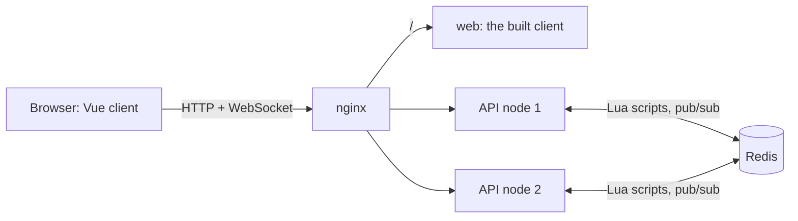

<!-- AI-ASSISTED: project overview: the live demo, video and test plan, what it does, how it works, the AI collaboration, where the documents are, how to try it locally and how to run the tests. -->
# Real-time vocabulary quiz

Players join a vocabulary quiz by its ID, answer timed questions, and watch one shared
leaderboard move live as anyone scores, across two server nodes.

[](https://github.com/kobars/realtime-vocab-quiz/actions/workflows/ci.yml)
[](https://scorecard.dev/viewer/?uri=github.com/kobars/realtime-vocab-quiz)

**Live demo:** <https://kobar-vocab-quiz-web.fly.dev>, on Fly.io. Start a quiz on its host page,
[/host](https://kobar-vocab-quiz-web.fly.dev/host), open the player link it shares in two browser
windows and join with a different name in each. The demo is shared: it holds at most 50 open
self-hosted quizzes, and one address can start only a few in a short time.

**Video walkthrough:** <https://www.youtube.com/watch?v=7gOKTPEs5Ak>

**Test plan:** <https://claude.ai/artifact/3i4p3bdSeFWfEen9UehCJi>: the manual and automated test
cases, each mapped to the requirement it proves, with the result of the latest verification run.


## What it does

- **Join by quiz ID:** any number of players join the same quiz from their own browser tab.
- **Real-time scoring:** the server scores each answer exactly once, on its own clock, and the
  player's score updates the moment the answer is accepted.
- **Live leaderboard:** every player sees the same standings, refreshed about five times a
  second while anyone is scoring, whichever node their socket is on.
- **Host a quiz:** any visitor can start a quiz from a question set on the host page (`/host`),
  share its `/q/<quizId>` link and end it early with the host token the tab keeps; a per-address
  limit and a cap on open quizzes keep it bounded.

The real-time server and self-service hosting are built for real, and the Vue client is their
working demo interface, for players and hosts. Identity, the question bank and the admin API behind the make
targets are mocks ([DESIGN.md §14](DESIGN.md#14-implemented-and-mocked)).

## How it works



Each answer runs as one Lua script in Redis, which scores it once and updates the quiz's sorted
set. A 200 ms tick on one node publishes the standings over Redis pub/sub, and every node relays
them to its own sockets. [DESIGN.md](DESIGN.md) has the full design.

## AI collaboration

Claude Code wrote the design, the code and the tests; every source file it wrote carries an
`AI-ASSISTED` marker. Each pull request has an entry in [docs/ai-log/](docs/ai-log/README.md): the
tool, the task, the interaction, how it was verified and the mistakes caught in review by
Claude Code `/code-review` and Codex. [DESIGN.md §15](DESIGN.md#15-ai-collaboration-in-design)
tells how the design was made.

### Harness and CI

The checks below are the harness that keeps AI-written changes honest: a change merges only when
they pass, whoever wrote it.

- **`make check`, on the laptop and in CI:** ruff, ESLint, shellcheck, typos and an offline link
  check; mypy; import-linter, which keeps the API's layers apart; deptry; actionlint and zizmor
  on the workflows; the unit, property and acceptance tests; a drift check of the generated
  contracts; vue-tsc, Vitest and the client build.
- **Pull-request guards** (`scripts/check_pr.py`): the frozen acceptance tests change only with
  a label, a PR stays under 400 changed lines unless labelled, every commit carries the
  `AI-Assisted:` trailer, and the PR's AI-LOG entry exists. `make review-budget` flags a PR too
  big to review well.
- **CI on every push** ([.github/workflows/](.github/workflows/)): `ci` adds the integration tests
  on Redis, the visual and accessibility specs, and coverage floors of 95% combined and 90% on
  the changed lines; `stack` runs the system and browser tests on the full stack; `containers`
  builds the images and publishes them on `main`; `security` runs the secret scan, the dependency
  review and audits; CodeQL and OpenSSF Scorecard run as well.
- **Scheduled runs:** the stack nightly and the rest weekly, with an online link check; a
  scheduled failure opens an issue.

## Documentation

Design:

- [DESIGN.md](DESIGN.md): the system design; start with its [reading map](DESIGN.md#reading-map)
- [docs/DECISIONS.md](docs/DECISIONS.md): the decision records, one file per ADR
- [docs/spec/](docs/spec/README.md): the domain, protocol, Redis and UI specs
- [docs/capacity.md](docs/capacity.md): the capacity estimate behind the load targets

Evidence:

- [load/README.md](load/README.md): the measured load runs and how to repeat them
- [docs/ai-log/README.md](docs/ai-log/README.md): how AI was used, one entry per merged PR

Engineering:

- [CONTRIBUTING.md](CONTRIBUTING.md): running the stack, development, the make targets, the [project layout](CONTRIBUTING.md#project-layout) and troubleshooting
- [AGENTS.md](AGENTS.md): the rules for every change, AI markers included
- [docs/operations.md](docs/operations.md): ports, endpoints, configuration, metrics and deploying to a VM or to Fly.io
- [web/packages/clay/README.md](web/packages/clay/README.md): the Clay design system and its gallery
- [SECURITY.md](SECURITY.md): how to report a vulnerability

## Quick start

You need Docker (Compose v2) and `make`.

```bash
git clone https://github.com/kobars/realtime-vocab-quiz.git
cd realtime-vocab-quiz
make demo
```

`make demo` writes `.env` with new secrets on the first run, builds the images, starts the stack,
starts a fresh 60-minute quiz with 20 bots playing it, and prints its ID, its player URL and the
command that ends it:

```text
Quiz ID:    VOCAB-42-7K3Q (open for 60 min)
Player URL: http://localhost:8080/q/VOCAB-42-7K3Q
End it:     make demo-end ID=VOCAB-42-7K3Q
```

Open the player URL in two browser windows, join with a different name in each, choose
**Start** and answer: both leaderboards update within a fraction of a second. Run the printed
end command and both windows show the final podium. `make new-quiz` starts another quiz on the
running stack, and `make down` stops everything.

To serve it over HTTPS from a fresh Ubuntu VM, one command installs it on the images that CI
publishes, and `make do-deploy` creates that VM on DigitalOcean from a laptop: see
[Deploy to a VM](docs/operations.md#deploy-to-a-vm). `make fly-launch` and `make fly-deploy` run it
on Fly.io instead: see [Deploy to Fly.io](docs/operations.md#deploy-to-flyio).

## Run the tests

The host tests need Docker, Python 3.14 with uv and Node 24 with pnpm:
`uv sync --project api && pnpm -C web install` ([CONTRIBUTING.md](CONTRIBUTING.md#set-up)).

- `make check`: lint, types, the unit, property, contract and acceptance tests, the client tests
  and build; every change passes it.
- `make test-integration`: the tests that need Redis (in a container of their own, or at
  `REDIS_URL` when it is set), then the acceptance tests on Redis.
- `make test-system`: the system tests through nginx against the running stack: a score on one
  node reaches a socket on the other. They need fresh stack data, not the `make demo` stack
  ([CONTRIBUTING.md](CONTRIBUTING.md#run-the-tests) has the steps).
- `make test-browser`: the browser specs in Chromium, with an accessibility scan, against the
  same fresh stack, after the system tests (`web/e2e/`; install Chromium once with
  `pnpm -C web exec playwright install chromium`).

`make help` lists the rest; [CONTRIBUTING.md](CONTRIBUTING.md#run-the-tests) explains each layer.
