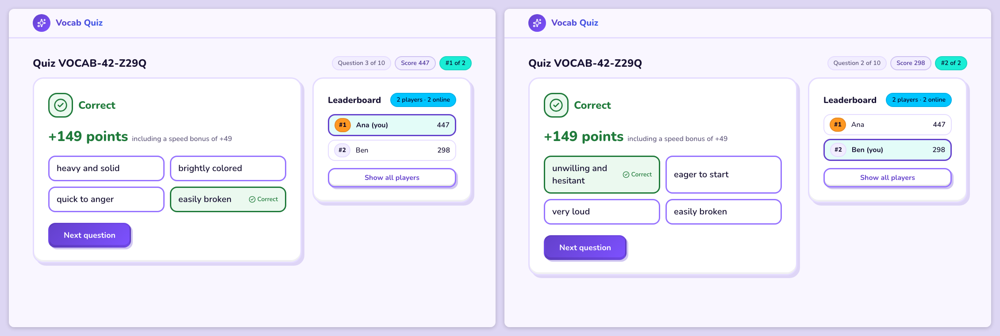
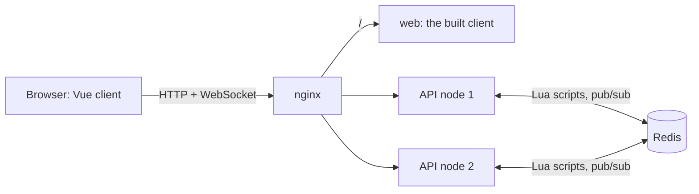

<!-- AI-ASSISTED: project overview: what it does, how to try it, run the tests, how it works and where the documents are. -->
# Real-time vocabulary quiz

Players join a vocabulary quiz by its ID, answer timed questions, and watch one shared
leaderboard move live as anyone scores, across two server nodes.

[](https://github.com/kobars/realtime-vocab-quiz/actions/workflows/ci.yml)
[](https://scorecard.dev/viewer/?uri=github.com/kobars/realtime-vocab-quiz)

**Video walkthrough:** placeholder, the link is added here once the video is published.



## Quick start

You need Docker (Compose v2) and `make`.

```bash
git clone https://github.com/kobars/realtime-vocab-quiz.git
cd realtime-vocab-quiz
make demo
```

`make demo` writes `.env` with new secrets on the first run, builds the images, starts the stack,
starts a fresh 60-minute quiz with 20 bots playing it, and prints its ID, its player URL and the
command that ends it:

```text
Quiz ID:    VOCAB-42-7K3Q (open for 60 min)
Player URL: http://localhost:8080/q/VOCAB-42-7K3Q
End it:     make demo-end ID=VOCAB-42-7K3Q
```

Open the player URL in two browser windows, join with a different name in each, choose
**Start** and answer: both leaderboards update within a fraction of a second. Run the printed
end command and both windows show the final podium. `make new-quiz` starts another quiz on the
running stack, and `make down` stops everything.

To serve it over HTTPS from a fresh Ubuntu VM, one command installs it on the images that CI
publishes, and `make do-deploy` creates that VM on DigitalOcean from a laptop: see
[Deploy to a VM](docs/operations.md#deploy-to-a-vm). `make fly-launch` and `make fly-deploy` run it
on Fly.io instead: see [Deploy to Fly.io](docs/operations.md#deploy-to-flyio).

## What it does

- **Join by quiz ID:** any number of players join the same quiz from their own browser tab.
- **Real-time scoring:** the server scores each answer exactly once, on its own clock, and the
  player's score updates the moment the answer is accepted.
- **Live leaderboard:** every player sees the same standings, refreshed about five times a
  second while anyone is scoring, whichever node their socket is on.
- **Host a quiz:** any visitor can start a quiz from a question set through the hosting API
  (`POST /api/quizzes`), share its `/q/<quizId>` link and end it early with the host token it
  got; a per-address limit and a cap on open quizzes keep it bounded.

The real-time server and self-service hosting are built for real, and the Vue client is the
players' working demo interface. Identity, the question bank and the admin API behind the make
targets are mocks ([DESIGN.md §14](DESIGN.md#14-implemented-and-mocked)).

## How it works



Each answer runs as one Lua script in Redis, which scores it once and updates the quiz's sorted
set. A 200 ms tick on one node publishes the standings over Redis pub/sub, and every node relays
them to its own sockets. [DESIGN.md](DESIGN.md) has the full design.

## Run the tests

The host tests need Docker, Python 3.14 with uv and Node 24 with pnpm:
`uv sync --project api && pnpm -C web install` ([CONTRIBUTING.md](CONTRIBUTING.md#set-up)).

- `make check`: lint, types, the unit, property, contract and acceptance tests, the client tests
  and build; every change passes it.
- `make test-integration`: the tests that need Redis (in a container of their own, or at
  `REDIS_URL` when it is set), then the acceptance tests on Redis.
- `make test-system`: the system tests through nginx against the running stack: a score on one
  node reaches a socket on the other. They need fresh stack data, not the `make demo` stack
  ([CONTRIBUTING.md](CONTRIBUTING.md#run-the-tests) has the steps).
- `make test-browser`: the browser specs in Chromium, with an accessibility scan, against the
  same fresh stack, after the system tests (`web/e2e/`; install Chromium once with
  `pnpm -C web exec playwright install chromium`).

`make help` lists the rest; [CONTRIBUTING.md](CONTRIBUTING.md#run-the-tests) explains each layer.

## AI collaboration

Claude Code wrote the design, the code and the tests; every source file it wrote carries an
`AI-ASSISTED` marker. Each pull request has an entry in [docs/ai-log/](docs/ai-log/README.md): the
tool, the task, the interaction, how it was verified and the mistakes caught in review by
Claude Code `/code-review` and Codex. [DESIGN.md §15](DESIGN.md#15-ai-collaboration-in-design)
tells how the design was made.

## Documentation

- [DESIGN.md](DESIGN.md): the system design, from the architecture to the failure modes
- [docs/spec/](docs/spec/): the domain, protocol, Redis and UI specs
- [docs/DECISIONS.md](docs/DECISIONS.md): the architecture decision records
- [CONTRIBUTING.md](CONTRIBUTING.md): running the stack, development, the make targets, troubleshooting
- [docs/operations.md](docs/operations.md): ports, endpoints, configuration, metrics and deploying to a VM or to Fly.io
- [SECURITY.md](SECURITY.md): how to report a vulnerability
