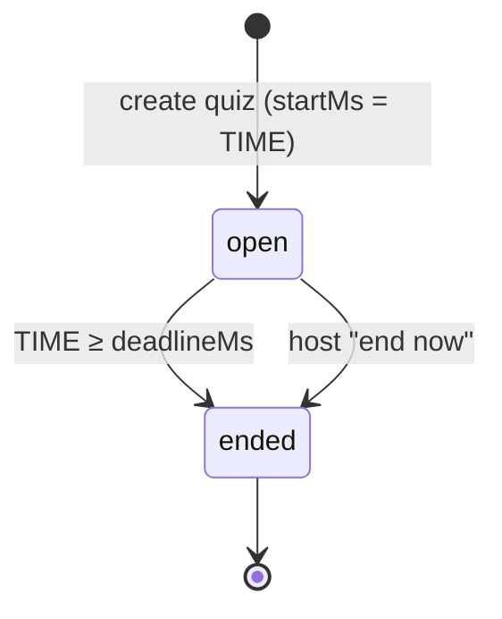
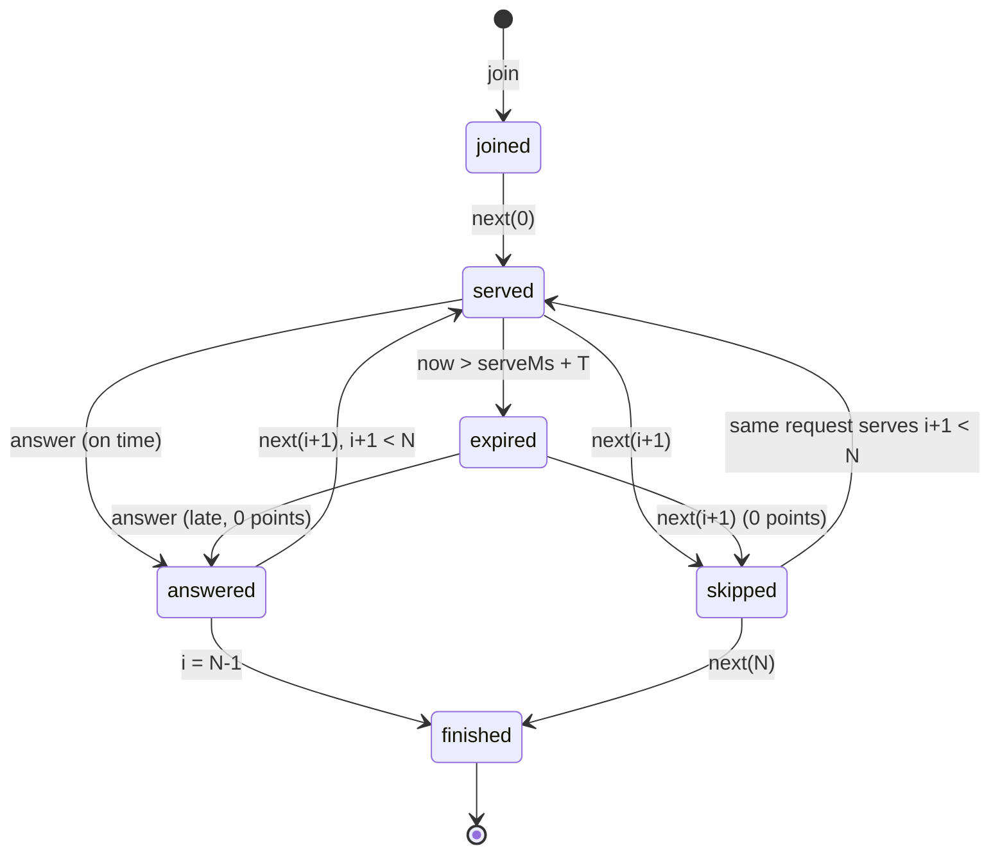

<!-- AI-ASSISTED: domain rules of the self-paced quiz, drafted with Claude Code and checked by hand against the scoring examples. -->
# Domain spec: the self-paced quiz

This document is the single definition of the quiz rules. Code, tests and the other documents refer to it, so "the scoring is accurate and consistent" (AC-4) has one meaning. The wire format lives in `docs/spec/protocol.md` and the Redis keys and scripts in `docs/spec/redis.md`; where they disagree with this file, this file wins and the other one is fixed. The model and its alternatives are recorded in ADR-002 (`docs/DECISIONS.md`).

## 1. The model in one paragraph

A quiz (for example `VOCAB-42`) has N questions (default 10), each with 4 choices and a time limit `T` (default 20,000 ms). Every player gets the questions in the same order, one at a time, at their own pace: the server serves question `i` to that player only, records the serve time, scores the answer when it arrives, and serves question `i + 1` when the player asks for it. All players share one live leaderboard. Real-time means live scores and one shared live board; each player sets their own pace. The server keeps no timer per player or per question: it decides lateness and the end of the quiz when a request arrives, against one clock.

## 2. Time

- **One clock.** Every time in this document is read from Redis `TIME` inside the script that does the write, in integer milliseconds. With several API nodes, all of them use the same clock. Client timestamps are never read; the client countdown is display only and runs from the server's `remainingMs`.
- **Quiz start.** The quiz window starts when the quiz is created (`startMs`). `deadlineMs = startMs + windowMs`. `windowMs` is set per quiz: default 10 min, at most 60 min. `make demo` creates a fresh 60-min quiz on every run, so a demo never starts on an expired quiz.
- **Elapsed time.** `e = max(0, answerMs − serveMs)`. If Redis `TIME` steps back between the serve and the answer, the raw difference is negative: the answer is scored with `e = 0` (full speed bonus), the counter `quiz_clock_step_back_total` is incremented, and no error is returned.
- **Late.** An answer is late when `e > T`. At exactly `e = T` it is on time.
- **The deadline is checked on every write.** Join, serve and score each compare `TIME` with `deadlineMs` (and with `endedMs`, if the host ended the quiz) in the same script as the write. A write at `now ≥ deadlineMs` is refused with `QUIZ_ENDED` and writes nothing. Correctness never depends on a timer or a tick: a timer may *announce* the end sooner, but which writes count is decided by this check alone.
- **Remaining time.** A served question shows `remainingMs = max(0, min(serveMs + T, deadlineMs) − now)`, so a question served near the deadline counts down to the deadline.

## 3. States and transitions

### 3.1 The quiz

| State | Meaning | Entered when |
|---|---|---|
| `open` | Joins, serves and answers are accepted | the quiz is created (`startMs = TIME`) |
| `ended` | Every write is refused with `QUIZ_ENDED`; the standings are final | `now ≥ deadlineMs`, or the mock host action "end now" sets `endedMs = TIME` |

`ended` is final; there is no way back to `open`. The quiz is `ended` as soon as the deadline passes, even before any request notices it: the state is computed from the clock, not stored by a timer. "End now" is idempotent: a second call changes nothing. Whichever comes first (the host action, a write that is refused, or the leaderboard tick) runs the end script, which broadcasts `quiz_ended` with the final standings exactly once; `docs/spec/redis.md` defines the mechanism. How soon `quiz_ended` arrives may depend on that tick; what the final standings are never does.



### 3.2 One player's progress

Question indexes are 0-based: `0 … N−1`. The player record holds the index of the last served question (`cursor`, −1 before the first serve), its `serveMs`, and whether it is closed.

| State | Meaning | Leaves by |
|---|---|---|
| `joined` | Registered with score 0; no question served yet (`cursor = −1`) | `next {questionIndex: 0}` → `served(0)` |
| `served(i)` | Question `i` is open for this player, `now ≤ serveMs + T` | `answer` → `answered(i)`; `next {i+1}` → `skipped(i)` then `served(i+1)`; time passes → `expired(i)` |
| `expired(i)` | Derived, never stored: question `i` is open and `now > serveMs + T` | `answer` → `answered(i)` with 0 points (late); `next {i+1}` → closed with 0, then `served(i+1)` |
| `answered(i)` | Closed by the player's first answer (points 0–150) | `next {i+1}` → `served(i+1)`; if `i = N−1` → `finished` |
| `skipped(i)` | Closed by `next` before any answer; scores 0 | (already moved on to `served(i+1)` or `finished`) |
| `finished` | The last question is closed | nothing; the player keeps watching the leaderboard |

Every transition happens only while the quiz is `open`. `next {questionIndex: N}` closes an open last question as skipped and marks the player `finished`; it serves nothing. Joining does not serve a question: the player's clock for question 0 starts when the client asks for it, so a slow page load costs nothing. A player whose last question is answered is `finished` at once.



## 4. Scoring

```
points = 0                                   if the choice is wrong, or e > T
points = 100 + (50 * (T - e)) // T           if the choice is correct and e ≤ T
```

All values are integers in milliseconds and `//` is floor division, so the bonus is exact and lies in `[0, 50]`. The same integer form is used in Python, in the Lua scoring script (exact in doubles, because every operand is an integer far below 2^53) and, for display only, in the client. The textbook form `50 * (1 - e / T)` rounds `e / T` first and gives 132 instead of 133 at `e = 6800`; it is not used anywhere.

Worked examples with `T = 20,000`:

| `e` (ms) | Choice | Points | Why |
|---|---|---|---|
| 0 | correct | 150 | full bonus |
| 6,800 | correct | 133 | `50 × 13,200 // 20,000 = 33` |
| 20,000 | correct | 100 | exactly on time, no bonus |
| 20,001 | correct | 0 | late by 1 ms |
| any | wrong | 0 | wrong choice |
| raw −50 (clock stepped back) | correct | 150 | `e` is clamped to 0 |

A skipped question scores 0. A player's total is the sum of the points of their closed questions.

## 5. Requests and their answers

`next` and `answer` both carry `questionIndex`, so a retried request never skips or repeats a question.

### 5.1 `next {questionIndex: i}`

| Case (player's `cursor = c`) | Result |
|---|---|
| `i = c + 1`, question `c` closed (or `c = −1`) | serve `i`: `serveMs = TIME` is stored |
| `i = c + 1`, question `c` still open (served or expired) | in one script: close `c` as skipped (0 points), then serve `i` |
| `i = c` (a retry of the serve) | return question `i` with its **stored** `serveMs`; nothing is written |
| `i = N` | close `c` as skipped if it is open, mark `finished`; nothing is served |
| any other `i` | `error INVALID_STATE`; nothing is written |

The serve payload never contains the correct choice.

### 5.2 `answer {questionIndex, choiceIndex, submissionId}`

"Current" means the question served to this player (`cursor`). The scoring script checks, in this order, and stops at the first match:

| # | Case | Reply | Writes |
|---|---|---|---|
| 1 | The same `submissionId` again, for the same question | an identical `answer_result` (stored with the first one) | nothing |
| 2 | The player reuses a `submissionId` for another question | `error INVALID_MESSAGE` | nothing |
| 3 | The quiz is `ended` | `error QUIZ_ENDED` | nothing |
| 4 | `questionIndex` was never served to this player (`> cursor`) | `error QUESTION_NOT_OPEN` | nothing |
| 5 | The question is closed (answered, late-answered or skipped), new `submissionId` | `error ALREADY_ANSWERED`; the score does not change | nothing |
| 6 | First answer, on time | `answer_result` with the points, the new total and the correct choice | answer, total, standings |
| 7 | First answer, late (`e > T`) | `answer_result` with `pointsAwarded: 0` and the correct choice; not an error | answer (closes the question) |

Another player's `submissionId` is simply this player's own new submission: submission keys are per player. A request from a connection that has not joined gets `NOT_JOINED`; an unknown quiz gets `QUIZ_NOT_FOUND`.

**Two idempotency layers, one script.** Layer 1 is the per-player `submissionId` map (rows 1–2): a network retry gets the stored reply. Layer 2 is the per-question "closed" flag (row 5): a second submission with a new ID cannot score again. Both are checked and written in the same Redis script as the score, so no interleaving of nodes can score a (player, question) twice.

**An answer and a skip are one choice.** `answer {i}` and `next {i+1}` both close question `i`, in scripts that run one at a time on the player's keys. Whichever runs first wins: if the skip ran first the answer gets `ALREADY_ANSWERED`; if the answer ran first the `next` simply serves `i + 1`.

### 5.3 `join`

The first join of a user registers the player with total 0 and `reachedRelMs` = the join time (relative to `startMs`). A later join of the same user (a reconnect) writes nothing and returns the player's current state, including the open question with its stored `serveMs`. A join while the quiz is `ended` gets the final standings and `error QUIZ_ENDED`, and writes nothing.

## 6. Standings

- **Order:** total descending, then `reachedRelMs` ascending, then `userId` ascending. Ranks are unique, `1 … N` players, with no shared ranks.
- **`reachedRelMs` in self-paced mode** is the server time, in ms since `startMs`, at which the player reached their current total: the time of the last answer that scored more than 0, or the join time while the total is 0. It changes only when an answer scores more than 0, so a 0-point answer or a skip never moves a player down among equals. A negative value after a clock step back is clamped to 0.
- **Why the window is at most 60 min.** The sorted-set score is `(2^30 − total) × 2^22 + reachedRelMs`. 2^22 ms is about 69.9 min, so `reachedRelMs` must stay below it; every write is refused after the deadline, so `reachedRelMs < windowMs ≤ 3,600,000`. The largest score is below 2^53, so a double holds it exactly.
- **Provisional ranks.** Players finish at different times. A finished player's rank can still change while others play; it is final only in `quiz_ended`.

## 7. Decisions on the rule questions

| Question | Decision | Reason |
|---|---|---|
| What does `next` do before the player answers? | It skips: the question scores 0 and is closed for that player | One request, one meaning; no "unanswered" question stays open behind the player |
| Question order | The same order for every player (and the same choice order) | Fair comparison of totals; simplest to test |
| How long is a quiz open? | A window from creation: default 10 min, at most 60 min, set per quiz; plus a mock host "end now" | Gives the quiz a clear end without a host; fits the sorted-set time field |
| Late joiners | They may join and play while the quiz is `open`, with the full `T` per question; questions they cannot reach before the deadline score nothing. After the end, a join gets the final standings and `QUIZ_ENDED` | No one is turned away from a live quiz; the end is the same for everyone |
| When is the correct choice revealed? | Right after the player's own answer, in that player's `answer_result` only; never broadcast, never in a served question, not on a skip | Feedback per answer without telling players who have not answered |

**Known limit.** With one question order and the reveal after each answer, players can share answers with players who are behind them. A per-player choice order (a shuffle seeded per player) is the future fix; it changes no rule above except the order of choices.

## 8. The consistency contract (C1–C6)

DESIGN §7 summarizes this table. "Proved by" names the tests to write.

| ID | Guarantee | Enforced by | Proved by |
|---|---|---|---|
| C1 | Each (player, question) is scored at most once, even with retries and concurrent requests on several nodes | Both idempotency layers and the "closed" flag, checked and written in one scoring script (§5.2) | `api/tests/integration/test_answer_script.py::test_same_submission_replays_identical_result`, `::test_submission_reused_for_other_question_writes_nothing`, `::test_concurrent_answer_and_skip_close_once`; `api/tests/property/test_session_machine.py::test_each_question_scored_at_most_once` |
| C2 | `seq` per quiz grows by exactly 1 per broadcast, with no gaps | Only a script that also publishes runs `INCR seq`; the scoring script never does | `api/tests/integration/test_seq.py::test_seq_has_no_gaps_under_concurrent_answers` |
| C3 | Per revision of a player's total: the total in `answer_result` equals that player's total in the next `leaderboard` frame (or their `rank_update` when the frame carries only the top 50), unless the player scored again first | One script writes the answer, the total and the sorted-set score together | `api/tests/property/test_session_machine.py::test_answer_total_matches_next_frame` |
| C4 | All clients show the same standings after a quiet period | The tick runs while `dirty` is set; a client that sees a `seq` gap resyncs | `api/tests/integration/test_two_nodes.py::test_clients_converge_after_quiet_period` |
| C5 | p99 below 500 ms from "answer accepted" to "leaderboard delivered" | The 200 ms coalescing tick; send-buffer limits | the load scenarios in `load/`, which record the bots' answer → leaderboard latency |
| C6 | The server decides time on one clock; lateness and the deadline need no timer | Redis `TIME` read inside the join, serve and scoring scripts (§2) | `api/tests/unit/test_scoring.py::test_worked_examples`, `::test_late_by_one_ms_scores_zero`, `::test_clock_step_back_scores_full_bonus`; `api/tests/integration/test_deadline.py::test_writes_after_deadline_write_nothing`; `api/tests/integration/test_points_parity.py::test_lua_points_match_python_for_every_elapsed` |

Standings order and unique ranks: `api/tests/unit/test_standings.py::test_order_total_then_reached_then_user` and `::test_ranks_are_unique_1_to_n`.
