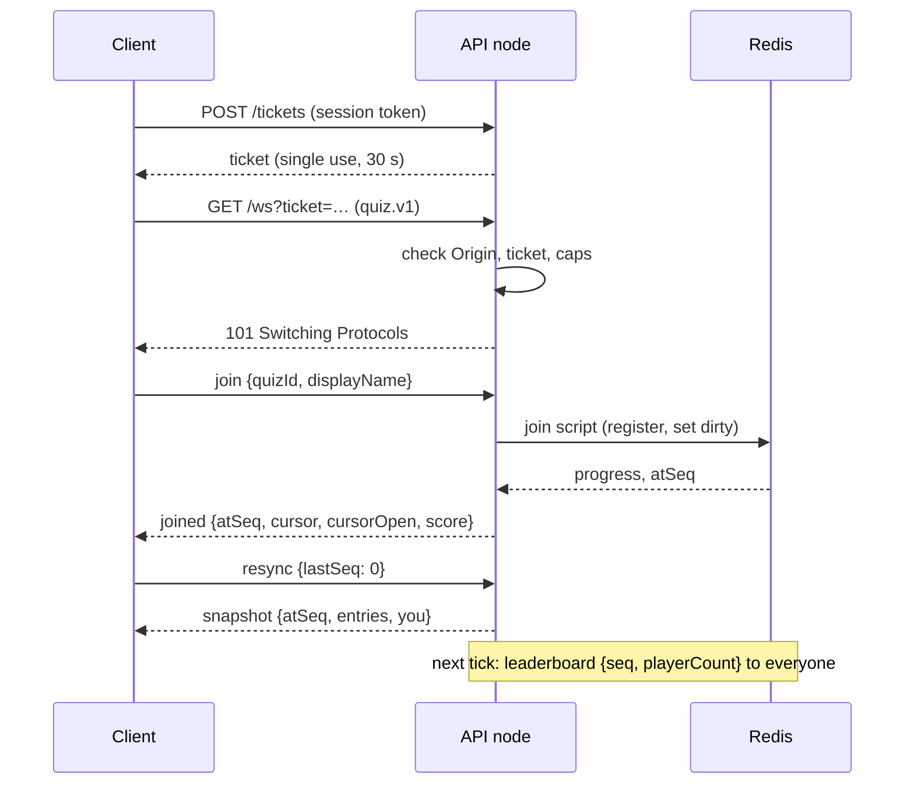
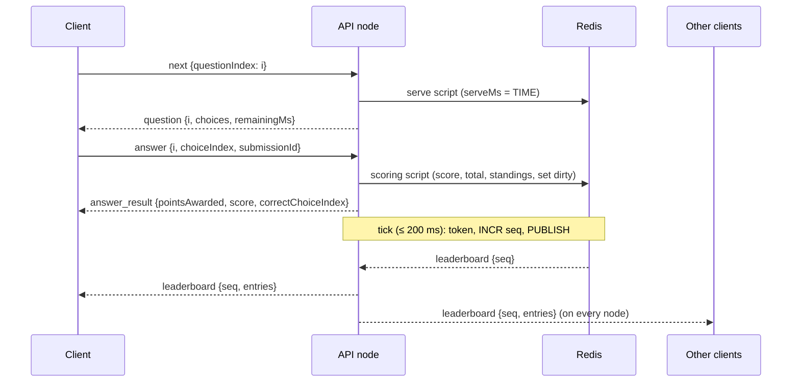

<!-- AI-ASSISTED: wire protocol v1 of the self-paced quiz, drafted with Claude Code and checked by hand against the domain spec. -->
# Protocol spec: the WebSocket message catalog v1

This document is the wire contract between the server, the Vue client, the load bots and the tests. The quiz rules behind each reply are in `docs/spec/domain.md` (where the two disagree, the domain spec wins). The contracts package turns this catalog into Pydantic models in `api/src/quiz/contracts/`, and the client imports TypeScript types generated from them. The transport choice is ADR-003 and the protocol, standings policy and tick are ADR-004 (`docs/DECISIONS.md`).

## 1. Envelope and connection

- One WebSocket per browser tab: `GET /ws?ticket=<ticket>` with the subprotocol `quiz.v1`. Text frames only, one JSON object per frame, UTF-8. `permessage-deflate` is off.
- Every message, in both directions, is `{"v": 1, "type": "<type>", ...}`. The server rejects unknown fields, unknown types, missing fields and wrong JSON types. All fields of a message are always present; a field that has no value is `null`, never omitted.
- A connection serves one quiz: the quiz of its first successful `join`, one answered with `joined`, or with the final `snapshot` and `QUIZ_ENDED` when the quiz has ended (that connection is read only). A `join` that fails in any other way (`QUIZ_NOT_FOUND`, `UNAVAILABLE`, `INVALID_MESSAGE`) binds nothing, so the client may send another. Each socket has one writer, so a client receives a node's messages in the order the node produced them.

### Field types

| Field | Type and range |
|---|---|
| `v` | integer, always `1` |
| `quizId` | string, `^[A-Z0-9-]{3,16}$`, for example `VOCAB-42` |
| `userId` | string, `^[A-Za-z0-9_-]{1,64}$`; set by the server from the ticket, never sent by the client |
| `questionId` | string, `^[A-Za-z0-9_-]{1,64}$` |
| `submissionId` | string, a UUID (RFC 9562, lowercase hex with hyphens) that the client makes per answer |
| `displayName` | string, at most 128 characters on input; 1–32 after trim and Unicode NFC normalization |
| `questionIndex` | integer, `0 … N−1` (`next` also accepts `N`) |
| `choiceIndex` | integer, `0 … 3` |
| `seq`, `atSeq`, `lastSeq` | integer ≥ 0 (see §3) |
| `score` | integer ≥ 0, the player's total; `pointsAwarded` is `0 … 150` |
| `rank` | integer ≥ 1; ranks are unique `1 … playerCount` |
| `remainingMs`, `timeLimitMs`, `quizRemainingMs` | integer ≥ 0, milliseconds |
| `entries` | array of `{rank, userId, displayName, score}`, ordered by rank |

Every integer field is at most 2^53 (9,007,199,254,740,992), so a client that reads JSON numbers as doubles reads it exactly; a larger value is `INVALID_MESSAGE`.

## 2. Message catalog

### 2.1 Client → server

| `type` | Fields | Reply | Notes |
|---|---|---|---|
| `join` | `quizId`, `displayName` | `joined`; `snapshot` (`status: ended`) then `error QUIZ_ENDED` when the quiz has ended; or `error` | The identity comes from the ticket. A repeat on the same connection returns `joined` again. A `join` for another quiz after a successful `join` on the same connection gets `INVALID_STATE` |
| `next` | `questionIndex` | `question`, `finished`, or `error` | Asks for question `i`; `i = N` finishes. A repeat of the same `i` gets the same reply (domain §5.1) |
| `answer` | `questionIndex`, `choiceIndex`, `submissionId` | `answer_result`, or `error` | A repeat with the same `submissionId` gets an identical `answer_result` (domain §5.2) |
| `ping` | — | `pong` | App-level liveness, every 25 s |
| `resync` | `lastSeq` | `snapshot`, or `error` | `lastSeq` = the last broadcast `seq` the client applied, `0` if none. At most 1 per second |
| `get_leaderboard` | `offset` (≥ 0), `limit` (1–200) | `leaderboard_page`, or `error` | Works while the quiz is open and after it ended |

### 2.2 Broadcasts (carry `seq`)

A broadcast goes to every connection of the quiz on every node. Self-paced mode adds no broadcast: question and answer traffic is unicast.

| `type` | Fields | When |
|---|---|---|
| `leaderboard` | `seq`, `rebase` (bool), `playerCount`, `onlineCount`, `entries` | At most once per 200 ms tick, only when the standings changed (`dirty`). `entries` holds every player while `playerCount ≤ 200`, else the top 50 |
| `quiz_ended` | `seq`, `playerCount`, `entries` (top 50), `you` (`{rank, score}` or `null`) | Exactly once, when the quiz ends; the last broadcast of a quiz. `you` is filled per socket by the node that delivers it; `null` for a connection with no player |

Joins and leaves are never broadcast one by one. A join, a leave (after the 10 s grace) and a scoring answer only set `dirty`; the next tick sends one `leaderboard` frame with the new `playerCount` and `onlineCount` (and, up to 200 players, every player). 5,000 players joining within one tick therefore cost one frame per connection, not the roughly 12.5 million sends (5,000 × 5,000 / 2) that one broadcast per join would need. `playerCount` counts everyone in the standings (a player who left keeps their score); `onlineCount` counts the players connected now.

### 2.3 Unicasts (carry `atSeq`)

`atSeq` is the latest broadcast `seq` of the quiz when the reply was built. Only `snapshot.atSeq` sets the client's `lastSeq`; the `atSeq` of every other unicast is never compared with it and never starts a resync (§3).

| `type` | Fields | Sent |
|---|---|---|
| `joined` | `atSeq`, `quizId`, `userId`, `displayName`, `questionCount`, `timeLimitMs`, `quizRemainingMs`, `cursor` (−1 … N−1), `cursorOpen` (bool), `finished` (bool), `score` | Reply to `join`. On a reconnect it holds the stored progress: if `cursorOpen`, the client sends `next {questionIndex: cursor}` to get the open question back with its stored serve time |
| `question` | `atSeq`, `questionIndex`, `questionId`, `prompt`, `choices` (4 strings), `timeLimitMs`, `remainingMs` | Reply to `next {i}`, `i < N`. **Never contains the correct choice** |
| `answer_result` | `atSeq`, `questionIndex`, `submissionId`, `choiceIndex`, `correctChoiceIndex`, `correct` (bool), `late` (bool), `pointsAwarded`, `score` | Reply to `answer`. The only message with the correct choice. A replay is byte-identical to the first reply, `atSeq` included |
| `rank_update` | `atSeq`, `rank`, `score`, `playerCount` | Only to players outside a frame's `entries` (above 200 players): §4 |
| `leaderboard_page` | `atSeq`, `offset`, `playerCount`, `final` (bool), `entries` (up to `limit` rows from rank `offset + 1`) | Reply to `get_leaderboard`. `final` is true once the quiz ended |
| `snapshot` | `atSeq`, `status` (`open` or `ended`), `playerCount`, `onlineCount`, `entries` (same policy as `leaderboard`), `you` (`{rank, score}` or `null`) | Reply to every `resync`, and after a pub/sub resubscribe. `atSeq` is the `seq` of the standings it holds |
| `finished` | `atSeq`, `score`, `rank`, `playerCount` | Reply to `next {questionIndex: N}`; a repeat returns the current values. The rank stays provisional until `quiz_ended` |

### 2.4 Neither `seq` nor `atSeq`

| `type` | Fields | Notes |
|---|---|---|
| `pong` | `seq` (the quiz's current counter, read from Redis when the node handles the `ping`; `null` before `join` or when Redis is unreachable) | Reply to `ping`. Lets a client find a lost last frame, also one that its node never received (§3) |
| `error` | `code`, `message` (English, for logs), `requestType` (the `type` that caused it, or `null`) | Carries no `seq` and no `atSeq`. Sent before every application close |

## 3. Sequence numbers

Rules:

1. `seq` is per quiz. The counter starts at 0 when the quiz is created; the first broadcast has `seq = 1`, and each later broadcast is exactly the previous one + 1, with no gaps (contract C2).
2. Only a Redis script that also publishes a broadcast runs `INCR seq`. The scoring, join and serve scripts never do.
3. Unicasts that describe quiz state carry `atSeq` (the current counter, not incremented); of these, only `snapshot.atSeq` moves the client's `lastSeq`. `pong` carries the current counter as `seq`. `error` carries neither.

| Who | Does what with `seq` |
|---|---|
| Tick script (Redis) | While `dirty` is set and it holds the 200 ms tick token: clears `dirty`, `INCR seq`, publishes `leaderboard` |
| End script (Redis) | Once per quiz: `INCR seq`, publishes `quiz_ended`. After it, no script increments `seq` again |
| Join, serve, scoring and snapshot reads (Redis) | Read the counter for `atSeq`; never change it |
| `pong` read (Redis) | A plain `GET` of the counter for each `ping` of a joined connection; never changes it |
| Gateway (each API node) | Relays broadcasts in the order it receives them; fills `pong.seq` from the `pong` read, never from the frames it relayed, so a node that relayed nothing yet or missed a frame on its pub/sub link still reports the quiz's counter; conflates `leaderboard` frames per slow socket (§5) |
| Client and load bots | Apply broadcasts in `seq` order with the rules below; the bots also count gaps and resyncs and time answer → leaderboard |
| Tests | Check that the published `seq` values have no gaps (`api/tests/integration/test_seq.py`) |

What the client does with an incoming `seq` (`L` = its `lastSeq`):

| Incoming | Client action |
|---|---|
| `seq = L + 1` | Apply; `L = seq` |
| `seq = L` | Ignore: a duplicate (a frame relayed just after the snapshot that already holds it) |
| `seq < L` | The store restarted (the counter went back): resync, and accept the snapshot's lower `atSeq` as the new `L` |
| `seq > L + 1` and `rebase: true` | Apply as a full replacement; `L = seq`. No resync |
| `seq > L + 1` otherwise | A gap: wait 0–250 ms (random), then `resync {lastSeq: L}` |
| `pong.seq > L` | A broadcast is still on its way or was lost: if `L` is still below that `pong.seq` 1 s later, `resync {lastSeq: L}` |
| `pong.seq ≤ L`, or `null` | Ignore. The counter read and the relay use different Redis connections, so a frame can reach the socket before a `pong` that read an older counter; a lower `pong.seq` is therefore not a restart signal. A store restart shows as `seq < L` on the next broadcast, and the node also sends each client a snapshot after it reconnects to Redis |
| `atSeq` of `joined`, `question`, `answer_result`, `rank_update`, `leaderboard_page` or `finished` | Use the reply's content as it arrives. Never compare its `atSeq` with `L`, never set `L` from it and never resync because of it: a replayed `answer_result` keeps the `atSeq` of its first reply, and a reply built just before a frame can arrive after it. After `joined` the client sends exactly one `resync {lastSeq: L}` with the `L` it already held, and the `snapshot` sets `L` |
| `snapshot` | Replace the standings; `L = atSeq`; then apply buffered broadcasts with `seq > L` in order |
| `snapshot` after `quiz_ended` was applied | `status: open`: ignore it, and keep the final standings and `L`. It was read before the end and only reached the socket after the `quiz_ended` (one writer orders frames by enqueue time, not by Redis read time); an announced end is never undone, even by a store restart (`docs/spec/redis.md` §3.1). `status: ended`: apply it as above |

Between sending `resync` and receiving `snapshot`, the client buffers broadcasts instead of applying them. `quiz_ended` is always applied, whatever its `seq`, and sets `L`; from then on the standings are final, and only a `snapshot` with `status: ended` or a second `quiz_ended` (after a store restart) replaces them.

## 4. Standings policy

- **Order:** score descending, then the time the player reached it, then `userId` (domain §6). Ranks are unique.
- **Up to 200 players:** each `leaderboard` frame carries every player. Nobody gets `rank_update`.
- **Above 200 players:** frames carry the top 50. Each player outside the top 50 gets `rank_update` with their own rank and score: a player who scored gets it after the next tick, together with that tick's frame (same `atSeq`); a player whose rank only shifted gets at most one per second, with the newest value.
- **The full list** comes from `get_leaderboard` pages of 1–200 rows, while the quiz runs and after it ended. `quiz_ended` carries the top 50 and the player's own final rank (`you`).

## 5. Flow control and conflation

- Each socket has a send buffer. Above the **soft limit (64 KiB)** the node stops queueing `leaderboard` frames for that socket and holds only the newest one (within the barrier rule below). When the socket drains, it sends that newest frame with `rebase: true`; the client applies it as a full replacement without a resync (§3). Unicasts are never dropped.
- `quiz_ended` is never dropped or conflated; it is queued even above the soft limit.
- Conflation merges only consecutive `leaderboard` frames. A newer frame replaces the held one in place only while nothing has been queued after the held frame; otherwise the held frame stays where it is, and the newer frame is queued (and held) after the later message. Every other message, `pong` included, is a conflation barrier, so the socket still sends messages in the order the node produced them (§1), and conflation never moves a newer frame ahead of a queued `pong`.
- Above the **hard limit (256 KiB)** the node sends `error UNAVAILABLE` and closes with 1013.
- A `snapshot` or `rebase: true` frame always carries the full standings under the policy of §4, so it never depends on an earlier frame.

## 6. Countdown

`question` carries `remainingMs = max(0, min(serveMs + T, deadlineMs) − now)` on the server clock (domain §2), on the first serve and on every re-serve (a repeat of `next {i}` or a reconnect). The client starts its countdown from the moment it receives the message, using a monotonic clock (`performance.now()`), and never reads its wall clock. The countdown is display only: the server decides lateness when the answer arrives.

## 7. Errors and close codes

The server sends `error` before every application close of an open socket. A refused upgrade is an HTTP response, not a close: it carries no `error` frame, and the browser sees only close 1006 (below). The codes for those refusals are server-side reasons, written to the server log. Error codes, with the client's action:

| Code | When | Client action |
|---|---|---|
| `INVALID_MESSAGE` | Bad JSON, unknown or missing field, wrong type or range, JSON depth above 8, or a `submissionId` reused for another question | Drop the request; it is a client bug. The socket stays open |
| `UNSUPPORTED_TYPE` | Unknown `type` | Same as above |
| `UNSUPPORTED_VERSION` | `v` is not 1 | Show "please reload"; close 1000 |
| `MESSAGE_TOO_LARGE` | An inbound frame above 16 KiB; the server closes with 1009 | Reconnect with backoff; never resend that frame |
| `UNAUTHORIZED` | Missing, used or expired ticket: HTTP 401 at the upgrade, never a frame; the client sees close 1006 | None of its own: a failed open (below) |
| `FORBIDDEN` | Wrong `Origin`: HTTP 403 at the upgrade, never a frame; the client sees close 1006 | None of its own: a failed open (below) |
| `QUIZ_NOT_FOUND` | `join` with an unknown `quizId` | Show "quiz not found"; the user may send another `join` |
| `NOT_JOINED` | Any request except `join` and `ping` before a successful `join` (§1). A connection whose `join` got the final `snapshot` and `QUIZ_ENDED` counts as joined, read only: its `get_leaderboard` and `resync` are answered, and its `next` and `answer` get `QUIZ_ENDED` | Send `join`, then repeat the request |
| `QUESTION_NOT_OPEN` | `answer` for a question never served to this player | Send `next` for the current question |
| `ALREADY_ANSWERED` | `answer` with a new `submissionId` for a closed question | Keep the first result; the score did not change |
| `INVALID_STATE` | `next` with an index other than `cursor` or `cursor + 1` (or `N`), or a `join` for another quiz after a successful `join` | Rejoin to read `cursor`, then continue |
| `QUIZ_ENDED` | Any write after the quiz ended. A `join` after the end first gets a `snapshot` of the final standings; the connection may then send `get_leaderboard` and `resync` | Show the final results |
| `RATE_LIMITED` | More than 20 msg/s (burst 40), or more than 1 `resync` per second; the message is dropped. Also the server-side reason for HTTP 429 at the upgrade (more than 50 connections from one IP), which is never a frame; the client sees close 1006 | Wait 1 s, then retry the message. At the upgrade: a failed open (below) |
| `SESSION_REPLACED` | The same user joined the same quiz on another socket; this older socket closes with 4001 | Show "opened elsewhere"; do not reconnect |
| `UNAVAILABLE` | Redis is unreachable (the request was not done), or the send buffer passed the hard limit (close 1013). Also the server-side reason for HTTP 503 at the upgrade (the node is full), which is never a frame; the client sees close 1006 | Retry the request after backoff (`next` and `answer` are safe to repeat); after 1013, wait 5 s plus the backoff. At the upgrade: a failed open (below) |
| `INTERNAL` | An unexpected server fault; the server closes with 1011 | Reconnect with backoff |

A browser cannot read the HTTP status of a refused upgrade (401, 403, 429 or 503): it sees a close with 1006 and no `error` frame. So the client treats every failed open like a 1006: a new ticket, then a reconnect with backoff, whatever the server's reason.

| Close code | Sent by | Used for | Client reconnects? |
|---|---|---|---|
| 1000 | client | The user left (also after the quiz ended; the server keeps the socket open so pages still work) | No |
| 1006 | (never sent) | The connection died | Yes, with backoff |
| 1008 | server | Policy violation (the token bucket is empty for 10 s in a row) | No; show an error |
| 1009 | server | Inbound frame above 16 KiB | Yes, with backoff; never resend that frame |
| 1011 | server | Internal error | Yes, with backoff |
| 1012 | (not sent) | Service restart; this build has no drain step | Yes, with backoff |
| 1013 | server | Overload or slow client | Yes, after 5 s plus the backoff |
| 4001 | server | Session replaced by another tab | No; show "opened elsewhere" |

Backoff is full jitter: `floor(random() × min(10,000, 250 × 2^attempt))` ms, reset after 10 s joined, with a 5 s open timeout. There is no graceful drain: when a node stops, its sockets drop and each client reconnects through nginx (to the other node) and resyncs.

## 8. Authentication

1. `POST /sessions` (once per tab) returns a mock `userId` and a session token, kept in the tab.
2. Before every connect, `POST /tickets` with the session token returns a ticket: 32 random bytes in base64url, single use, valid 30 s.
3. `GET /ws?ticket=…` with the subprotocol `quiz.v1`. Before the upgrade the server checks, in order, the `Origin` (403), that the client offers `quiz.v1` (400), the ticket (401) and the connection caps (503 at 10,000 per process, 429 at 50 per IP). Each refusal is a plain HTTP response with no `error` frame, which the browser sees as close 1006 (§7). The identity comes from the ticket only.
4. Logs record the path only, never the query string, so tickets never reach a log.

The HTTP endpoints (`/docs` serves the OpenAPI page, without the admin routes). Every error body is `{error, message}`: request validation answers 422 `INVALID_MESSAGE`, a store outage 503 `UNAVAILABLE`, and a path that does not exist 404 `NOT_FOUND`.

| Endpoint | Reply |
|---|---|
| `POST /sessions {displayName}` | MOCK: 201 `{userId, sessionToken}`; 422 for a bad name |
| `POST /tickets`, header `Authorization: Bearer <sessionToken>` | MOCK: 201 `{ticket, expiresInMs}`; 401 `UNAUTHORIZED` with `WWW-Authenticate: Bearer` for an unknown session. The scheme is case-insensitive |
| `GET /quizzes/{quizId}` | `{quizId, title, questionCount, status, players}`; `status` is `ended` from the deadline alone. Every unknown ID gets the same 404 body |
| `POST /admin/quizzes {quizId, timeLimitMs, windowMs}` | MOCK admin: only with `ADMIN_MOCK=1` and the `X-Admin-Token` header; without them every request under `/admin`, whatever its method or body, gets the 404 of a path that does not exist. 201, or 409 when the quiz exists |
| `POST /admin/quizzes/{quizId}/end` | MOCK admin, same rule: the host's "end now" (Redis §3.1): `end_quiz(host)` marks, a second call announces. 200 `{quizId, status: "ended", endSeq}`, idempotent; 404 for an unknown quiz |
| `GET /healthz`; `GET /readyz` | Liveness; readiness: 503 when Redis is unreachable |
| `GET /metrics` | The Prometheus text format: `ws_connections`, `answers_total{result}`, `leaderboard_frames_total`, `tick_duration_seconds`, `redis_clock_step_total` |

Logs are JSON lines on stderr, one per event; each line carries `quiz_id` and `request_id` (`null` when unknown). The request id is the client's `X-Request-ID` when it is safe (1–64 of `A-Za-z0-9_.-`), else a fresh one, and the response echoes it.

## 9. Limits

Inbound frames at most 16 KiB and JSON depth at most 8, both checked before parsing; a token bucket of 20 msg/s with a burst of 40 per connection, checked before parsing; `resync` at most 1 per second; after a `pong.seq` above `lastSeq` the client waits 1 s before it resyncs; the server pings every 25 s and closes a socket with no pong by the next sweep; the client pings every 25 s and reconnects after 50 s with no inbound message; a player counts as gone 10 s after a disconnect.

## 10. Sequence diagrams

### Join



### Answer → leaderboard



### Reconnect → resync → snapshot

```mermaid
sequenceDiagram
    participant C as Client
    participant N2 as Other API node
    participant R as Redis
    Note over C: socket drops (1006); lastSeq = L
    C->>C: wait full-jitter backoff
    C->>N2: POST /tickets, then GET /ws?ticket=…
    C->>N2: join {quizId, displayName}
    N2->>R: join script (existing player: no write)
    N2-->>C: joined {atSeq, cursor, cursorOpen}
    C->>N2: resync {lastSeq: L}
    N2->>R: read standings at seq S
    N2-->>C: snapshot {atSeq: S, entries, you}
    C->>N2: next {questionIndex: cursor} (if cursorOpen)
    N2-->>C: question {remainingMs from the stored serveMs}
```
