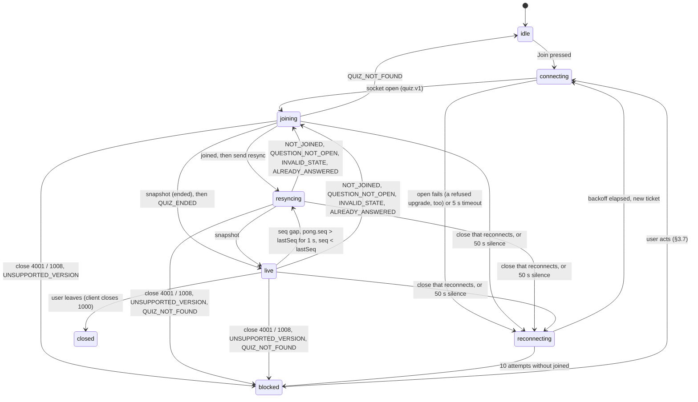
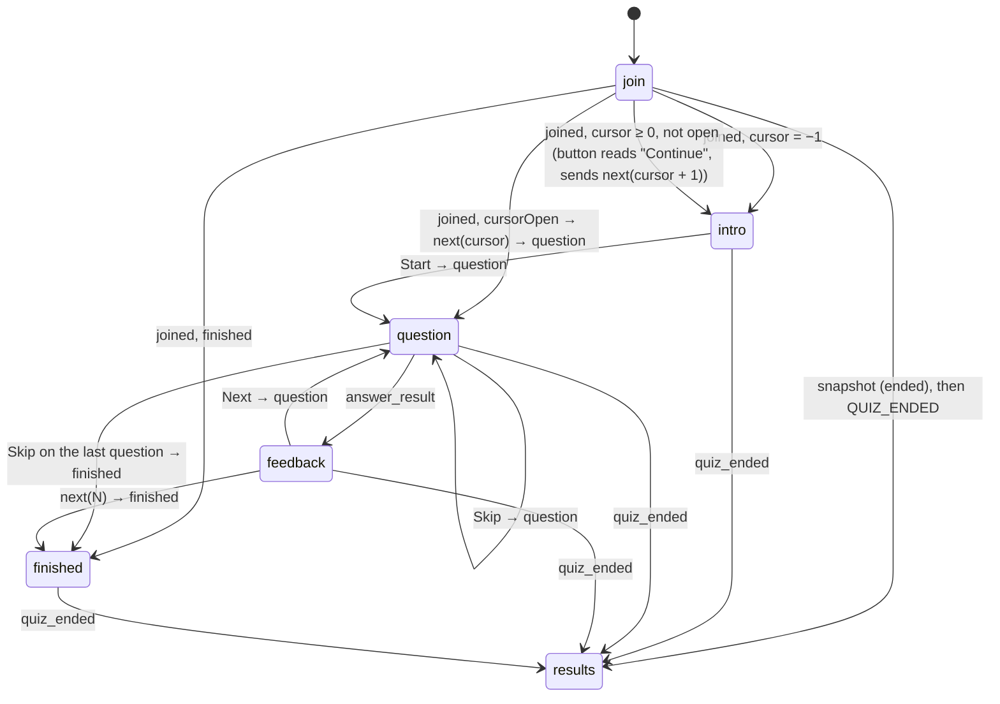

<!-- AI-ASSISTED: UI spec of the Vue client (screens, state chart, motion, accessibility, design tokens), drafted with Claude Code; contrast ratios computed with the WCAG 2.2 relative-luminance formula. -->
# UI spec: screens, states, motion and style of the Vue client

This document is the contract for every screen of the Vue client in `web/`. It says what each screen shows, which protocol message moves the UI from one state to the next, how things move, how the client works with a keyboard and a screen reader, and which design tokens give it its look. The wire messages are in `docs/spec/protocol.md` and the quiz rules in `docs/spec/domain.md`; where this spec disagrees with them, they win.

The app is called **Vocab Quiz**. It uses its own playful design system; no third-party logo or name appears in the UI.

## 1. Chosen direction

**Direction "Clay"**: a pale violet page with white cards, one brand violet with a brighter violet for gradients, three playful role colors (mint, cyan and sun) used only as fills under dark text, one rounded web font, generous 16 px and 24 px corners, a 3 px outline and hard, zero-blur shadows tinted from the primary, so cards look like pressed clay (in the dark theme a soft glow and a 2 px edge instead, §7.5). It has a light and a dark theme; the dark theme follows the operating system. The tokens are in §7.2. It replaces direction "Slate" (§7.1), the neutral look of the first version.

Why Clay:

1. **A quiz is a game.** Rounded type, thick outlines and a tactile press on every button make the app feel like a game without adding any motion that runs on its own (§5).
2. **The same contrast guarantees as before.** Every text pair, the feedback states included, passes WCAG AA (4.5:1) in both themes, and the input outline and the focus ring pass 3:1 (§6.4). `web/packages/clay/src/styles/contrast.test.ts` recomputes each ratio from `tokens.css`, so a token change that breaks one fails the build.
3. **Feedback stays apart from the brand.** Success is green and danger red, both far from the violet primary and the violet focus ring; the role colors never carry text or state.
4. **One font file, from our own origin.** Nunito Variable is served from the app's origin (the content security policy allows no font host), and one variable file covers every weight. Its default figures have equal widths, so scores and the countdown do not jitter.

Switching the look later still means replacing the token values in one file (§7.3); no component names a color, size, radius, shadow or duration directly.

## 2. Routes and layout

| Route | Screen |
|---|---|
| `/` | Landing and join (§3.1) |
| `/quiz/:quizId` | Everything after the join: intro, question, feedback, finished and results, chosen by the client state (§4). Without a join to this quiz (a direct load, a refresh, another ID) it redirects to `/?quiz=:quizId`. A refresh of the quiz this tab last joined also starts that join again with the same name: the join screen shows "Joining…" and `joined` returns to `/quiz/:quizId`. The join is saved in `sessionStorage` only as the page unloads (not after "This quiz is open in another tab" or "This quiz is no longer available") and read once by the next page, so a duplicated tab, which copies `sessionStorage` while this page stays open, does not join and take the session |
| `/host` | Host a quiz (§3.8) |
| `/q/:quizId` | Short share link; redirects to `/?quiz=:quizId`, the join screen with the quiz ID filled in |
| any other path | "Page not found" with a link back to `/` |

- **Phones (below 1024 px):** one column. A two-tab switch at the top, "Quiz" and "Leaderboard", with my rank and score always visible in the header, so the leaderboard tab is never needed to know where I stand. The switch is a WAI-ARIA tab list: each tab controls its panel, only the selected tab is in the tab order, and the arrow keys, `Home` and `End` move the selection and the focus (§6.1). Both panels stay mounted, so a question on the hidden Quiz tab keeps its countdown and its pending answer. While a question is open under the Leaderboard tab, the header shows its time left as a button ("13 s left") that selects the Quiz tab and moves the focus to it. "Quiz" is selected when the screen opens.
- **Desktops (1024 px and up):** two columns: the quiz on the left (at most 640 px wide), the live leaderboard on the right (360 px), both visible at once.
- **Header (every quiz screen):** the quiz ID, the question counter ("Question 3 of 10"), my score (not for a viewer of an ended quiz who is not a player), my rank ("#12 of 340"; its sources are in §3.5), and the connection pill (§3.7) while the connection is not `live`.
- All copy lives in one strings module in `web/src/`, so a translation can be added later.

## 3. Screens

### 3.1 Landing and join

- A short headline ("Real-time vocabulary quiz"), a quiz ID field and a display name field, and a "Join" button.
- The quiz ID field upper-cases what is typed and accepts `^[A-Z0-9-]{3,16}$`. The display name is 1–32 characters after trim and NFC normalization, like the server counts it, at least one of them visible and none a control character, as protocol §1 defines it (a name of only zero-width, direction-mark or other invisible characters reads "Use at least one visible character", a tab or other control character "Remove tabs, line breaks and other control characters"; the server refuses both), and the field has no native length limit. Both are checked on blur and on submit; the message sits under the field, linked with `aria-describedby`.
- A link `/?quiz=VOCAB-42` fills the quiz ID and puts the focus in the name field. The last display name is remembered in the tab (`sessionStorage`).
- A valid quiz ID (on blur, from a link, or on submit) is looked up with `GET /quizzes/{id}`, and a preview card shows the title, the question count, the player count and whether the quiz is open or ended. A 404 with the error code `QUIZ_NOT_FOUND` puts "No quiz with this ID" under the quiz ID field, where it stays until the ID is edited, and the join is not sent; the polite region of the preview announces it too, since the lookup may end after the focus has left the field. An ended quiz reads "This quiz has ended. You can still see the final results." and the button reads "See results". A failed lookup (network, 5xx, an unexpected body, any other 404, or no answer within 3 s) shows no preview and does not block the join: the socket `join` decides. A share link opened while a join is in progress is ignored.
- On submit: the button shows a spinner and "Joining…", the fields stay readable. The client creates the mock session once (`POST /sessions`), fetches a ticket, opens the socket and sends `join` (protocol §8). `joined` routes to `/quiz/:quizId`. An `UNAVAILABLE` reply keeps the spinner and adds "Server busy, retrying" under the fields while the client sends the `join` again after the backoff.
- `QUIZ_NOT_FOUND` puts "No quiz with this ID" under the quiz ID field; the user may try again. A join after the quiz ended gets the final `snapshot` first, then `QUIZ_ENDED` (protocol §7), and routes to the results screen at `/quiz/:quizId` (§3.6).
- A join that ends in a blocked state (`UNSUPPORTED_VERSION`, close 1008, close 4001, or 10 connects without a `joined`) unlocks the form and shows the blocking card of §3.7 above it, with its action ("Reload", "Use this tab" or "Try again"); "Use this tab" and "Try again" join again from this screen.
- Any other join failure (another `error` reply to the `join`, another final close before `joined`, or a client that cannot start) unlocks the form and shows "Could not join, try again" above the button; the user may try again. A `reconnecting` link keeps the spinner.
- Under the join card, a quiet line "Running a class or a game night? **Host a quiz**" links to `/host` (§3.8). It is a text link after the "Join" button in the focus order, so it never competes with Join, and it shows only once `GET /banks` answers with a list: a 404 (hosting off), a failure or an empty list hides it.
- After the wordmark leads here from a quiz that is still joined (the socket stays open), a "Resume quiz VOCAB-42" link goes back to `/quiz/:quizId`. Joining another quiz closes the old socket.

### 3.2 Intro

Shown after `joined` when `cursor = −1` (no question served yet).

- The quiz ID, the number of questions (`questionCount`), the time per question (`timeLimitMs`), how much time the quiz has left (`quizRemainingMs`, counted down), and the scoring rule in one line: "Correct answers score 100–150 points, more when faster; wrong or late answers score 0."
- The live leaderboard is already visible (desktop) or one tab away (phone), with the player count.
- One primary button, "Start", which has the focus. It sends `next {questionIndex: 0}`; the question clock starts only now (domain §3.2). From the click until the `question` (or a final error) it shows a spinner and `aria-busy="true"`.
- After a rejoin with `cursor ≥ 0` and the question at `cursor` closed, the same screen shows "Continue" instead. It sends `next {questionIndex: cursor + 1}`; when `cursor = N − 1` that is `N`, which finishes the quiz (domain §5.1). It never sends `cursor` or 0, which would re-serve a closed question or get `INVALID_STATE`.

### 3.3 Question

- The countdown ring (§5.3) with the whole seconds left in its center, the prompt as the screen's `<h2>`, and the four choices as a 2 × 2 grid (one column on narrow phones). Each choice is a button with its key hint ("1"–"4") on the left.
- Choosing (click, tap or key 1–4) sends `answer` with a new `submissionId` made once per question and kept until the result arrives. The choices lock at once; the chosen one shows "Checking…" with a small spinner. There is no second choice and no undo. If the reply is `ALREADY_ANSWERED` (the question was already closed, for example by a Skip that the server ran first, domain §5.2), no `answer_result` follows: the choices unlock, the spinner goes, and the client rejoins to read `cursor` and `score` (§4.3).
- When the ring reaches 0 the choices stay enabled, and a note appears under them: "Time's up: an answer now scores 0." A secondary "Skip" button sends `next {questionIndex: i + 1}` (the question closes with 0 points).
- While the connection is `connecting`, `joining` or `reconnecting` (§3.7), the choices are disabled with the note "Waiting for the connection…". The ring keeps running, because the server clock keeps running; after the reconnect, the re-served `question` resets it from its new `remainingMs`.

### 3.4 Answer feedback

Shown on `answer_result`.

- The chosen choice is marked correct (success color, check icon, "Correct") or wrong (danger color, cross icon, "Wrong"), and the correct choice is always marked with the check icon and "Correct answer". Color is never the only signal: each state has an icon and a word.
- `late: true` reads "Too late: 0 points"; otherwise "+133 points" counts up (§5.2), and the total score in the header counts up with it.
- One primary button, "Next question" (or "See my result" after the last question), which has the focus; Enter or Space presses it. It sends `next {questionIndex: i + 1}` (or `N`), and is busy like "Start" until the reply. While the socket is not usable (any connection state but `resyncing` and `live`) it has `aria-disabled="true"` and sends nothing; while the connection is `connecting`, `joining` or `reconnecting` the note "Waiting for the connection…" shows under it.
- There is no auto-advance: the quiz is self-paced and the clock of the next question starts only when the player asks for it.

### 3.5 Live leaderboard

A panel on every quiz screen (intro, question, feedback, finished).

- **Rows:** rank, display name, score (tabular numerals, right-aligned). At most 10 rows are rendered: the top 10 of the latest `leaderboard` or `snapshot` (frames carry every player up to 200, else the top 50; the client still renders 10).
- **My row:** highlighted with the `--highlight` tint inside a 3 px `--primary` outline, and "(you)". Inside the top 10 my row is highlighted in place. Outside it, a pinned row under the list, after a decorative "⋯" gap mark, shows my rank and score right under the tenth row.
- **Look:** each row is at least 48 px tall with a 2 px outline. The rank sits in a round chip: first place on `--sun`, second on a silver tint (`--muted` with a `--border` outline), third on a bronze tint (`--warning-soft`), all under dark text; the others on `--muted`. A long name is cut with an ellipsis and keeps the full name in its `title`.
- **Where my rank and score come from** (the pinned row and the header): each `snapshot.you` and `quiz_ended.you` sets them, because no `rank_update` follows a join or a reconnect while the standings stay the same (protocol §4). A `snapshot` with `you: null` clears them: the user is not a player. A `quiz_ended` with `you: null` and no row of mine means the node could not read my rank, so the last values stay and the client sends one `resync` after the same random 0–250 ms wait as a gap (protocol §3), with its reply deadline and retries; the final `snapshot` it gets sets them. After that, a `leaderboard` frame updates them from its `entries` up to 200 players; above 200, each `rank_update` does. My score never moves backward: a `leaderboard` frame with `seq`, or a `rank_update` with `atSeq`, at or below the `atSeq` of my last `answer_result` was built before that answer was scored, so it never lowers the score the answer gave (nor my row in a live "Show all players" page read at or before that `atSeq`), while `you` (read fresh), the rows of a `snapshot` or `quiz_ended`, and `joined.score` always set it, also lower after a store restart. My row in the list shows the same rank and score as the header, also when a `snapshot`'s `you` is newer than its rows: my row moves to the rank of `you` and the rows it passes shift by one.
- **Header:** "340 players · 312 online" (`playerCount`, `onlineCount`).
- **"Show all players"** (offered once `playerCount` is above 10, so some players are not in the top 10, and from then on, so a count that drops after a store restart never takes the button and its focus away): the paged full standings (§3.6) take the place of the top 10 and the pinned row while the panel is open, so no player is listed twice; Close or `Escape` brings the top 10 back and returns the focus to the button.
- Rows are keyed by `userId`, so a rank change moves the row instead of re-drawing it (§5.1). Ties cannot happen: ranks are unique.
- The list itself is not a live region (§6.3); my rank and score are.

### 3.6 Finished and results

- **Finished** (`finished`, or `joined` with `finished: true`): "You finished!", my score, my provisional rank, and "Your rank can still change until the quiz ends in 4:12" (from `quizRemainingMs`). The live leaderboard keeps updating next to it.
- **Results** (`quiz_ended`, or a `snapshot` with `status: "ended"`): a podium for ranks 1–3 (the first place in the middle and highest, each step with a decorative medal emoji hidden from assistive tech, the name, the score and the rank as text, on the place fills of §3.5; it rises once, §5.5), my final rank and score from `you` in a card under it ("You placed #12 of 340"), then the rest of the top 10 as a list, with my row pinned under it as in §3.5 when I am outside the top 10. "Show all players" (offered as in §3.5) takes the place of that list and the pinned row while it is open, the podium and my result card staying, and loads `get_leaderboard` pages of 100 rows, with the result in `leaderboard_page` (`final: true`); until a page arrives a `role="status"` line reads "Loading players…", and Previous or Next keeps the rows on screen until the next page arrives. A viewer with no player (`you: null`) sees the podium and the list only, and no score in the header. An ended quiz with no players shows "No one played this quiz." instead of the podium, the list and "Show all players".
- With fewer than 3 players the podium shows only the steps it has.

### 3.7 Connection and error states

Two kinds, by how much they interrupt:

- **Calm (the client recovers by itself):** a small pill in the header, never a modal, never a layout shift. The screen under it stays readable.

  | Pill | When |
  |---|---|
  | "Connecting…" | First open, before `joined` |
  | "Reconnecting… (attempt 3)" | After a close that reconnects (1006, 1009, 1011, 1012, 1013) or a failed open, during the backoff and the new open |
  | "Server busy, retrying" | After `UNAVAILABLE`: the failed request is sent again after the backoff (an `answer` with the same `submissionId`, a `next` with the same index), until a reply arrives. After 1013: wait 5 s plus the backoff, then reconnect |
  | "Updating…" | Between `resync` and `snapshot`; the leaderboard stays visible at full opacity, with a small spinner in its header |

- **Blocking (only the user can act):** a centered card that replaces the quiz column; the leaderboard is hidden.

  | Card | When | Action |
  |---|---|---|
  | "This quiz is open in another tab" | `SESSION_REPLACED`, close 4001 | "Use this tab" (a new ticket and `join`; the other tab then gets this card) |
  | "A new version is available" | `UNSUPPORTED_VERSION` | "Reload" |
  | "Can't connect to this quiz" | Close 1008 (policy violation) | "Reload", and a link back to `/` |
  | "Still can't connect" | 10 reconnect attempts in a row without a `joined` | "Try again" (resets the attempts) |
  | "This quiz is no longer available" | `QUIZ_NOT_FOUND` after `joined` (the quiz was removed during play) | "Back to join" (routes to `/`) |

  A refused upgrade never reaches the client as a message. A wrong `Origin` (HTTP 403, `FORBIDDEN`), a bad ticket (401, `UNAUTHORIZED`) and a full node or IP cap (503, 429) all look like close 1006 to a browser (protocol §7). The client treats each as a failed open: a new ticket and a reconnect with backoff, which ends at "Still can't connect" after 10 attempts.

### 3.8 Host a quiz

Self-service hosting for a visitor of the public demo: no account, the host token proves who may end the quiz.

- **Pick a question set.** The headline "Host a quiz" and one line on what happens next, then one button per set from `GET /banks` (an icon tile, the title, the question count and "Host"), two columns from 640 px. A button is a big outlined clay control with the press shadow and the `focus-hug` band. Choosing one sends `POST /quizzes {"bankQuizId"}`; that button reads "Creating…" with a spinner and every set has `aria-disabled="true"` until the reply.
- **States while picking**, each in words: "Loading question sets…" (a status line); a 404 or an empty list, or a 404 on the create: "This server does not offer public hosting." with a link back to `/`; a failed list: the network message and "Try again". A failed create shows its reason in a polite status box above the sets, which stay usable: 429 "You started several quizzes in a row. Try again in 2 minutes." from `Retry-After` (seconds below a minute, whole minutes above; the sets stay locked until then); 503 `HOSTING_FULL` "Every public quiz slot is in use. Try again in a few minutes."; 422 "That question set is no longer available. Pick another one." and the list loads again; anything else (network, 5xx, an unexpected body, no reply within 8 s) "Could not reach the server. Check your connection and try again."
- **Created.** One card, which takes the focus on its heading "Your quiz is open": an "Open" badge and "Open until 10:30" (from `endsAtMs`), the quiz ID large in `--primary`, the full player link in a read-only field with "Copy link" (a status line says "Link copied", or asks to copy by hand when the clipboard refuses), the QR code of the same link (drawn in the browser as one SVG path, `--night` modules on a `--mint` tile with a four-module quiet zone, in both themes, so scanners always see dark on light; it has an outline and no shadow, as a surface inside a card), and the player count with a people icon in a polite, atomic live region ("12 players joined"). Under a divider: "Join as a player" (opens the link in a new tab) and the destructive "End quiz". From 768 px the QR code sits to the right of the details.
- **Player count.** The quiz preview (`GET /quizzes/{id}`) is read at once and every 3 s while the page is visible; a hidden tab stops polling and reads again as soon as it is visible. A preview that says `ended` (the window closed, or someone else ended it) or a `QUIZ_NOT_FOUND` 404 moves to the ended card.
- **End quiz.** "End quiz" opens a confirm box in the danger soft fill under the actions: "End the quiz for everyone? Players see the final results and cannot answer any more." with "End it now" (destructive) and "Keep it open", which takes the focus and returns it to "End quiz". "End it now" sends `POST /quizzes/{id}/end` with `X-Host-Token`, reads "Ending…" with `aria-busy="true"` while "Keep it open" is disabled (the end can no longer be called off), and on 200, 409 `QUIZ_ENDED` or 404 `QUIZ_NOT_FOUND` moves to the ended card. A 403 says "This tab can no longer end the quiz."; any other failure "Could not end the quiz, try again." (`role="alert"`), and the panel stays.
- **Ended.** A card with "Quiz VOCAB-42-7K3Q has ended" (it takes the focus), "Players can still open the link to see the final results.", "Host another quiz" (the sets again) and "Open the player link" (the share link, where a join shows the final results).
- **Refresh.** The created quiz (ID, share path, host token, end time) is kept in `sessionStorage` only, so a refresh of the tab shows the same panel without listing the sets, and another tab or browser has no host controls. A create that answers after the visitor has left `/host` is still saved, so the quiz is there on the way back. With storage blocked the panel still works until a refresh. The ended card clears it.

## 4. State chart

The client keeps two pieces of state: the **connection** (is the socket usable) and the **phase** (which screen). The phase changes only on server messages; the connection decides whether requests can be sent.

### 4.1 Connection

A close that reconnects is 1006 (also a failed open), 1009, 1011, 1012 or 1013. The connected states are `joining`, `resyncing` and `live`: the socket is open in each, so every edge for a close, an error or silence starts from all three.

`connecting`, `joining`, `resyncing` and `reconnecting` show the calm pill; `blocked` shows the card; `live` shows nothing. `resyncing` is a healthy socket: protocol §3 buffers only broadcasts until the `snapshot`, so requests (Start, Continue, an answer, Next, Skip, "Show all players") are sent at once, and the choices stay enabled. Requests made while the connection is `connecting`, `joining` or `reconnecting` are not queued, except one pending `answer`, which is resent with the same `submissionId` once the connection is `live` again (the server replays the same result): Start, Continue, Next question, "See my result" and Skip have `aria-disabled="true"` and send nothing in every state but `resyncing` and `live`. `QUIZ_NOT_FOUND` from `joining` goes to `idle` only on the first join; on a rejoin after `joined` it goes to `blocked` like the edges from `resyncing` and `live`.

### 4.2 Phase

After a reconnect, the new `joined` keeps the current screen when it agrees with it: feedback stays on feedback when `cursor` is the answered question and it is closed, and finished stays finished. When `cursorOpen` is true the client sends `next {questionIndex: cursor}` and the re-served `question` resets the ring; until it arrives, a screen with no question yet shows a "Loading the question…" card, announced by a `role="status"` region that stays in the page. Only a disagreement (for example `finished: true` while the client shows a question) moves the phase, by the arrows above.

### 4.3 Every message, error and close code

| Input | Phase change | Connection change | Visible effect |
|---|---|---|---|
| `joined` | per §4.2 | `joining` → `resyncing` | Header filled; the client sends `resync {lastSeq}` |
| `question` | → question | — | Ring starts from `remainingMs`; focus on the prompt |
| `answer_result` | → feedback | — | Marks, points count-up, score count-up |
| `finished` | → finished | — | Provisional rank |
| `leaderboard` | — | — | Rows move (FLIP); counts update; applied by the `seq` rules of protocol §3 |
| `rank_update` | — | — | Pinned "my row" updates |
| `snapshot` | → results if `status: "ended"`; ignored with `status: "open"` once `quiz_ended` was applied (protocol §3) | `resyncing` → `live`; in `joining` it answers a join after the end and the connection waits for the `QUIZ_ENDED` that follows | Standings replaced without animation; my rank and score from `you` |
| `leaderboard_page` | — | — | The page's rows replace those in "Show all players" |
| `quiz_ended` | → results (from any phase) | — | Podium; my final rank from `you`; the pill and any pending request are dropped |
| `pong` | — | `live` → `resyncing` if `seq` is still above `lastSeq` 1 s later (protocol §3) | None |
| `INVALID_MESSAGE`, `UNSUPPORTED_TYPE` | — | — | None (logged to the console; a client bug) |
| `UNSUPPORTED_VERSION` | — | → `blocked` | "A new version is available" |
| `MESSAGE_TOO_LARGE` | — | → `reconnecting` (close 1009) | Calm pill |
| `UNAUTHORIZED`, `FORBIDDEN`, HTTP 503 or 429 | — | `connecting` → `reconnecting` with a new ticket | Calm pill. Never a message: a refused upgrade looks like close 1006 (§3.7) |
| `QUIZ_NOT_FOUND` | stays join; after `joined`, stays | `joining` → `idle`; after `joined` (and before the end) → `blocked` | Message under the quiz ID field; after `joined`, "This quiz is no longer available" |
| `NOT_JOINED` | — | `resyncing`, `live` → `joining` | None; `join`, then the request again |
| `QUESTION_NOT_OPEN`, `INVALID_STATE` | — | `resyncing`, `live` → `joining` | None; rejoin reads `cursor` and §4.2 picks the screen |
| `ALREADY_ANSWERED` | per §4.2 after the rejoin | `resyncing`, `live` → `joining` | The choices unlock and the spinner goes; the first result stands, and the rejoin reads `cursor` and `score` |
| `QUIZ_ENDED` | → results | `joining` → `live` after a join (the socket may still send `get_leaderboard` and `resync`); otherwise it stays | Podium from the final `snapshot` that came before it (on a join) or from the `quiz_ended` broadcast (on a write) |
| `RATE_LIMITED` | — | — | None; the request is retried after 1 s |
| `SESSION_REPLACED` | — | → `blocked` | "This quiz is open in another tab" |
| `UNAVAILABLE` | — | stays (also on a first `join`); with close 1013 → `reconnecting` | "Server busy, retrying" (on the join screen, under the fields); the request is retried after the backoff, an `answer` with the same `submissionId` |
| `INTERNAL` | — | → `reconnecting` (close 1011) | Calm pill |
| Close 1000 | — | `live` → `closed` | None (the user left) |
| Close 1006, 1009, 1011, 1012 | — | → `reconnecting` | Calm pill |
| Close 1013 | — | → `reconnecting`, 5 s plus the backoff | "Server busy, retrying" |
| Close 1008 | — | → `blocked` | "Can't connect to this quiz" |
| Close 4001 | — | → `blocked` | "This quiz is open in another tab" |

## 5. Motion

Every animation uses the motion tokens (§7.2) and follows one rule: **motion answers a touch or shows what changed; it never asks for attention.** No pulsing, flashing, shaking, confetti or looping animation during play. The spring easing (`--ease-spring`) is only for touch feedback and one-shot entrances (§5.5); FLIP, fades and the countdown keep `--ease-standard`.

### 5.1 Rank changes (FLIP)

- Leaderboard rows animate position changes with FLIP: record each row's position, apply the new order, invert with a transform, then play to zero. Vue's `<TransitionGroup>` move class does exactly this; it runs on `transform` only, so it never triggers layout.
- Duration `--motion-base` (200 ms), easing `--ease-standard`: no longer than the 200 ms tick, so a move ends before the next frame can start another. A row that enters fades in over `--motion-base`; a row that leaves fades out over `--motion-fast`.
- My own row, when it moves up, gets a 1 s `--highlight` tint fade on top of the move. Rows that move down get no extra effect.
- A frame applied as a full replacement (`snapshot`, `rebase: true`) or more than 20 rows moving at once skips FLIP and swaps the list in one step.

### 5.2 Scores count up

- `pointsAwarded` on the feedback screen and the header score count up from the old to the new value over `--motion-count` (600 ms), ease-out, with tabular numerals so the width never jitters. Leaderboard scores swap without counting (FLIP already shows the change).

### 5.3 The countdown ring

- An SVG circle whose stroke shrinks from full to empty over the question's time, driven by `requestAnimationFrame` and `performance.now()` from the moment the client last sent the `next` for it (protocol §6). The center shows the whole seconds left (`ceil`).
- 72 px, 88 px from 640 px: an 8 px `--muted` track under an 8 px `--primary` stroke with round ends, and the seconds at 24 px, weight 800.
- In the last 5 s the stroke turns `--warning` and the track `--warning-soft`. No pulse and no scale.

### 5.4 Reduced motion

With `prefers-reduced-motion: reduce` (read with VueUse `usePreferredReducedMotion`, and set in CSS by one media query on the motion tokens):

- every motion token becomes `0ms` (`--motion-fast`, `--motion-base`, `--motion-slow`, `--motion-count`, `--motion-pop` and `--stagger`), so FLIP, fades and the tint simply snap to the end state;
- the press and lift of buttons, cards and choices, the answer pop and the podium rise do not run at all (their classes sit behind Tailwind's `motion-safe:` variant); colors and borders still change;
- counters show the final value at once;
- the ring updates once per second in steps, with no transition; the number in its center is unchanged.

Nothing is lost: every animated change also has a static end state that carries the same information.

### 5.5 Touch feedback, the answer pop and the podium rise

- **Press and lift:** a button or a choice lifts by 2 px on hover (its hard shadow grows from 4 px to 6 px; in dark, a glow joins its 2 px edge) and sinks by 2 px when pressed (the shadow shrinks to 2 px; in dark, the edge to 1 px), over `--motion-fast` with `--ease-spring`. A card that acts as a control lifts by 4 px with `--shadow-clay-lift` over `--motion-slow`. Transforms and shadows only, never layout.
- **Answer pop:** after a correct answer the feedback card scales from 0.85 to 1 and fades in once, over `--motion-pop` (360 ms) with `--ease-spring` (`animate-pop`). After a wrong answer it only fades in, over `--motion-slow` with `--ease-standard` (`animate-fade-in`), never a shake. The end state is the card at full size and opacity.
- **"Show all players":** the panel fades in over `--motion-slow` with `--ease-standard` (`animate-fade-in`).
- **Podium rise:** each step rises 16 px and fades in once, over `--motion-pop` with `--ease-spring` (`animate-rise`), third place first, then second, then first, `--stagger` (120 ms) apart. The end state is the final podium.

## 6. Accessibility

### 6.1 Keyboard

| Key | Where | Does |
|---|---|---|
| `1`–`4` | Question, while the focus is in the question, on the Quiz tab or on no control (the page or the main region), and the question is shown (not under the phone's Leaderboard tab) | Chooses that answer (the same as clicking it) |
| `←`, `→`, `Home`, `End` | The phone's tab list (§2) | Selects the previous, next, first or last tab and moves the focus to it |
| `Enter` or `Space` | Feedback | Presses the focused "Next question" button |
| `Tab`, `Shift+Tab` | Everywhere | Moves through the focus order (§6.2) |
| `Escape` | "Show all players" panel | Closes it and returns the focus to its button |

The key hints are visible on the choice buttons, so the shortcut is discoverable without a help screen.

### 6.2 Focus order and focus moves

- Focus order on a quiz screen: the skip link "Skip to content" (the first focusable element of every screen; it moves the focus to the main region, `<main id="main" tabindex="-1">`), the header, on phones the selected tab (then only its panel), the quiz column (prompt, choices 1–4 in reading order, then "Skip" when shown), the leaderboard.
- When the screen changes, focus moves on purpose: to the "Start" button on the intro, to the prompt heading (`tabindex="-1"`) on a new question, to "Next question" on feedback, and to the results heading on results. Focus is never left on an element that disappeared.
- Every focusable element shows one focus outline (§7.5), drawn with `:focus-visible` in `--ring` (§7.2) at least 3:1 against both backgrounds: 2 px solid with a 2 px offset, or, on a control that draws its own outline, a 5 px band over that outline.

### 6.3 Live regions

- My score and my rank are each in a polite live region (`aria-live="polite"`, `aria-atomic="true"`). The rank is announced only when it changes, at most once every 5 s ("Rank 12 of 340").
- The answer result is announced through the same region ("Correct, plus 133 points" or "Wrong, the answer was 'bright'").
- The countdown announces only at 10 s and 5 s left, never every second, from a region outside the phone's tab panels, so the warnings are heard on the Leaderboard tab too.
- The leaderboard list is not live: 10 rows changing five times a second would drown everything else.
- On the host page (§3.8), the player count is a polite, atomic region, and a failed create is announced from a status box that stays in the page.
- Connection pills use `role="status"`; blocking cards use `role="alert"` and take the focus.

### 6.4 Contrast and size

- All text meets WCAG AA (4.5:1) in both themes, large text included. Interactive outlines (choice buttons, inputs) and the focus ring meet 3:1. The ratios are in §7.2; `web/packages/clay/src/styles/contrast.test.ts` recomputes them from `tokens.css`. The lowest pairs: light muted text on muted fills 6.16:1, success on its soft fill 4.95:1, danger on its soft fill 4.81:1, the input outline on the page 3.14:1 and the focus ring on the page 4.37:1; dark primary text on the card 5.32:1 and the input outline on the card 5.32:1.
- Role colors (mint, cyan, sun) are fills only, always under `--night` text (at least 9.46:1); they never carry text or a state on their own.
- Body text is at least 16 px; touch targets are at least 44 × 44 px; the layout works at 320 px wide and at 200 % zoom without horizontal scrolling.

## 7. Style

### 7.1 The previous direction: three candidate token sets

The first version used direction A, "Slate", chosen from the three candidates below for its contrast margins and calm motion. Clay (§1, §7.2) replaced it and keeps those guarantees; this comparison stays as the record of the earlier choice. Contrast ratios are computed with the WCAG 2.2 relative-luminance formula, against the page background and the card surface.

| | A "Slate" (light, cool) | B "Paper" (light, warm) | C "Night" (dark) |
|---|---|---|---|
| Page / card | `#F8FAFC` / `#FFFFFF` | `#FAF7F2` / `#FFFFFF` | `#0B1020` / `#151B2E` |
| Text / muted | `#0F172A` / `#475569` | `#1C1917` / `#57534E` | `#E6E8EF` / `#A3AAC2` |
| Accent | indigo `#4338CA` | teal `#0F766E` | periwinkle `#8B9CFF` |
| Success / danger / warning | `#15803D` / `#B91C1C` / `#B45309` | `#166534` / `#B42318` / `#A16207` | `#4ADE80` / `#F87171` / `#FBBF24` |
| Type | system UI stack, tabular numerals | serif headings, humanist sans body (two web fonts) | IBM Plex Sans (one web font) |
| Radius | 10 px | 4 px | 14 px |
| Shadow | soft, two layers, cards only | none; 1 px borders | colored glow on the accent |
| Motion | 120 / 200 / 320 ms, one ease-out curve | 150 / 250 / 400 ms, ease-in-out | 100 / 180 / 280 ms, spring with overshoot |

| Criterion | A | B | C |
|---|---|---|---|
| Readability | Text 17.1:1, muted 7.2:1; system font renders sharp everywhere | Text 16.4:1, muted 7.1:1; serif headings are charming but slower to scan under time pressure | Text 15.5:1, muted 8.2:1; light-on-dark text blooms in bright rooms and on projectors |
| AA contrast (lowest text pair on the page) | success 4.79:1, warning 4.80:1: all pass | warning 4.61:1: passes with little margin | all pass (lowest: danger 6.2:1 on cards), but the control outline `#6B7799` is 3.85:1 on cards |
| Visible focus | indigo ring 7.55:1, a hue unlike success and danger | teal ring 5.12:1, close in hue to success green | pale yellow ring 15.2:1, strong |
| Calm motion | short, no overshoot; the 200 ms FLIP ends before the next 200 ms frame | slow; even its 250 ms base step outlasts the 200 ms frames, so moves pile up | spring overshoot makes rank moves look jumpy |

A won on the criteria that matter during play (feedback colors, focus during feedback, calm leaderboard). Clay keeps those criteria: feedback colors apart from the focus ring, AA in both themes, no spring on the leaderboard.

### 7.2 Tokens of direction Clay

Each row gives the light value (on `:root`) and the dark value (under `prefers-color-scheme: dark`); "same" keeps the light value.

| Token | Light | Dark | Use | Contrast (light; dark) |
|---|---|---|---|---|
| `--background` | `#F9F6FF` | `#050024` | Page | — |
| `--card` / `--popover` | `#FFFFFF` / `#FFFFFF` | `#171236` / `#171236` | Panels, choices, cards, menus | — |
| `--foreground` | `#181233` | `#F9F6FF` | Body text, headings | 16.75:1 on page; 19.05:1 |
| `--card-foreground` / `--popover-foreground` | `#181233` / `#181233` | `#F9F6FF` / `#F9F6FF` | Text on cards and menus | 17.90:1; 16.71:1 |
| `--muted` | `#F2EEFF` | `#1E1A3C` | Quiet fills, the ring's track | — |
| `--muted-foreground` | `#5C5478` | `#A9A3C7` | Secondary text, hints | 6.56:1 on page, 7.01:1 on card, 6.16:1 on muted; 7.44:1 on card, 6.90:1 on muted |
| `--secondary` / `--secondary-foreground` | `#F2EEFF` / `#4B3199` | `#1E1A3C` / `#B197FF` | Secondary buttons, the default badge | 8.39:1; 6.89:1 |
| `--accent` / `--accent-foreground` | `#F2EEFF` / `#181233` | `#1E1A3C` / `#F9F6FF` | Hover background of ghost buttons and menus (shadcn-vue's use) | 15.73:1; 15.50:1 |
| `--border` | `#E5DCFF` | `#322066` | Card and badge outlines (decorative) | — |
| `--input` | `#9774FF` | `#9774FF` | Outlines of choices and inputs; the first key-hint chip, under `--night` text (6.06:1) | 3.14:1 on page, 3.36:1 on card; 5.32:1 on card |
| `--primary` | `#6441CC` | `#9774FF` | Brand violet: primary text, the ring's stroke, focused inputs, my row's border | 6.20:1 on page, 6.62:1 on card; 5.32:1 on card |
| `--primary-foreground` | `#FFFFFF` | `#050024` | Text on primary and on the primary gradient | 6.62:1 on primary, 4.67:1 on the gradient end; 6.06:1 |
| `--primary-hover` | `#4B3199` | `#B197FF` | The outline button's hover fill | primary-foreground on it 9.55:1; 8.47:1 |
| `--primary-bright` | `#7D51FF` | `#B197FF` | End of the primary gradient only | — |
| `--ring` | `#7D51FF` | `#B197FF` | Focus outline, 2 px, 2 px off the edge or on a control's own outline (§7.5) | 4.37:1 on page, 4.67:1 on card; 8.47:1 on page |
| `--highlight` | `#E3FCF8` | `#123A35` | My row's tint, its 1 s fade (§5.1) | text on it 16.66:1; 11.68:1 |
| `--mint` / `--cyan` / `--sun` | `#1AEDD5` / `#00C5FF` / `#FF9822` | same | Role fills: badges, key hints, icon tiles, first place | `--night` on them 13.68:1 / 10.11:1 / 9.46:1 |
| `--night` | `#050024` | same | Text on the role fills | — |
| `--success` | `#1F7A3A` | `#60F07F` | Correct mark, "+points" | 5.04:1 on page; 13.83:1 on page |
| `--success-soft` | `#EBF9EF` | `#0F3A1F` | Correct choice fill | success on it 4.95:1; 8.67:1 |
| `--destructive` | `#CC2626` | `#FF8282` | Wrong mark, errors | 5.08:1 on page; 8.50:1 on page |
| `--destructive-foreground` | `#FFFFFF` | `#050024` | Text on the destructive button | 5.42:1; 8.50:1 |
| `--destructive-soft` | `#FDEEEE` | `#4A1520` | Wrong choice fill | destructive on it 4.81:1; 6.18:1 |
| `--warning` | `#A65200` | `#FFC17A` | Last 5 s of the ring, "Server busy" | 5.13:1 on page, 5.49:1 on card; 11.19:1 on card |
| `--warning-soft` | `#FFF3E6` | `#3A2610` | The ring's track in the last 5 s, third place | warning on it 5.02:1; 8.99:1 |
| `--gradient-primary` | `linear-gradient(135deg, var(--primary), var(--primary-bright))` | same | Primary button, progress bar, icon tiles | — |
| `--gradient-text` | `linear-gradient(135deg, #6441CC, #385CEC)` | `linear-gradient(135deg, #B197FF, #00C5FF)` | Wordmark and the results heading, clipped to the text, with a solid `--primary` fallback | each stop at least 5.03:1 on page; 8.47:1 |
| `--font-sans` | `"Nunito Variable", ui-rounded, system-ui, "Segoe UI", Roboto, sans-serif` | same | All text: body 500, buttons 700, headings 800 | — |
| `--font-size-title` / `--font-size-display` | `2rem` / `2.5rem` | same | Type scale 14 / 16 / 20 / 24 / 32 px, plus 40 px display from 640 px; line height 1.5 (body) and 1.2 (headings) | — |
| `--radius` / `--radius-card` | `1rem` / `1.5rem` | same | Buttons, inputs, choices (sm 12, md 14, xl 20 px) / cards; pills are fully round | — |
| `--border-clay` | `3px` | same | Outline of cards, buttons, inputs and choices; badges use 2 px | — |
| `--clay-tint` | `18%` | `35%` | Strength of the primary tint in the card shadows (light) and in the glow (dark) | — |
| `--shadow-clay` / `--shadow-clay-lift` | `6px 6px 0 color-mix(in srgb, var(--primary) var(--clay-tint), transparent), inset 0 -4px 0 rgb(5 0 36 / 0.06)` / `10px 10px 0 color-mix(in srgb, var(--primary) var(--clay-tint), transparent), inset 0 -4px 0 rgb(5 0 36 / 0.06)` | `0 8px 24px -8px color-mix(in srgb, var(--primary) var(--clay-tint), transparent)` / `0 14px 32px -8px color-mix(in srgb, var(--primary) var(--clay-tint), transparent)` | Cards / a card that lifts; a hard offset in light, a soft glow in dark (§7.5) | — |
| `--shadow-press` / `--shadow-press-hover` / `--shadow-press-active` | `4px 4px 0 color-mix(in srgb, var(--primary) 30%, transparent), inset 0 -3px 0 rgb(5 0 36 / 0.12)` / `6px 6px 0 color-mix(in srgb, var(--primary) 30%, transparent), inset 0 -3px 0 rgb(5 0 36 / 0.12)` / `2px 2px 0 color-mix(in srgb, var(--primary) 30%, transparent), inset 0 -1px 0 rgb(5 0 36 / 0.12)` | `0 2px 0 color-mix(in srgb, var(--primary) 30%, transparent)` / `0 2px 0 color-mix(in srgb, var(--primary) 30%, transparent), 0 6px 16px -6px color-mix(in srgb, var(--primary) var(--clay-tint), transparent)` / `0 1px 0 color-mix(in srgb, var(--primary) 30%, transparent)` | Buttons and choices: at rest / hovered / pressed; a hard offset in light, a 2 px edge straight down in dark (§7.5) | — |
| `--shadow-inset` | `inset 0 2px 4px rgb(5 0 36 / 0.06)` | same | Inputs | — |
| `--blob-tint` | `16%` | `8%` | Strength of the join screen's decoration | — |
| `--motion-fast` / `--motion-base` / `--motion-slow` | `120ms` / `200ms` / `320ms` | same | Leave, press / enter, FLIP / the "Show all players" panel, card lift | — |
| `--motion-count` / `--motion-pop` / `--stagger` | `600ms` / `360ms` / `120ms` | same | Count-up / answer pop and podium rise / delay between podium steps | — |
| `--ease-standard` / `--ease-spring` | `cubic-bezier(0.2, 0, 0, 1)` / `cubic-bezier(0.34, 1.56, 0.64, 1)` | same | Every transition / touch feedback and one-shot entrances only (§5.5) | — |

### 7.3 Where the tokens live

- The tokens, the Tailwind theme, the font and the components below form the Clay design system, the workspace package `web/packages/clay` (`@quiz/clay`). The app imports it only through the package's entry points (`@quiz/clay` for components, `@quiz/clay/theme.css` in its Tailwind entry `web/src/main.css`), which ESLint enforces, and a guard test keeps raw colors, radii, shadows and durations out of app code. The package's [README](../../web/packages/clay/README.md) documents its API, theming and accessibility rules, and `make clay` serves its gallery: every token and every component variant and state, in light and dark side by side.
- One file, `web/packages/clay/src/styles/tokens.css`, defines the tokens as CSS custom properties on `:root`, with the full set of names that shadcn-vue components read (`--background`, `--foreground`, `--card`, `--card-foreground`, `--popover`, `--popover-foreground`, `--primary`, `--primary-foreground`, `--secondary`, `--secondary-foreground`, `--muted`, `--muted-foreground`, `--accent`, `--accent-foreground`, `--destructive`, `--border`, `--input`, `--ring`, `--radius`; the chart and sidebar tokens are unused) plus the brand, role, state, gradient, type, shape, shadow and motion tokens of §7.2. `--accent` keeps shadcn-vue's meaning (the hover background), so my row has its own `--highlight` and buttons never hover in the my-row tint.
- The dark theme is one `@media (prefers-color-scheme: dark)` block in the same file that redefines the color tokens, `--gradient-text`, `--clay-tint`, `--blob-tint` and the five shadow tokens (§7.5) on `:root`, and switches `color-scheme` from `light` to `dark` so scrollbars and native form controls follow. There is no toggle. Tailwind's `dark:` variant stays bound to a `.dark` ancestor, so the shadcn-vue `dark:` classes never apply; components carry none. `web/index.html` sets the browser's `theme-color` for each scheme.
- Tailwind maps its theme colors, the title and display sizes, the radius and the default transition to these properties in `web/packages/clay/src/styles/theme.css`; the tokens that Tailwind has no theme namespace for (the card radius, the clay border, the shadows, the primary gradient, the durations and easings) are `@utility` classes that read them. The shadow utilities set `box-shadow` to their token; focus is an outline (§7.5), which no shadow covers, so no ring slot is kept. Components use classes such as `bg-card`, `text-success`, `rounded-card`, `shadow-press` and `duration-slow`, never a raw hex value, pixel size or millisecond count.
- The same file holds the one `@media (prefers-reduced-motion: reduce)` block that sets every motion token to `0ms` (§5.4).
- The font is self-hosted: `fonts.css` (next to `theme.css`) declares the latin and latin-ext faces of Nunito Variable from the `@fontsource-variable/nunito` package, with `font-display: swap`, so the browser fetches it from the app's own origin.

### 7.4 Components

The shadcn-vue primitives in `web/packages/clay/src/components/`, exported from `@quiz/clay`, carry the clay look, so screens choose a variant instead of overriding classes:

- **Button:** 16 px corners, the 3 px clay outline, weight 700, 16 px text; sizes `default` 44 px, `sm` 44 px with 14 px text, `lg` 56 px. Variants: `default` (primary gradient, primary-foreground text), `secondary`, `outline` (card fill, input outline, primary text; fills with `--primary-hover` on hover), `ghost`, `destructive`, `mint` (celebratory calls to action) and `link`. Press and lift sit behind `motion-safe:`.
- **Card:** `rounded-card`, the clay outline in `--border`, `shadow-clay`, 24 px padding (32 px from 640 px). The `interactive` prop adds the 4 px lift on hover.
- **Badge:** a pill with a 2 px outline, 14 px text at weight 600 and an optional leading icon. Variants: `default` (secondary tokens), `mint`, `cyan` and `sun` (role fill, `--night` text), `success`, `destructive` and `warning` (soft fill, state text), `outline`.
- **Input:** 48 px tall, 16 px text at every width, the clay outline in `--input`, an inset shadow; on focus the focus outline covers its outline (§7.5); an invalid field has a `--destructive` outline, and its focus band is `--destructive` too.
- **Progress:** a 12 px `--muted` track with a 2 px outline and a primary-gradient fill with round ends.
- **Toasts:** clay corners, outline and shadow, in the app font; success, error and warning toasts use the soft state fills.
- **Join fields:** the quiz ID and name inputs carry `data-1p-ignore`, `data-lpignore="true"`, `data-bwignore` and `data-form-type="other"`, so 1Password, LastPass, Bitwarden and Dashlane do not treat them as login fields; `autocomplete` stays `off` (quiz ID) and `nickname` (name).

### 7.5 Depth and focus in each theme

- **Shadows.** Light keeps the Clay look: hard, zero-blur offsets tinted from the primary (6 px on cards, 4 px on controls). On the near-black dark page a hard offset reads as a misplaced ghost box, so the dark block redefines the shadow tokens: a surface gets a soft glow below it (`--shadow-clay`, no offset sideways), and a control gets a 2 px edge straight down (`--shadow-press`), which hover adds a glow to and press thins to 1 px. Components keep the same classes; only the tokens change.
- **Nesting.** Only the outermost surface casts a shadow, and only the outermost frame draws an outline: the phone tab track has the 3 px `--border` outline on the page colour, and the selected tab inside it is a `--card` fill with the press shadow and no outline of its own. A surface inside a card (the quiz preview on the join screen, the "Show all players" panel in the leaderboard) has its outline and no shadow, in both themes, so offsets never stack.
- **Focus.** Every control shows one indicator: the page's `:focus-visible` outline, 2 px solid `--ring`, 2 px off the edge with a transparent gap, so the card or page shows through, the outline reads against a filled control (the primary, destructive and mint buttons, the header link) and it survives forced colors. A control that draws its own outline (inputs, the outline, secondary, ghost and link buttons, the answer choices, the tabs, the skip link) adds the `focus-hug` utility: the focus outline widens to 5 px and starts at the inner edge of the 3 px outline, so it paints over it and 2 px past it, one band instead of an outline, a gap and a ring. The band is all outline, so a border colour from hover, selection or a border transition never shows through it. No control adds a box-shadow ring or `outline-none`. The ring meets 3:1 against the page and the card in both themes (§6.4).
