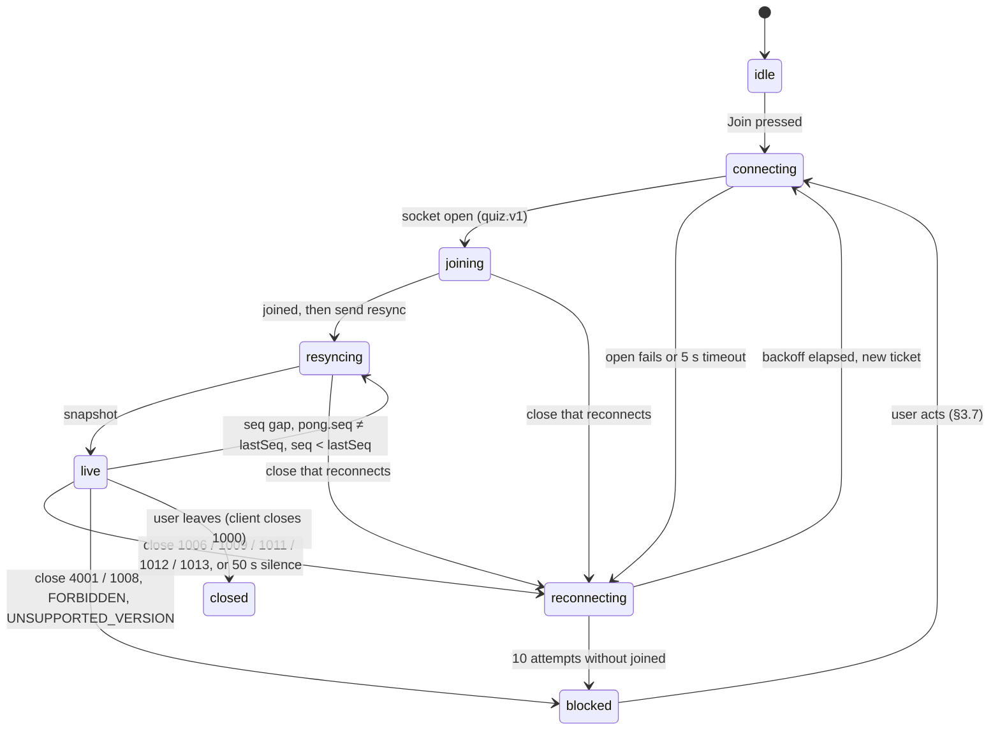
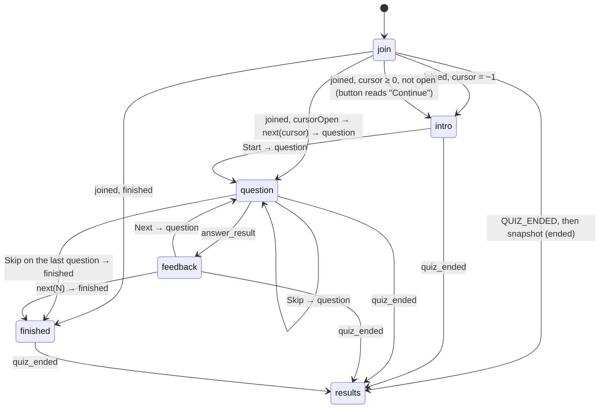

<!-- AI-ASSISTED: UI spec of the Vue client (screens, state chart, motion, accessibility, design tokens), drafted with Claude Code; contrast ratios computed with the WCAG 2.2 relative-luminance formula. -->
# UI spec: screens, states, motion and style of the Vue client

This document is the contract for every screen of the Vue client in `web/`. It says what each screen shows, which protocol message moves the UI from one state to the next, how things move, how the client works with a keyboard and a screen reader, and which design tokens give it its look. The wire messages are in `docs/spec/protocol.md` and the quiz rules in `docs/spec/domain.md`; where this spec disagrees with them, they win.

The app is called **Vocab Quiz**. It uses its own neutral look: no third-party logo, brand colors or brand name appear anywhere in the UI.

## 1. Chosen direction

**Direction A, "Slate"**: a light, neutral surface with slate text, one indigo accent, the system font stack, soft 10 px corners and short motion with no overshoot. The tokens are in §7.2. The comparison of the three candidates is in §7.1.

Why A:

1. **The widest contrast margins.** Every text pair, including the success, warning and danger colors that carry answer feedback, passes WCAG AA (4.5:1) on both the page and the card background, and the main text reaches 17:1 (§7.1).
2. **A focus ring that cannot be mistaken for feedback.** The indigo ring has 7.5:1 against the page and is a different hue from the green "correct" and red "wrong" states. In direction B the teal ring sits next to the success green, which is exactly where the player looks after answering.
3. **Calm and fast.** The system font stack needs no web-font download and has tabular numerals for scores and the countdown; the motion tokens use one easing curve with no spring or overshoot, so rank changes read as movement, not as alarm.

Switching the look later means replacing the token values in one file (§7.3); no component names a color, radius or duration directly.

## 2. Routes and layout

| Route | Screen |
|---|---|
| `/` | Landing and join (§3.1) |
| `/quiz/:quizId` | Everything after the join: intro, question, feedback, finished and results, chosen by the client state (§4) |

- **Phones (below 1024 px):** one column. A two-tab switch at the top, "Quiz" and "Leaderboard", with my rank and score always visible in the header, so the leaderboard tab is never needed to know where I stand.
- **Desktops (1024 px and up):** two columns: the quiz on the left (at most 640 px wide), the live leaderboard on the right (360 px), both visible at once.
- **Header (every quiz screen):** the quiz ID, the question counter ("Question 3 of 10"), my score, my rank ("#12 of 340"), and the connection pill (§3.7) when the connection is not live.
- All copy lives in one strings module in `web/src/`, so a translation can be added later.

## 3. Screens

### 3.1 Landing and join

- A short headline ("Real-time vocabulary quiz"), a quiz ID field and a display name field, and a "Join" button.
- The quiz ID field upper-cases what is typed and accepts `^[A-Z0-9-]{3,16}$`. The display name is 1–32 characters after trim. Both are checked on blur and on submit; the message sits under the field, linked with `aria-describedby`.
- A link `/?quiz=VOCAB-42` fills the quiz ID and puts the focus in the name field. The last display name is remembered in the tab (`sessionStorage`).
- On submit: the button shows a spinner and "Joining…", the fields stay readable. The client creates the mock session once (`POST /sessions`), fetches a ticket, opens the socket and sends `join` (protocol §8). `joined` routes to `/quiz/:quizId`.
- `QUIZ_NOT_FOUND` puts "No quiz with this ID" under the quiz ID field; the user may try again. `QUIZ_ENDED` on join routes to the results screen (§3.6).

### 3.2 Intro

Shown after `joined` when `cursor = −1` (no question served yet).

- The quiz ID, the number of questions (`questionCount`), the time per question (`timeLimitMs`), how much time the quiz has left (`quizRemainingMs`, counted down), and the scoring rule in one line: "Correct answers score 100–150 points, more when faster; wrong or late answers score 0."
- The live leaderboard is already visible (desktop) or one tab away (phone), with the player count.
- One primary button, "Start", which has the focus. It sends `next {questionIndex: 0}`; the question clock starts only now (domain §3.2).

### 3.3 Question

- The countdown ring (§5.3) with the whole seconds left in its center, the prompt as the screen's `<h2>`, and the four choices as a 2 × 2 grid (one column on narrow phones). Each choice is a button with its key hint ("1"–"4") on the left.
- Choosing (click, tap or key 1–4) sends `answer` with a new `submissionId` made once per question and kept until the result arrives. The choices lock at once; the chosen one shows "Checking…" with a small spinner. There is no second choice and no undo.
- When the ring reaches 0 the choices stay enabled, and a note appears under them: "Time's up: an answer now scores 0." A secondary "Skip" button sends `next {questionIndex: i + 1}` (the question closes with 0 points).
- While the connection is not live (§3.7), the choices are disabled with the note "Waiting for the connection…". The ring keeps running, because the server clock keeps running; after the reconnect, the re-served `question` resets it from its new `remainingMs`.

### 3.4 Answer feedback

Shown on `answer_result`.

- The chosen choice is marked correct (success color, check icon, "Correct") or wrong (danger color, cross icon, "Wrong"), and the correct choice is always marked with the check icon and "Correct answer". Color is never the only signal: each state has an icon and a word.
- `late: true` reads "Too late: 0 points"; otherwise "+133 points" counts up (§5.2), and the total score in the header counts up with it.
- One primary button, "Next question" (or "See my result" after the last question), which has the focus; Enter or Space presses it. It sends `next {questionIndex: i + 1}` (or `N`).
- There is no auto-advance: the quiz is self-paced and the clock of the next question starts only when the player asks for it.

### 3.5 Live leaderboard

A panel on every quiz screen (intro, question, feedback, finished).

- **Rows:** rank, display name, score (tabular numerals, right-aligned). At most 50 rows are rendered: the top 50 of the latest `leaderboard` or `snapshot` (frames up to 200 players carry everyone; the client still renders 50).
- **My row:** highlighted with the accent tint and "(you)". If I am not in the top 50, a pinned row under the list shows my rank and score: from the frame's `entries` up to 200 players, else from the latest `rank_update`.
- **Header:** "340 players · 312 online" (`playerCount`, `onlineCount`).
- Rows are keyed by `userId`, so a rank change moves the row instead of re-drawing it (§5.1). Ties cannot happen: ranks are unique.
- The list itself is not a live region (§6.3); my rank and score are.

### 3.6 Finished and results

- **Finished** (`finished`, or `joined` with `finished: true`): "You finished!", my score, my provisional rank, and "Your rank can still change until the quiz ends in 4:12" (from `quizRemainingMs`). The live leaderboard keeps updating next to it.
- **Results** (`quiz_ended`, or a `snapshot` with `status: "ended"`): a podium for ranks 1–3 (the first place in the middle and highest, each step with rank, name and score), my final rank and score from `you` in a card under it ("You placed #12 of 340"), then the rest of the top 50 as a list. "Show all players" loads `get_leaderboard` pages of 100 rows, with the result in `leaderboard_page` (`final: true`). A viewer with no player (`you: null`) sees the podium and the list only.
- With fewer than 3 players the podium shows only the steps it has.

### 3.7 Connection and error states

Two kinds, by how much they interrupt:

- **Calm (the client recovers by itself):** a small pill in the header, never a modal, never a layout shift. The screen under it stays readable.

  | Pill | When |
  |---|---|
  | "Connecting…" | First open, before `joined` |
  | "Reconnecting… (attempt 3)" | After a close that reconnects (1006, 1009, 1011, 1012, 1013), during the backoff and the new open |
  | "Server busy, retrying" | After `UNAVAILABLE` or 1013 (wait 5 s plus the backoff) |
  | "Updating…" | Between `resync` and `snapshot`; the leaderboard stays visible at full opacity, with a small spinner in its header |

- **Blocking (only the user can act):** a centered card that replaces the quiz column; the leaderboard is hidden.

  | Card | When | Action |
  |---|---|---|
  | "This quiz is open in another tab" | `SESSION_REPLACED`, close 4001 | "Use this tab" (a new ticket and `join`; the other tab then gets this card) |
  | "A new version is available" | `UNSUPPORTED_VERSION` | "Reload" |
  | "Can't connect to this quiz" | `FORBIDDEN`, close 1008 | "Reload", and a link back to `/` |
  | "Still can't connect" | 10 reconnect attempts in a row without a `joined` | "Try again" (resets the attempts) |

## 4. State chart

The client keeps two pieces of state: the **connection** (is the socket usable) and the **phase** (which screen). The phase changes only on server messages; the connection decides whether requests can be sent.

### 4.1 Connection

`connecting`, `joining`, `resyncing` and `reconnecting` show the calm pill; `blocked` shows the card; `live` shows nothing. Requests made while the connection is not `live` are not queued, except one pending `answer`, which is resent with the same `submissionId` after the reconnect (the server replays the same result).

### 4.2 Phase

After a reconnect, the new `joined` keeps the current screen when it agrees with it: feedback stays on feedback when `cursor` is the answered question and it is closed, and finished stays finished. When `cursorOpen` is true the client sends `next {questionIndex: cursor}` and the re-served `question` resets the ring. Only a disagreement (for example `finished: true` while the client shows a question) moves the phase, by the arrows above.

### 4.3 Every message, error and close code

| Input | Phase change | Connection change | Visible effect |
|---|---|---|---|
| `joined` | per §4.2 | `joining` → `resyncing` | Header filled; the client sends `resync {lastSeq}` |
| `question` | → question | — | Ring starts from `remainingMs`; focus on the prompt |
| `answer_result` | → feedback | — | Marks, points count-up, score count-up |
| `finished` | → finished | — | Provisional rank |
| `leaderboard` | — | — | Rows move (FLIP); counts update; applied by the `seq` rules of protocol §3 |
| `rank_update` | — | — | Pinned "my row" updates |
| `snapshot` | → results if `status: "ended"` | `resyncing` → `live` | Standings replaced without animation |
| `leaderboard_page` | — | — | Rows appended to "Show all players" |
| `quiz_ended` | → results (from any phase) | — | Podium; the pill and any pending request are dropped |
| `pong` | — | → `resyncing` if `seq` differs from `lastSeq` | None |
| `INVALID_MESSAGE`, `UNSUPPORTED_TYPE` | — | — | None (logged to the console; a client bug) |
| `UNSUPPORTED_VERSION` | — | → `blocked` | "A new version is available" |
| `MESSAGE_TOO_LARGE` | — | → `reconnecting` (close 1009) | Calm pill |
| `UNAUTHORIZED` | — | → `reconnecting` with a new ticket | Calm pill |
| `FORBIDDEN` | — | → `blocked` | "Can't connect to this quiz" |
| `QUIZ_NOT_FOUND` | stays join | → `idle` | Message under the quiz ID field |
| `NOT_JOINED` | — | → `joining` | None; `join`, then the request again |
| `QUESTION_NOT_OPEN`, `INVALID_STATE` | — | → `joining` | None; rejoin reads `cursor` and §4.2 picks the screen |
| `ALREADY_ANSWERED` | stays | — | None; the first result stands |
| `QUIZ_ENDED` | → results | — | Podium after the `snapshot` |
| `RATE_LIMITED` | — | — | None; the request is retried after 1 s |
| `SESSION_REPLACED` | — | → `blocked` | "This quiz is open in another tab" |
| `UNAVAILABLE` | — | stays, or → `reconnecting` after 1013 | "Server busy, retrying" |
| `INTERNAL` | — | → `reconnecting` (close 1011) | Calm pill |
| Close 1000 | — | → `closed` | None (the user left) |
| Close 1006, 1009, 1011, 1012 | — | → `reconnecting` | Calm pill |
| Close 1013 | — | → `reconnecting`, 5 s plus the backoff | "Server busy, retrying" |
| Close 1008 | — | → `blocked` | "Can't connect to this quiz" |
| Close 4001 | — | → `blocked` | "This quiz is open in another tab" |

## 5. Motion

Every animation uses the motion tokens (§7.2) and follows one rule: **motion shows what changed, it never asks for attention.** No pulsing, flashing, shaking or confetti.

### 5.1 Rank changes (FLIP)

- Leaderboard rows animate position changes with FLIP: record each row's position, apply the new order, invert with a transform, then play to zero. Vue's `<TransitionGroup>` move class does exactly this; it runs on `transform` only, so it never triggers layout.
- Duration `--motion-slow` (320 ms), easing `--ease-standard`. A row that enters fades in over `--motion-base`; a row that leaves fades out over `--motion-fast`.
- My own row, when it moves up, gets a 1 s accent-tint fade on top of the move. Rows that move down get no extra effect.
- A frame applied as a full replacement (`snapshot`, `rebase: true`) or more than 20 rows moving at once skips FLIP and swaps the list in one step.

### 5.2 Scores count up

- `pointsAwarded` on the feedback screen and the header score count up from the old to the new value over `--motion-count` (600 ms), ease-out, with tabular numerals so the width never jitters. Leaderboard scores swap without counting (FLIP already shows the change).

### 5.3 The countdown ring

- An SVG circle whose stroke shrinks from full to empty over the question's time, driven by `requestAnimationFrame` and `performance.now()` from the moment the `question` arrived (protocol §6). The center shows the whole seconds left (`ceil`).
- The stroke is the accent color; in the last 5 s it turns to the warning color. No pulse.

### 5.4 Reduced motion

With `prefers-reduced-motion: reduce` (read with VueUse `usePreferredReducedMotion`, and set in CSS by one media query on the motion tokens):

- every motion token becomes `0ms`, so FLIP, fades and the tint simply snap to the end state;
- counters show the final value at once;
- the ring updates once per second in steps, with no transition; the number in its center is unchanged.

Nothing is lost: every animated change also has a static end state that carries the same information.

## 6. Accessibility

### 6.1 Keyboard

| Key | Where | Does |
|---|---|---|
| `1`–`4` | Question, while no text field has the focus | Chooses that answer (the same as clicking it) |
| `Enter` or `Space` | Feedback | Presses the focused "Next question" button |
| `Tab`, `Shift+Tab` | Everywhere | Moves through the focus order (§6.2) |
| `Escape` | "Show all players" panel | Closes it and returns the focus to its button |

The key hints are visible on the choice buttons, so the shortcut is discoverable without a help screen.

### 6.2 Focus order and focus moves

- Focus order on a quiz screen: the skip link "Skip to quiz", the header, the quiz column (prompt, choices 1–4 in reading order, then "Skip" when shown), the leaderboard.
- When the screen changes, focus moves on purpose: to the "Start" button on the intro, to the prompt heading (`tabindex="-1"`) on a new question, to "Next question" on feedback, and to the results heading on results. Focus is never left on an element that disappeared.
- Every focusable element shows the focus ring (§7.2): a 2 px solid ring with a 2 px offset, at least 3:1 against both backgrounds, drawn with `:focus-visible`.

### 6.3 Live regions

- My score and my rank are each in a polite live region (`aria-live="polite"`, `aria-atomic="true"`). The rank is announced only when it changes, at most once every 5 s ("Rank 12 of 340").
- The answer result is announced through the same region ("Correct, plus 133 points" or "Wrong, the answer was 'bright'").
- The countdown announces only at 10 s and 5 s left, never every second.
- The leaderboard list is not live: 50 rows changing five times a second would drown everything else.
- Connection pills use `role="status"`; blocking cards use `role="alert"` and take the focus.

### 6.4 Contrast and size

- All text meets WCAG AA (4.5:1; 3:1 for text of 24 px and up, or 19 px bold and up). Interactive outlines (choice buttons, inputs) and the focus ring meet 3:1. The measured ratios are in §7.1.
- Body text is at least 16 px; touch targets are at least 44 × 44 px; the layout works at 320 px wide and at 200 % zoom without horizontal scrolling.

## 7. Style

### 7.1 Three candidate token sets

Contrast ratios are computed with the WCAG 2.2 relative-luminance formula, against the page background and the card surface.

| | A "Slate" (light, cool) | B "Paper" (light, warm) | C "Night" (dark) |
|---|---|---|---|
| Page / card | `#F8FAFC` / `#FFFFFF` | `#FAF7F2` / `#FFFFFF` | `#0B1020` / `#151B2E` |
| Text / muted | `#0F172A` / `#475569` | `#1C1917` / `#57534E` | `#E6E8EF` / `#A3AAC2` |
| Accent | indigo `#4338CA` | teal `#0F766E` | periwinkle `#8B9CFF` |
| Success / danger / warning | `#15803D` / `#B91C1C` / `#B45309` | `#166534` / `#B42318` / `#A16207` | `#4ADE80` / `#F87171` / `#FBBF24` |
| Type | system UI stack, tabular numerals | serif headings, humanist sans body (two web fonts) | IBM Plex Sans (one web font) |
| Radius | 10 px | 4 px | 14 px |
| Shadow | soft, two layers, cards only | none; 1 px borders | colored glow on the accent |
| Motion | 120 / 200 / 320 ms, one ease-out curve | 150 / 250 / 400 ms, ease-in-out | 100 / 180 / 280 ms, spring with overshoot |

| Criterion | A | B | C |
|---|---|---|---|
| Readability | Text 17.1:1, muted 7.2:1; system font renders sharp everywhere | Text 16.4:1, muted 7.1:1; serif headings are charming but slower to scan under time pressure | Text 15.5:1, muted 8.2:1; light-on-dark text blooms in bright rooms and on projectors |
| AA contrast (lowest text pair on the page) | success 4.79:1, warning 4.80:1: all pass | warning 4.61:1: passes with little margin | all pass (lowest: danger 6.2:1 on cards), but the control outline `#6B7799` is 3.85:1 on cards |
| Visible focus | indigo ring 7.55:1, a hue unlike success and danger | teal ring 5.12:1, close in hue to success green | pale yellow ring 15.2:1, strong |
| Calm motion | short, no overshoot | slow; the 400 ms FLIP lags behind 200 ms frames | spring overshoot makes rank moves look jumpy |

A wins on the criteria that matter during play (feedback colors, focus during feedback, calm leaderboard). C stays documented as a dark theme that can be added later by swapping tokens.

### 7.2 Tokens of direction A

| Token | Value | Use | Contrast |
|---|---|---|---|
| `--background` | `#F8FAFC` | Page | — |
| `--card` | `#FFFFFF` | Panels, choices, cards | — |
| `--foreground` | `#0F172A` | Body text, headings | 17.1:1 on page |
| `--muted-foreground` | `#475569` | Secondary text, hints | 7.2:1 on page |
| `--border` | `#E2E8F0` | Dividers (decorative) | — |
| `--input` | `#64748B` | Outlines of choices and inputs | 4.55:1 on page, 4.76:1 on card |
| `--primary` | `#4338CA` | Primary button, ring stroke, my row's marker | 7.55:1 on page |
| `--primary-foreground` | `#FFFFFF` | Text on primary | 7.90:1 |
| `--accent` | `#EEF2FF` | My row's tint | text on it 16.0:1 |
| `--ring` | `#4338CA` | Focus ring, 2 px, offset 2 px | 7.55:1 on page |
| `--success` | `#15803D` | Correct mark, "+points" | 4.79:1 on page; white on it 5.02:1 |
| `--success-soft` | `#F0FDF4` | Correct choice fill | `#166534` on it 6.81:1 |
| `--destructive` | `#B91C1C` | Wrong mark, errors | 6.18:1 on page; white on it 6.47:1 |
| `--destructive-soft` | `#FEF2F2` | Wrong choice fill | `#991B1B` on it 7.60:1 |
| `--warning` | `#B45309` | Last 5 s of the ring, "Server busy" | 4.80:1 on page |
| `--font-sans` | `ui-sans-serif, system-ui, "Segoe UI", Roboto, sans-serif` | All text; `font-variant-numeric: tabular-nums` on numbers | — |
| Type scale | 14 / 16 / 20 / 24 / 32 px, line height 1.5 (body) and 1.2 (headings) | Hint / body / choice / prompt / podium | — |
| `--radius` | `0.625rem` (10 px) | Cards, buttons, choices; pills are fully round | — |
| `--shadow-card` | `0 1px 2px rgb(15 23 42 / 0.06), 0 4px 12px rgb(15 23 42 / 0.06)` | Cards only | — |
| `--motion-fast` / `--motion-base` / `--motion-slow` | `120ms` / `200ms` / `320ms` | Leave / enter, hover / FLIP | — |
| `--motion-count` | `600ms` | Count-up | — |
| `--ease-standard` | `cubic-bezier(0.2, 0, 0, 1)` | Every transition | — |

### 7.3 Where the tokens live

- One file, `web/src/styles/tokens.css`, defines the tokens as CSS custom properties on `:root`, with the names that shadcn-vue components already read (`--background`, `--foreground`, `--card`, `--primary`, `--primary-foreground`, `--muted-foreground`, `--accent`, `--border`, `--input`, `--ring`, `--destructive`, `--radius`) plus `--success`, `--warning`, the soft fills, the shadow and the motion tokens.
- Tailwind maps its theme colors, radius and durations to these properties, so components use classes such as `bg-card`, `text-success` and `duration-slow`, never a raw hex value or millisecond count.
- The same file holds the one `@media (prefers-reduced-motion: reduce)` block that sets every motion token to `0ms` (§5.4).
